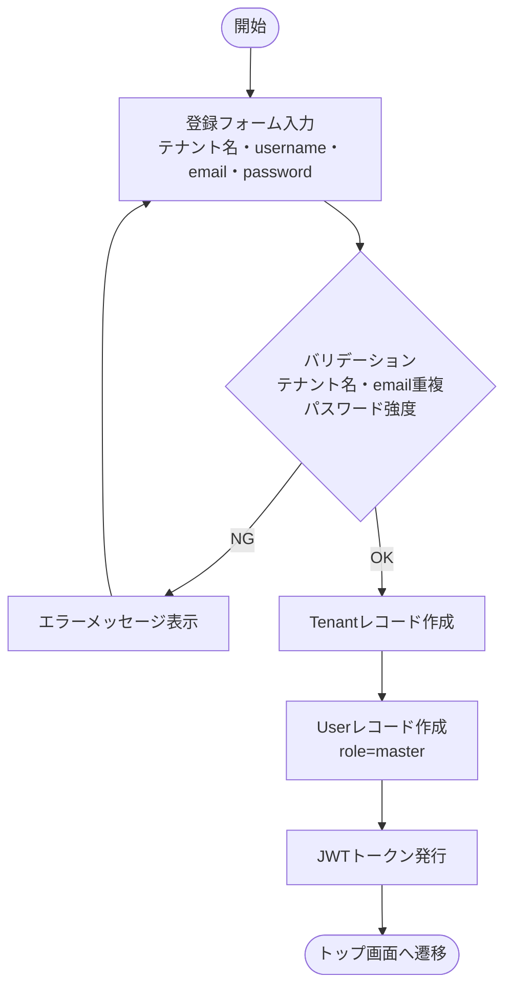
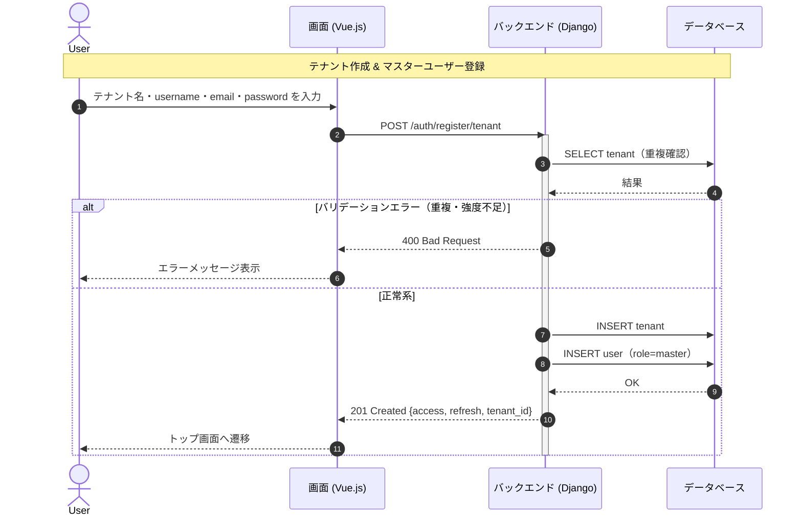

# 【機能仕様書】認証・ユーザー管理

## 1. 処理概要

- **目的**：テナントを親単位とし、テナントに紐づくユーザーの登録・ログイン・プロフィール管理を提供する。JWT（2トークン方式）で認証し、テナント間のデータは完全に独立させる。
- **背景**：マルチテナントSaaSとして複数組織が独立してシステムを利用できる基盤が必要。ロール（マスター・管理者・メンバー）によって操作権限を制御する。

## 2. アクター

| アクター | 種別 | 役割 |
| --- | --- | --- |
| マスターユーザー | ユーザー | テナント作成・ユーザー作成/削除/ロール変更・全権限 |
| 管理者（Admin） | ユーザー | プロジェクト管理・タスク編集・レビュー・自動割り振り |
| メンバー | ユーザー | 担当タスクの進捗更新・テンプレート利用・報告書閲覧 |
| 招待ユーザー | ユーザー | 招待メールから受諾してアカウントを作成 |
| システム | 自動処理 | JWTトークンの発行・検証・リフレッシュ |

## 3. ワークフロー

## 4. シーケンス図

## 5. 処理フロー

### 5.1 テナント作成 & マスターユーザー登録

1. **バリデーション**：テナント名・email重複チェック、パスワード8文字以上（詳細は6.1参照）
   - バリデーションエラー：400 Bad Request を返す。
2. **DB操作**：Tenantレコード作成 → Userレコード作成（role=master）（詳細は6.2, 6.3参照）
   - DB失敗：トランザクションをロールバックし、500 エラーを返す。
3. **JWT発行**：アクセストークン・リフレッシュトークンを返却。
4. **画面遷移**：トップ画面へ遷移。

### 5.2 ログイン

1. **バリデーション**：email・password必須チェック。
2. **認証**：emailでUser検索 → パスワード照合 → テナント有効確認（詳細は6.1参照）
   - 不一致：401 Unauthorized を返す。
3. **JWT発行**：role・tenant_id 含むトークンを返却。
4. **画面遷移**：トップ画面へ遷移。

### 5.3 プロフィール更新

1. **バリデーション**：email重複チェック（同テナント内）（詳細は6.1参照）
   - 重複あり：409 Conflict を返す。
2. **DB操作**：Userレコード（氏名・email）を更新。（詳細は6.2参照）
3. **画面遷移**：完了メッセージを表示。

### 5.4 ユーザー作成（マスターユーザー操作）

1. **権限チェック**：マスターユーザーのみ実行可能。
   - 権限不足：403 Forbidden を返す。
2. **バリデーション**：email重複チェック（同テナント内）。
3. **DB操作**：Userレコードを指定ロールで作成しテナントに紐付け。

## 6. 処理ロジック詳細

### 6.1 バリデーション条件（What）

| No | 項目名 | 条件 | 備考 |
| :--- | :--- | :--- | :--- |
| 1 | テナント名 | 必須・重複不可 | テナント単位でユニーク |
| 2 | email | 必須・メール形式・重複不可 | テナント内でユニーク |
| 3 | password | 必須・8文字以上 | |
| 4 | username | 必須 | |
| 5 | ロール | master / admin / member のいずれか | |

### 6.2 登録内容（What）

| No | 対象カラム | 登録内容 | 備考 |
| :--- | :--- | :--- | :--- |
| 1 | tenant.name | 入力値 | |
| 2 | user.email | 入力値 | |
| 3 | user.username | 入力値 | |
| 4 | user.role | 'master'（テナント作成時）/ 指定値 | |
| 5 | user.tenant_id | 作成したテナントのID | |

### 6.3 処理制御（How）

- **トランザクション**：TenantレコードとUserレコードの作成はアトミックに実行。どちらか失敗時は即時ロールバック。
- **JWT方式**：djangorestframework-simplejwt を使用。アクセストークン（短命）/ リフレッシュトークン（長命）の2トークン方式。

## 7. API概要

| API名 | メソッド | 役割・概要 |
| :--- | :---: | :--- |
| テナント登録API | `POST` | テナント作成＋マスターユーザー登録 |
| ログインAPI | `POST` | email・password認証・JWT発行 |
| ログアウトAPI | `POST` | リフレッシュトークン無効化 |
| トークンリフレッシュAPI | `POST` | アクセストークン再発行 |
| プロフィール取得API | `GET` | ログインユーザーのプロフィール取得 |
| プロフィール更新API | `PUT` | 氏名・email更新 |
| ユーザー招待API | `POST` | 招待トークン生成・メール送信 |
| 招待受諾API | `POST` | トークン検証・ユーザー登録 |
| ユーザー一覧API | `GET` | テナント内ユーザー一覧取得 |
| ユーザーロール変更API | `PUT` | ロール変更（マスターユーザーのみ） |
| ユーザー削除API | `DELETE` | テナント内ユーザー削除 |

## 8. テーブル概要

| テーブル名 | カラム名 | 操作 | 備考 |
| :--- | :--- | :--- | :--- |
| tenant | id, name | INSERT / SELECT | テナント作成時 |
| user | id, username, email, password, role, tenant_id | INSERT / SELECT / UPDATE | 登録・ログイン・プロフィール更新 |
| invitation | id, email, role, token, expires_at, tenant_id | INSERT / SELECT / DELETE | ユーザー招待 |
