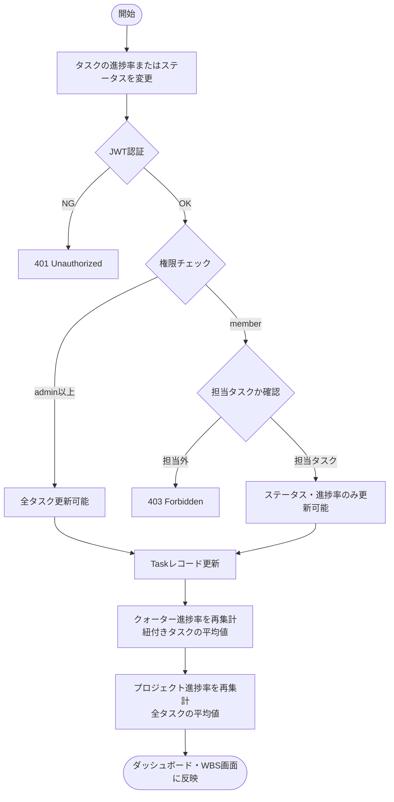
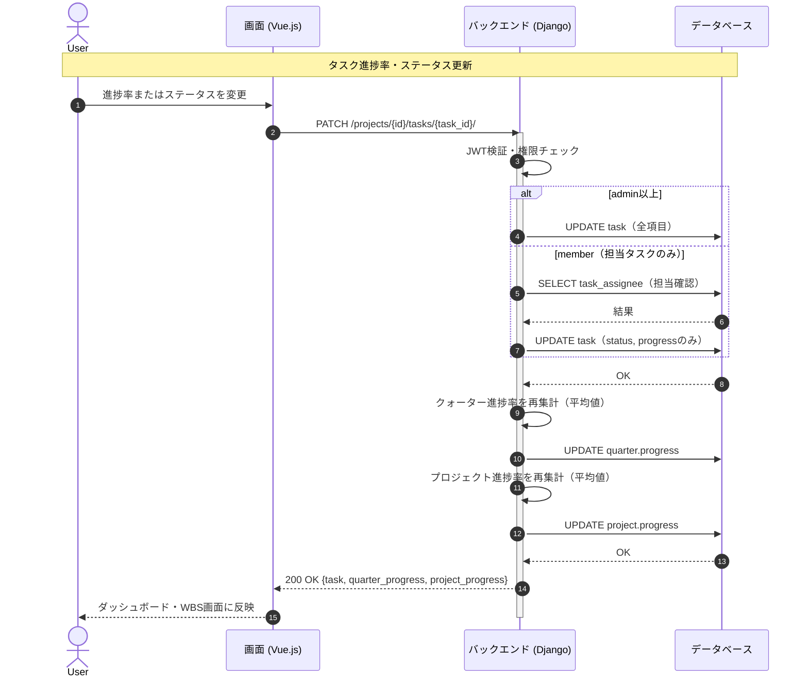

# 【機能仕様書】進捗・ステータス管理

## 1. 処理概要

- **目的**：ダッシュボードでテナント内の全プロジェクト・クォーター・タスクの進捗率を一覧表示する。タスクのステータス・進捗率が更新されると、クォーター・プロジェクトの進捗率が自動集計される。
- **背景**：担当者・管理者・経営層など各ユーザーがプロジェクト全体の状況をリアルタイムで把握できる統合ビューが必要。

## 2. アクター

| アクター | 種別 | 役割 |
| --- | --- | --- |
| 全ユーザー | ユーザー | ダッシュボード閲覧 |
| メンバー | ユーザー | 担当タスクの進捗率・ステータスを更新 |
| 管理者以上 | ユーザー | 全タスクの進捗率・ステータスを更新 |
| システム | 自動処理 | タスク更新時にクォーター・プロジェクト進捗率を再集計 |

## 3. ワークフロー

## 4. シーケンス図

## 5. 処理フロー

### 5.1 ダッシュボード表示

1. **DB操作**：テナント内の全プロジェクトを取得 → 各プロジェクトのタスク・クォーター情報を集計。（詳細は6.3参照）
2. 進捗率・ステータス別件数・遅延タスク数をサマリーとして算出。
3. ダッシュボードに一覧・グラフで表示。

### 5.2 タスク進捗率・ステータス更新

1. **バリデーション**：進捗率は0〜100の数値チェック。（詳細は6.1参照）
2. **権限チェック**：memberは担当タスクのみ・ステータス/進捗率のみ更新可能。
   - 担当外：403 Forbidden を返す。
3. **DB操作**：Taskレコードを更新 → クォーター進捗率（平均）→ プロジェクト進捗率（平均）の順で再集計。（詳細は6.2, 6.3参照）
4. **画面遷移**：ダッシュボード・WBS画面に反映。

### 5.3 フィルタリング

1. 担当者・ステータス・クォーターを選択（複数条件可、AND絞り込み）。
2. **DB操作**：クエリパラメータ付きでタスク一覧を取得。
3. フィルター結果を表示（0件の場合はメッセージ表示）。

## 6. 処理ロジック詳細

### 6.1 バリデーション条件（What）

| No | 項目名 | 条件 | 備考 |
| :--- | :--- | :--- | :--- |
| 1 | 進捗率 | 0〜100の整数 | |
| 2 | ステータス | 未着手 / 進行中 / レビュー待ち / 完了 / 保留 のいずれか | |

### 6.2 登録内容（What）

| No | 対象カラム | 登録内容 | 備考 |
| :--- | :--- | :--- | :--- |
| 1 | task.status | 選択値 | memberは自タスクのみ |
| 2 | task.progress | 入力値（0〜100） | memberは自タスクのみ |
| 3 | quarter.progress | 紐付きタスクのprogress平均値 | 自動集計 |
| 4 | project.progress | 全タスクのprogress平均値 | 自動集計 |

### 6.3 処理制御（How）

- **進捗率集計順序**：タスク更新 → クォーター進捗率（紐付きタスクの平均） → プロジェクト進捗率（全タスクの平均）の順で再計算する。
- **遅延タスク**：終了日（end_date）を過ぎて status が「完了」以外のタスクを遅延とカウントする。

## 7. API概要

| API名 | メソッド | 役割・概要 |
| :--- | :---: | :--- |
| ダッシュボードAPI | `GET` | テナント全体の進捗サマリー取得 |
| プロジェクト別ダッシュボードAPI | `GET` | プロジェクト単体の進捗・クォーター別進捗 |
| タスク一覧API（フィルタリング） | `GET` | 担当者・ステータス・クォーターでフィルタリング |
| タスク部分更新API | `PATCH` | 進捗率・ステータスの更新 |

## 8. テーブル概要

| テーブル名 | カラム名 | 操作 | 備考 |
| :--- | :--- | :--- | :--- |
| task | id, status, progress, end_date, quarter_id, project_id | SELECT / UPDATE | |
| quarter | id, progress, project_id | SELECT / UPDATE | 進捗率再集計 |
| project | id, progress, tenant_id | SELECT / UPDATE | 進捗率再集計 |
| task_assignee | task_id, user_id | SELECT | 担当者確認 |
