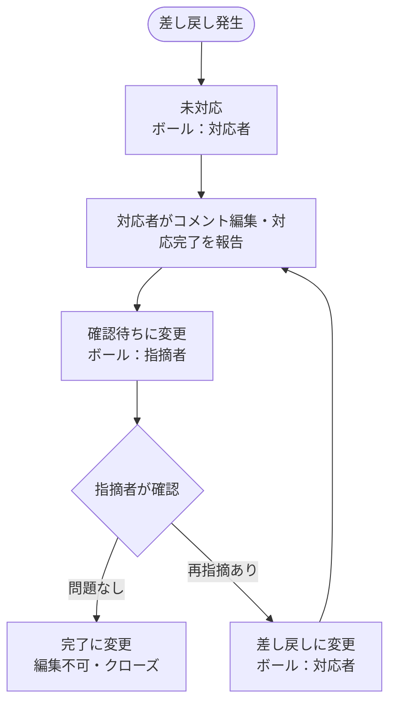
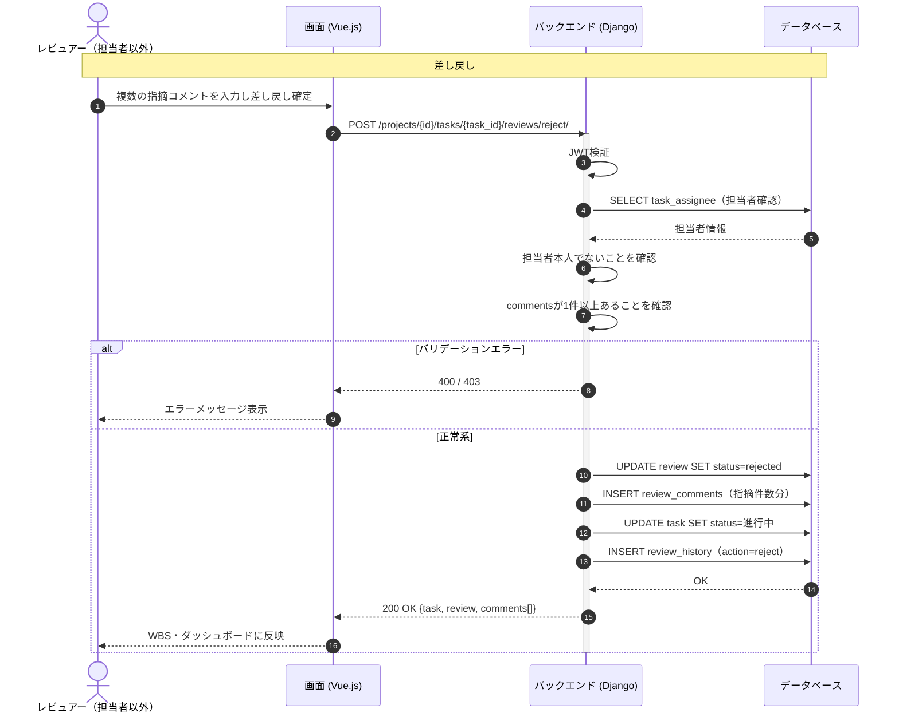

# 【機能仕様書】レビュー管理

## 1. 処理概要

- **目的**：タスクが「レビュー待ち」になると担当者以外のメンバーがレビューを実施できる。承認・差し戻しの操作とコメント管理が可能で、全操作は履歴として記録される。
- **背景**：タスクの品質担保のためのレビューフローを体系化し、差し戻し→対応→確認→完了のループを管理する仕組みが必要。

## 2. アクター

| アクター | 種別 | 役割 |
| --- | --- | --- |
| 担当者 | ユーザー | タスクをレビュー待ちに変更・差し戻しへの対応・コメント編集 |
| レビュアー（担当者以外） | ユーザー | 承認 / 差し戻し・指摘コメント入力 |
| 指摘者 | ユーザー | 差し戻しコメント作成・確認待ち→完了/差し戻しの変更 |
| システム | 自動処理 | レビュー履歴（ReviewHistory）の自動記録 |

## 3. ワークフロー

## 4. シーケンス図

## 5. 処理フロー

### 5.1 レビュー待ちへの移行

1. **権限チェック**：担当タスクまたはadmin以上のみ。
   - 担当外：403 Forbidden を返す。
2. **DB操作**：Taskのstatusをレビュー待ちに更新 → Reviewレコードを新規作成（status=pending）→ ReviewHistoryに記録。（詳細は6.2参照）

### 5.2 承認

1. **権限チェック**：担当者本人はレビュー不可。
   - 本人：403 Forbidden を返す。
2. **DB操作**：Reviewをstatus=approved → Taskをstatus=完了 → ReviewHistoryに記録 → 進捗率を再集計。（詳細は6.2, 6.3参照）

### 5.3 差し戻し

1. **権限チェック**：担当者本人はレビュー不可。
2. **バリデーション**：指摘コメントが1件以上あること。（詳細は6.1参照）
   - 0件：400 Bad Request を返す。
3. **DB操作**：Reviewをstatus=rejected → ReviewCommentをINSERT（指摘件数分）→ Taskをstatus=進行中 → ReviewHistoryに記録。（詳細は6.2参照）

### 5.4 レビューステータス更新・コメント編集

1. **権限チェック**：指摘者または対応者のみ。レビューが完了の場合は操作不可。
   - 完了・権限外：403 Forbidden を返す。
2. コメント本文編集時：先頭に「ユーザー名 日時」を自動付与。（詳細は6.3参照）
3. 完了への変更時：確認ダイアログを表示。
4. **DB操作**：Reviewレコードのステータスを更新 → ReviewHistoryに記録。

## 6. 処理ロジック詳細

### 6.1 バリデーション条件（What）

| No | 項目名 | 条件 | 備考 |
| :--- | :--- | :--- | :--- |
| 1 | 差し戻し指摘コメント | 1件以上 | 0件の場合は400・フロントではボタンを非活性 |
| 2 | レビュアー | 担当者本人以外 | 本人の場合は403 |
| 3 | レビューステータス更新 | レビューが完了でないこと | 完了後は編集不可 |

### 6.2 登録内容（What）

| No | 対象カラム | 登録内容 | 備考 |
| :--- | :--- | :--- | :--- |
| 1 | review.status | pending / approved / rejected / 確認待ち / 完了 | |
| 2 | review_comment.body | 入力値 | 差し戻し時は複数件INSERT |
| 3 | task.status | レビュー待ち / 完了 / 進行中 | 承認時=完了、差し戻し時=進行中 |
| 4 | review_history.action | request_review / approve / reject 等 | |

### 6.3 処理制御（How）

- **コメント編集履歴**：コメント本文を編集するたびに先頭へ「ユーザー名 日時\n（本文）」の形式で自動追記する。
- **完了後のロック**：レビューstatusが「完了」になったら、コメント編集・ステータス変更を一切不可にする。

## 7. API概要

| API名 | メソッド | 役割・概要 |
| :--- | :---: | :--- |
| レビュー情報取得API | `GET` | タスクのレビュー情報・コメント取得 |
| 承認API | `POST` | レビュー承認（コメント任意・1件） |
| 差し戻しAPI | `POST` | レビュー差し戻し（指摘コメント1件以上必須） |
| レビュー更新API | `PATCH` | ステータス変更・コメント編集 |
| レビュー履歴API | `GET` | 時系列の操作履歴取得 |

## 8. テーブル概要

| テーブル名 | カラム名 | 操作 | 備考 |
| :--- | :--- | :--- | :--- |
| review | id, task_id, status, reviewer_id | INSERT / SELECT / UPDATE | |
| review_comment | id, review_id, body, author_id | INSERT / SELECT / UPDATE | |
| review_history | id, review_id, task_id, action, user_id, created_at | INSERT / SELECT | |
| task | id, status | SELECT / UPDATE | レビュー時のステータス変更 |
| task_assignee | task_id, user_id | SELECT | 担当者確認 |
