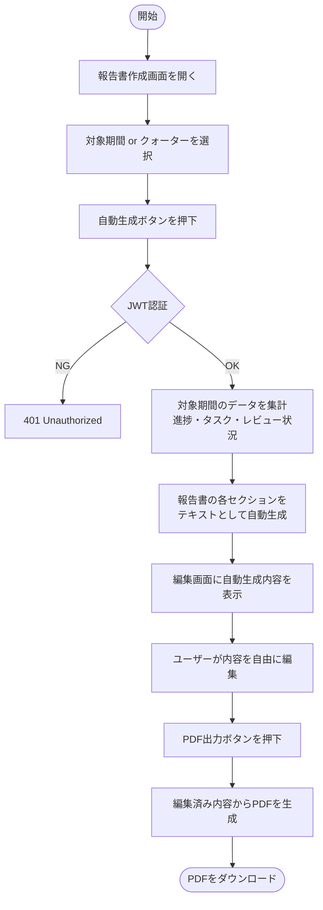
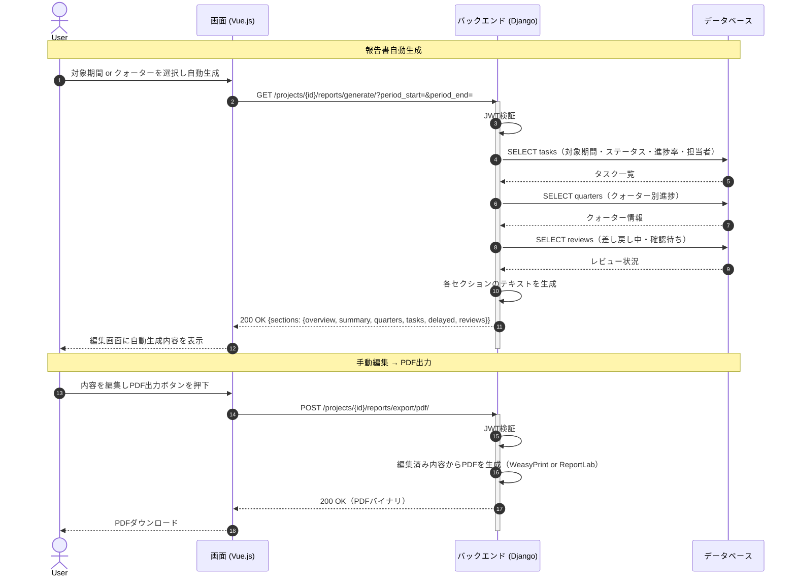

# 【機能仕様書】報告書管理

## 1. 処理概要

- **目的**：プロジェクトの進捗データをもとに報告書の内容を自動生成し、ユーザーが手動で編集してPDFとして出力する。DBへの保存は行わない（都度生成）。
- **背景**：定期的な進捗報告に必要な情報を自動収集・整形することで、報告書作成の工数を削減する。

## 2. アクター

| アクター | 種別 | 役割 |
| --- | --- | --- |
| 管理者以上 | ユーザー | 報告書の作成・編集・PDF出力 |
| メンバー | ユーザー | 報告書の閲覧・PDF出力 |
| システム | 自動処理 | 進捗データの集計・報告書テキストの自動生成・PDF変換 |

## 3. ワークフロー

## 4. シーケンス図

## 5. 処理フロー

### 5.1 報告書自動生成

1. **バリデーション**：対象期間（開始日・終了日）またはクォーターを必須で選択。（詳細は6.1参照）
2. **DB操作**：対象期間のタスク・クォーター・レビューデータを集計。（詳細は6.3参照）
   - 認証エラー：401 Unauthorized を返す。
3. 各セクションのテキストを生成してレスポンスで返却（DB保存なし）。
4. 編集画面に自動生成内容を表示。

### 5.2 手動編集 → PDF出力

1. 自動生成された各セクションの内容を自由に編集。
2. **PDF生成**：編集済み内容からPDFを生成。（詳細は6.3参照）
   - 生成失敗：500 エラーを返す。
3. PDFバイナリをダウンロード。

### 5.3 再生成

1. 再生成ボタンを押下。
2. **確認ダイアログ**：編集内容が破棄される旨の警告。キャンセル時は何もしない。
3. 最新の進捗データで各セクションを再生成し編集画面に反映。

## 6. 処理ロジック詳細

### 6.1 バリデーション条件（What）

| No | 項目名 | 条件 | 備考 |
| :--- | :--- | :--- | :--- |
| 1 | 対象期間 | 開始日・終了日 または クォーター の選択が必須 | |

### 6.2 登録内容（What）

※報告書はDBに保存しない。都度生成のため登録処理なし。

### 6.3 処理制御（How）

- **DB保存なし**：報告書の内容はDBに保存せず、リクエストのたびに最新データから生成する。
- **PDF生成**：WeasyPrint または ReportLab を使用してHTMLベースのPDFを生成する。
- **自動生成セクション**：プロジェクト概要・進捗サマリー・クォーター別進捗・タスク一覧・遅延タスク・レビュー状況の6セクションを生成する。

## 7. API概要

| API名 | メソッド | 役割・概要 |
| :--- | :---: | :--- |
| 報告書自動生成API | `GET` | 対象期間の進捗データを集計して報告書テキストを生成（DB保存なし） |
| PDF出力API | `POST` | 編集済み内容をPDFに変換してダウンロード |

## 8. テーブル概要

| テーブル名 | カラム名 | 操作 | 備考 |
| :--- | :--- | :--- | :--- |
| task | id, title, status, progress, start_date, end_date, assignees | SELECT | タスク一覧・遅延タスク取得 |
| quarter | id, title, progress, start_date, end_date | SELECT | クォーター別進捗取得 |
| review | id, task_id, status | SELECT | 差し戻し中・確認待ちのレビュー取得 |
| project | id, name, start_date, end_date | SELECT | プロジェクト概要取得 |
