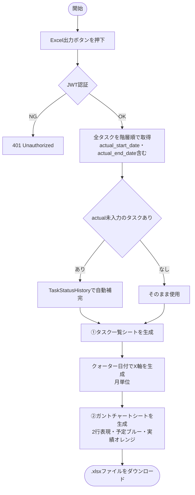
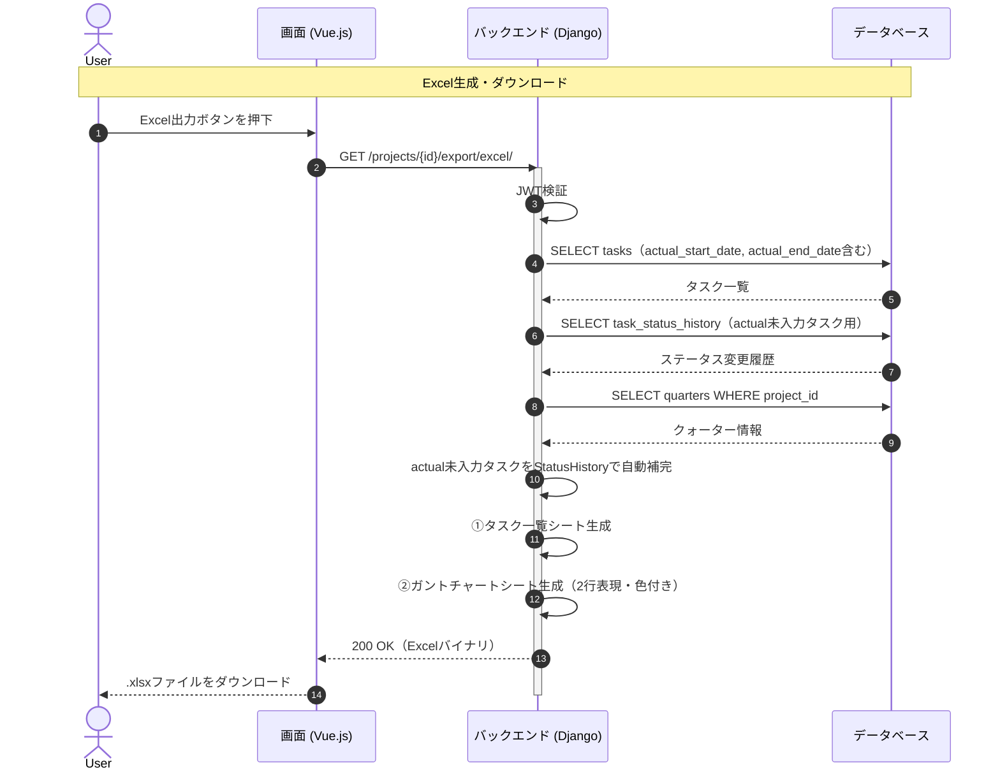

# 【機能仕様書】WBS Excel出力

## 1. 処理概要

- **目的**：WBSのタスク情報をExcel（.xlsx）形式でエクスポートする。タスク一覧シートとガントチャートシートの2シート構成で出力し、予定・実績の比較を色で表現する。
- **背景**：プロジェクト管理において、Excelでの納品・共有が必要な場面に対応する。実績日は手動入力値を優先し、未入力時はStatusHistoryから自動補完する。

## 2. アクター

| アクター | 種別 | 役割 |
| --- | --- | --- |
| 全ユーザー | ユーザー | Excel出力の実行・ダウンロード |
| 管理者以上 | ユーザー | タスク編集画面から実績日を手動編集 |
| システム | 自動処理 | タスク一覧・ガントチャートシートの生成、実績日の自動補完 |

## 3. ワークフロー

## 4. シーケンス図

## 5. 処理フロー

### 5.1 実績日の手動編集（タスク編集画面）

1. タスク編集画面を開く（actual未入力時はStatusHistoryから自動補完表示）。
2. 実績開始日・実績終了日を手動で修正（任意）。
3. **DB操作**：Taskレコードのactual_start_date・actual_end_dateを更新。（詳細は6.2参照）

### 5.2 Excel生成・ダウンロード

1. **DB操作**：全タスクをactual_start/end含めて取得 → actual未入力タスクはTaskStatusHistoryで自動補完 → クォーター情報を取得。（詳細は6.3参照）
   - 認証エラー：401 Unauthorized を返す。
2. **①タスク一覧シート生成**：階層番号・タスク名・担当者・予定日・実績日・工数・ステータス・進捗率・クォーター。（詳細は6.2参照）
3. **②ガントチャートシート生成**：1タスク2行（予定行・実績行）、月単位X軸、色分けで遅延を表現。
   - クォーター未設定時：プロジェクト期間で代替。
4. Excelバイナリをダウンロード。

## 6. 処理ロジック詳細

### 6.1 バリデーション条件（What）

| No | 項目名 | 条件 | 備考 |
| :--- | :--- | :--- | :--- |
| 1 | 出力単位 | プロジェクト全体 or クォーター指定 | |

### 6.2 登録内容（What）

| No | 対象カラム | 登録内容 | 備考 |
| :--- | :--- | :--- | :--- |
| 1 | task.actual_start_date | 手動入力値 | 編集画面から更新 |
| 2 | task.actual_end_date | 手動入力値 | 編集画面から更新 |

### 6.3 処理制御（How）

- **実績日の優先順位**：① task.actual_start/end_date（手動入力） → ② TaskStatusHistory（「進行中」になった日・「完了」になった日）の順でフォールバック。
- **セル色分けルール**：
  - 1行目（予定）：start_date〜end_date のセルを薄いブルー（#BDD7EE）で塗る。
  - 2行目（実績）：actual_start〜actual_end のセルを薄いオレンジ（#FFD966）で塗る。予定終了日を超えた部分はレッド（#FF4C4C）で塗る。
- **ファイル名**：`{プロジェクト名}_WBS_{出力日}.xlsx`（クォーター指定時は `_Q1` 等を付与）

## 7. API概要

| API名 | メソッド | 役割・概要 |
| :--- | :---: | :--- |
| WBS全体Excel出力API | `GET` | 2シート構成のExcelを生成してダウンロード |
| クォーター指定Excel出力API | `GET` | クォーター単位でフィルタしてExcel出力 |

※実績日の編集は機能仕様04のタスク編集APIを共用。

## 8. テーブル概要

| テーブル名 | カラム名 | 操作 | 備考 |
| :--- | :--- | :--- | :--- |
| task | id, title, parent_task_id, start_date, end_date, actual_start_date, actual_end_date, status, progress, estimated_hours, quarter_id | SELECT / UPDATE | actual日の更新・Excel生成用取得 |
| task_status_history | id, task_id, status, changed_at | SELECT | actual未入力時の自動補完 |
| task_assignee | task_id, user_id | SELECT | 担当者名取得 |
| quarter | id, title, start_date, end_date | SELECT | X軸生成用 |
