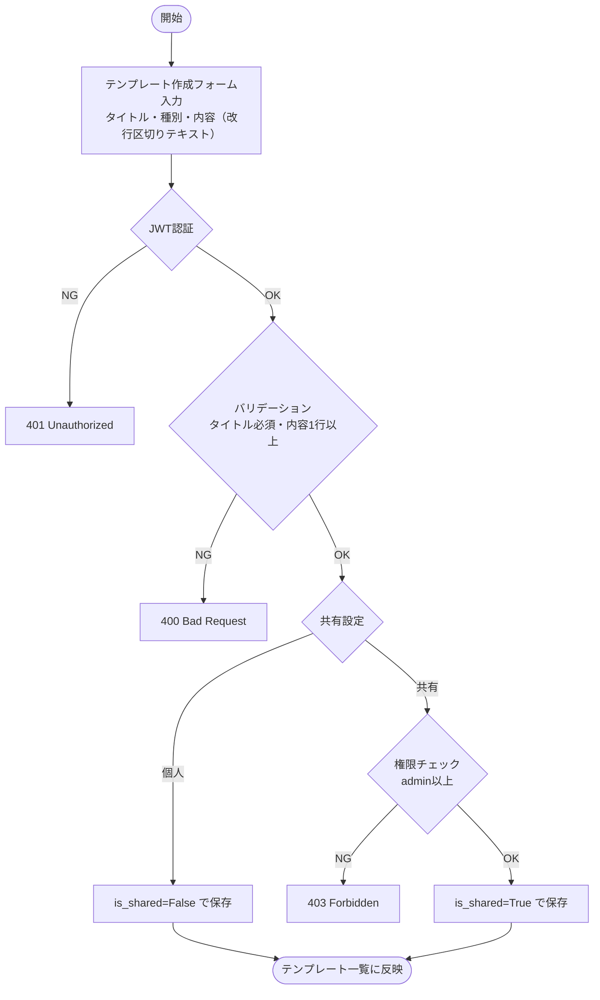
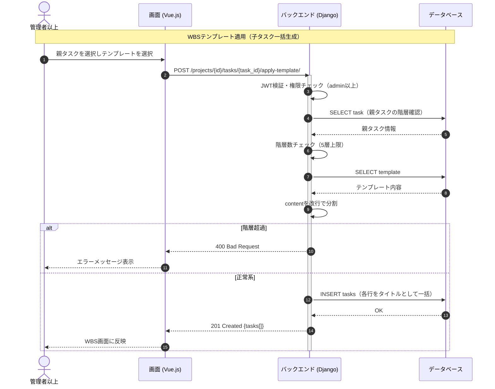

# 【機能仕様書】テンプレート管理

## 1. 処理概要

- **目的**：WBSの子タスク一括生成テンプレートとタスク（Issue形式）テンプレートを管理する。改行区切りのテキストで定義し、プロジェクト横断で再利用できる。
- **背景**：繰り返し使うタスク構成をテンプレート化することで、WBS作成・タスク起票の効率化を図る。管理者が作成したテンプレートはチーム全体で共有可能。

## 2. アクター

| アクター | 種別 | 役割 |
| --- | --- | --- |
| 全ユーザー | ユーザー | テンプレートの作成・利用（個人テンプレート） |
| 管理者以上 | ユーザー | 共有テンプレートの作成・編集・削除 |
| システム | 自動処理 | テンプレート内容の改行分割・子タスク一括INSERT |

## 3. ワークフロー

## 4. シーケンス図

## 5. 処理フロー

### 5.1 テンプレート作成

1. **バリデーション**：タイトル必須・内容1行以上（詳細は6.1参照）
   - バリデーションエラー：400 Bad Request を返す。
2. **権限チェック**：is_shared=True の場合はadmin以上のみ。
   - 権限不足：403 Forbidden を返す。
3. **DB操作**：テンプレートレコードを作成。（詳細は6.2参照）
4. **画面遷移**：テンプレート一覧に反映。

### 5.2 WBSテンプレート適用（子タスク一括生成）

1. **権限チェック**：admin以上のみ。
2. **バリデーション**：親タスクの階層数が5層以内であること。（詳細は6.1参照）
   - 階層超過：400 Bad Request を返す。
3. **DB操作**：テンプレートのcontentを改行で分割 → 各行をタイトルとして子タスクを一括INSERT。（詳細は6.3参照）
4. **画面遷移**：WBS画面に新しい子タスクを反映。

### 5.3 タスクテンプレート適用（Issue形式）

1. タスク作成画面でテンプレートを選択。
2. **DB操作**：テンプレート内容を取得。
3. テンプレート内容をdescriptionフィールドに自動入力（以降は手動で編集・保存）。

### 5.4 テンプレート削除

1. **確認ダイアログ**：削除確認。キャンセル時は何もしない。
2. **権限チェック**：作成者またはadmin以上のみ。
3. **DB操作**：テンプレートレコードを削除。

## 6. 処理ロジック詳細

### 6.1 バリデーション条件（What）

| No | 項目名 | 条件 | 備考 |
| :--- | :--- | :--- | :--- |
| 1 | タイトル | 必須 | |
| 2 | 内容（content） | 1行以上（改行区切り） | |
| 3 | 種別 | wbs / task のいずれか | |
| 4 | 共有設定（is_shared=True） | admin以上のみ | |
| 5 | 適用先の親タスク階層 | 5層未満 | 5層目への子タスク追加は不可 |

### 6.2 登録内容（What）

| No | 対象カラム | 登録内容 | 備考 |
| :--- | :--- | :--- | :--- |
| 1 | template.title | 入力値 | |
| 2 | template.type | 'wbs' or 'task' | |
| 3 | template.content | 改行区切りのテキスト | |
| 4 | template.is_shared | true / false | |
| 5 | template.created_by | JWTのuser_id | |

### 6.3 処理制御（How）

- **一括INSERT**：WBSテンプレート適用時、contentを改行（`\n`）で分割し、各行を title として子タスクをINSERTする。タイトルのみ設定し、他の項目は空欄（後から個別編集）。
- **テンプレート取得スコープ**：一覧取得時は `is_shared=True` のテンプレートと `created_by=自分` のテンプレートを合わせて返す。

## 7. API概要

| API名 | メソッド | 役割・概要 |
| :--- | :---: | :--- |
| テンプレート一覧API | `GET` | 個人＋共有テンプレートの一覧取得 |
| テンプレート作成API | `POST` | テンプレート新規作成 |
| テンプレート詳細API | `GET` | テンプレート内容取得（適用時に使用） |
| テンプレート編集API | `PUT` | テンプレート情報更新 |
| テンプレート削除API | `DELETE` | テンプレート削除 |
| WBSテンプレート適用API | `POST` | 親タスク直下に子タスクを一括生成 |

## 8. テーブル概要

| テーブル名 | カラム名 | 操作 | 備考 |
| :--- | :--- | :--- | :--- |
| template | id, title, type, content, is_shared, created_by | INSERT / SELECT / UPDATE / DELETE | |
| task | id, title, parent_task_id, project_id | INSERT / SELECT | テンプレート適用時の子タスク一括生成 |
