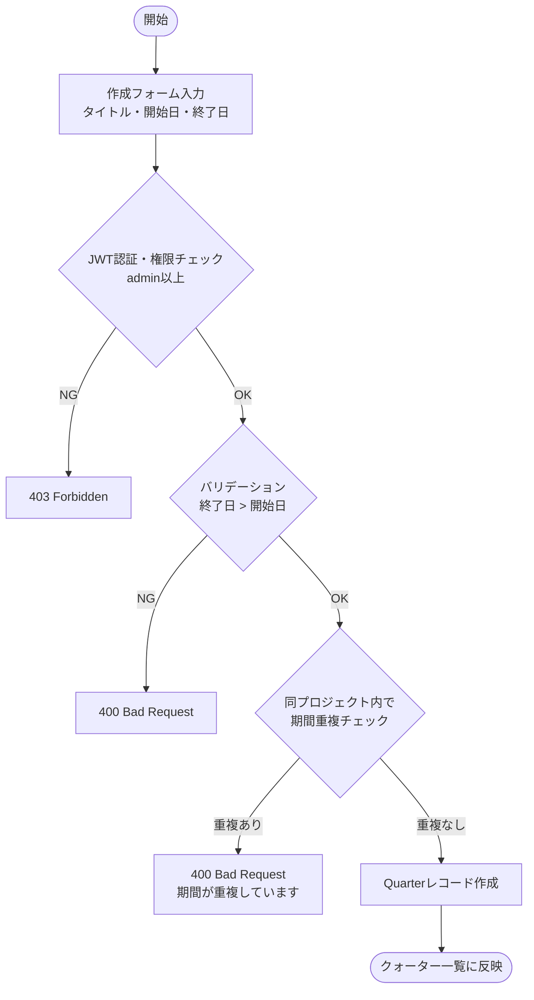
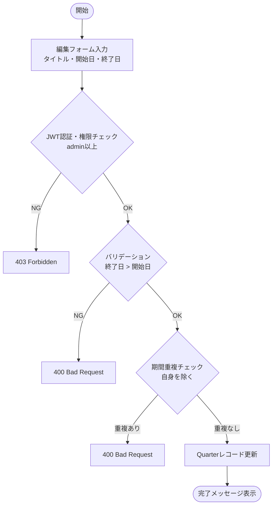
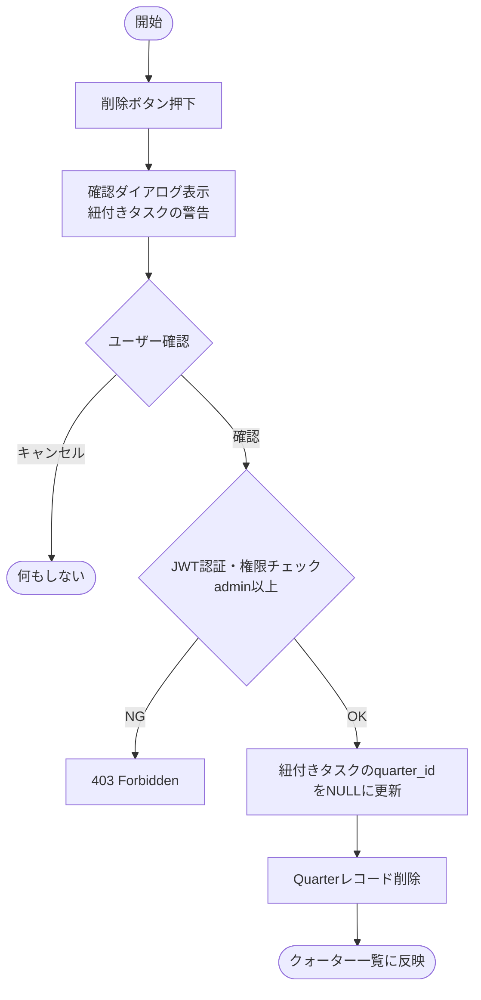
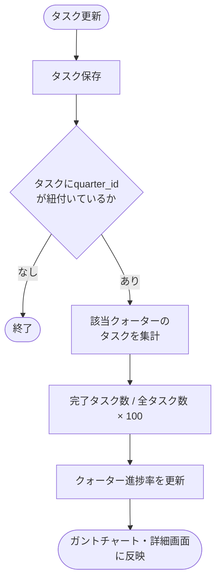
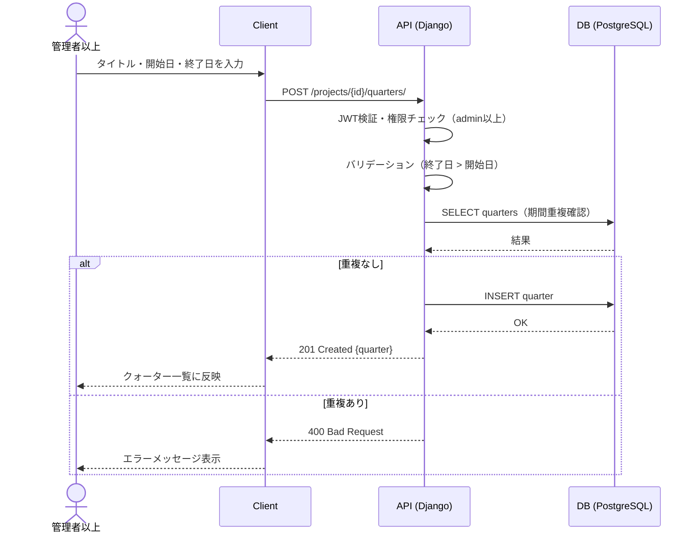
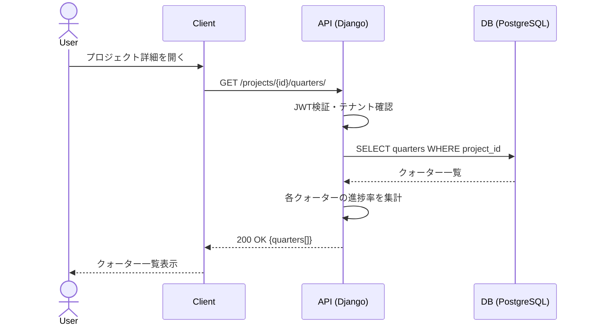
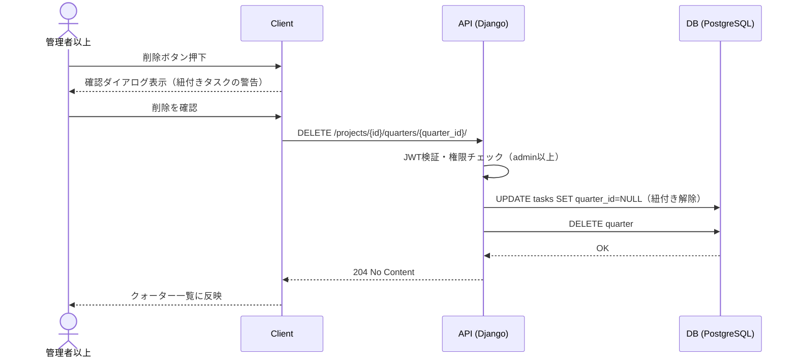

# 機能仕様 03 - クォーター管理

**作成日：** 2026年4月12日  
**バージョン：** 1.0

---

## 1. 機能概要

プロジェクト内を Q1 / Q2 / Q3 / Q4 などのクォーター単位で期間区切りし、タスクをクォーターに紐付けることでスケジュール管理を行う。クォーターごとの進捗率を集計し、ガントチャート上にも区切りとして表示する。

| 項目 | 内容 |
|------|------|
| 対象ユーザー | 管理者以上（作成・編集・削除）、メンバー（閲覧） |
| 紐付け単位 | プロジェクト単位でクォーターを設定 |
| タスクとの関係 | タスクは任意のクォーターに紐付け可能（紐付けなしも可） |

---

## 2. 処理フロー

### 2-1. クォーター作成

### 2-2. クォーター編集

### 2-3. クォーター削除

### 2-4. クォーター進捗率集計

---

## 3. シーケンス図

### 3-1. クォーター作成

### 3-2. クォーター一覧取得

### 3-3. クォーター削除

---

## 4. ステップ記述

### 4-1. クォーター作成

| ステップ | 処理 | 担当 | エラー処理 |
|---------|------|------|-----------|
| 1 | 作成フォームにタイトル・開始日・終了日を入力 | フロントエンド | 必須チェック |
| 2 | POST /projects/{id}/quarters/ にリクエスト送信 | フロントエンド | - |
| 3 | JWTで権限（admin以上）を確認 | バックエンド | 403 Forbidden |
| 4 | 終了日が開始日より後であることを確認 | バックエンド | 400 Bad Request |
| 5 | 同プロジェクト内での期間重複チェック | バックエンド | 400 Bad Request |
| 6 | Quarterレコードを作成 | バックエンド | 500 Server Error |
| 7 | 201レスポンスでクォーター情報を返却 | バックエンド | - |
| 8 | クォーター一覧・ガントチャートに反映 | フロントエンド | - |

### 4-2. クォーター編集

| ステップ | 処理 | 担当 | エラー処理 |
|---------|------|------|-----------|
| 1 | 編集フォームでタイトル・開始日・終了日を変更 | フロントエンド | 必須チェック |
| 2 | PUT /projects/{id}/quarters/{quarter_id}/ にリクエスト送信 | フロントエンド | - |
| 3 | JWTで権限（admin以上）を確認 | バックエンド | 403 Forbidden |
| 4 | 終了日が開始日より後であることを確認 | バックエンド | 400 Bad Request |
| 5 | 他のクォーターとの期間重複チェック（自身を除く） | バックエンド | 400 Bad Request |
| 6 | Quarterレコードを更新 | バックエンド | 500 Server Error |
| 7 | 完了メッセージ表示・ガントチャートに反映 | フロントエンド | - |

### 4-3. クォーター削除

| ステップ | 処理 | 担当 | エラー処理 |
|---------|------|------|-----------|
| 1 | 削除ボタンを押下 | フロントエンド | - |
| 2 | 確認ダイアログを表示（紐付きタスクへの影響を警告） | フロントエンド | キャンセル時は何もしない |
| 3 | DELETE /projects/{id}/quarters/{quarter_id}/ にリクエスト送信 | フロントエンド | - |
| 4 | JWTで権限（admin以上）を確認 | バックエンド | 403 Forbidden |
| 5 | 紐付きタスクのquarter_idをNULLに更新 | バックエンド | - |
| 6 | Quarterレコードを削除 | バックエンド | 500 Server Error |
| 7 | 204レスポンスを返却 | バックエンド | - |
| 8 | クォーター一覧・ガントチャートに反映 | フロントエンド | - |

### 4-4. 進捗率集計

| ステップ | 処理 | 担当 | エラー処理 |
|---------|------|------|-----------|
| 1 | タスクのステータスまたは進捗率が更新される | ユーザー操作 | - |
| 2 | タスク更新API呼び出し | フロントエンド | - |
| 3 | タスクにquarter_idが紐付いているか確認 | バックエンド | - |
| 4 | 該当クォーターの完了タスク数 / 全タスク数 × 100 を算出 | バックエンド | - |
| 5 | クォーター進捗率を更新 | バックエンド | - |
| 6 | ガントチャート・詳細画面に反映 | フロントエンド | - |

---

## 5. APIエンドポイント一覧

| メソッド | エンドポイント | 説明 | 権限 |
|---------|--------------|------|------|
| GET | /projects/{id}/quarters/ | クォーター一覧取得 | メンバー以上 |
| POST | /projects/{id}/quarters/ | クォーター作成 | admin以上 |
| GET | /projects/{id}/quarters/{quarter_id}/ | クォーター詳細取得 | メンバー以上 |
| PUT | /projects/{id}/quarters/{quarter_id}/ | クォーター編集 | admin以上 |
| DELETE | /projects/{id}/quarters/{quarter_id}/ | クォーター削除 | admin以上 |
