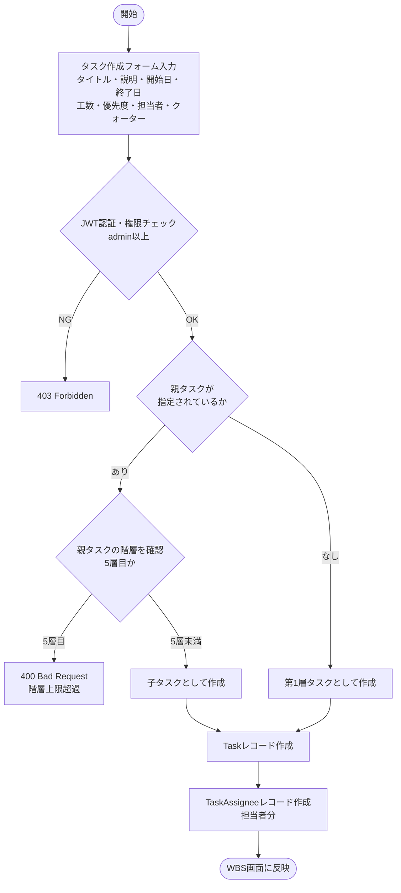
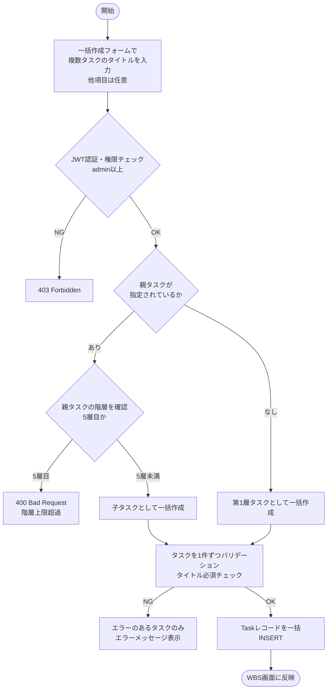
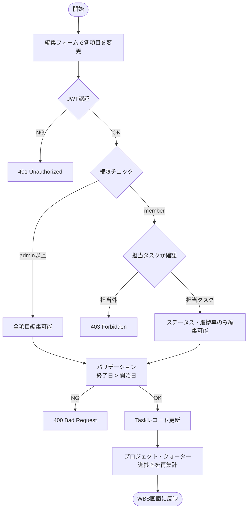
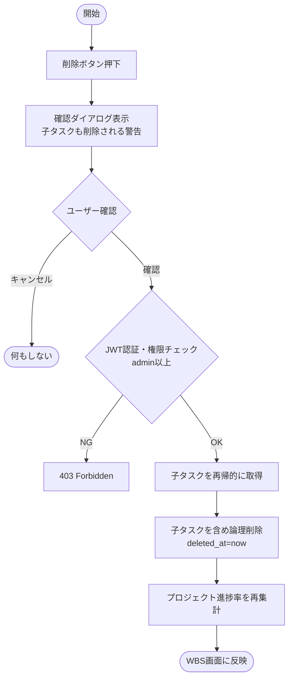
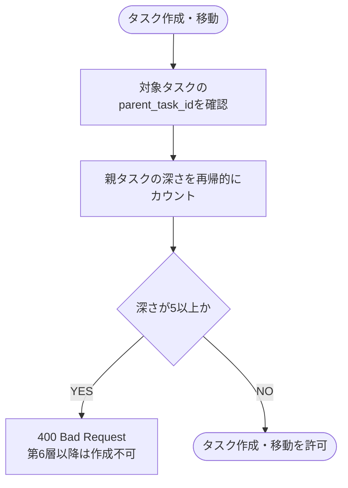
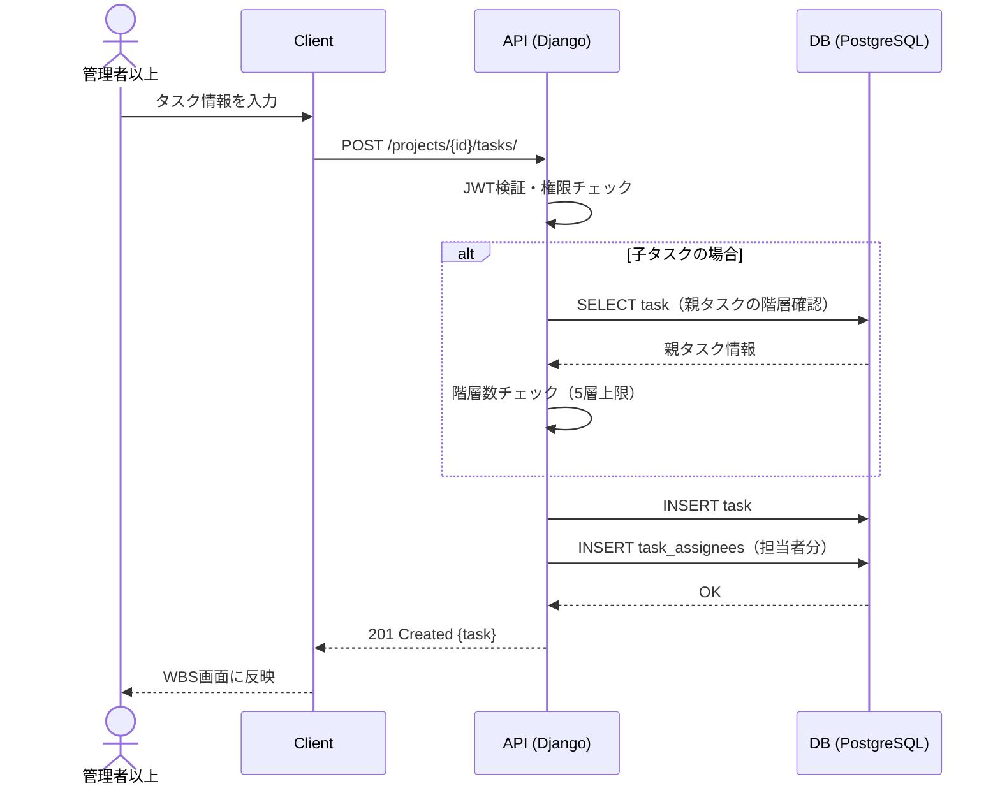
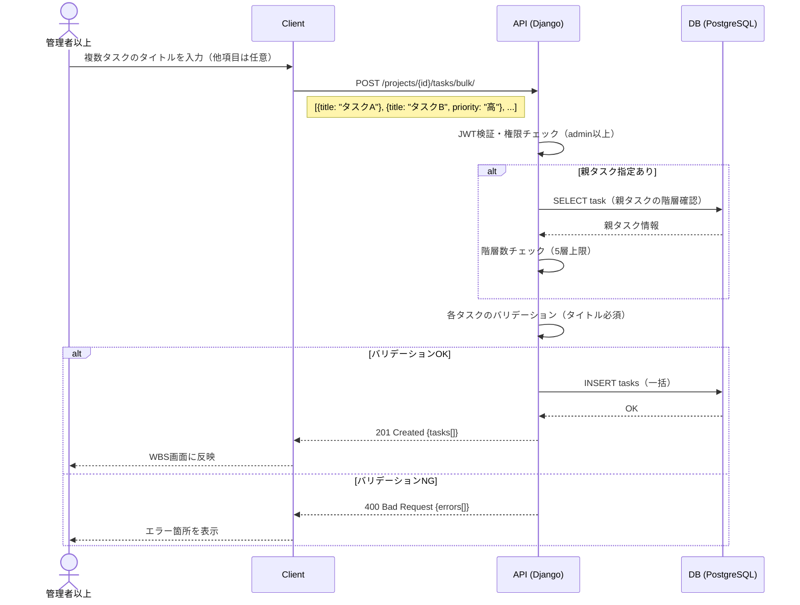
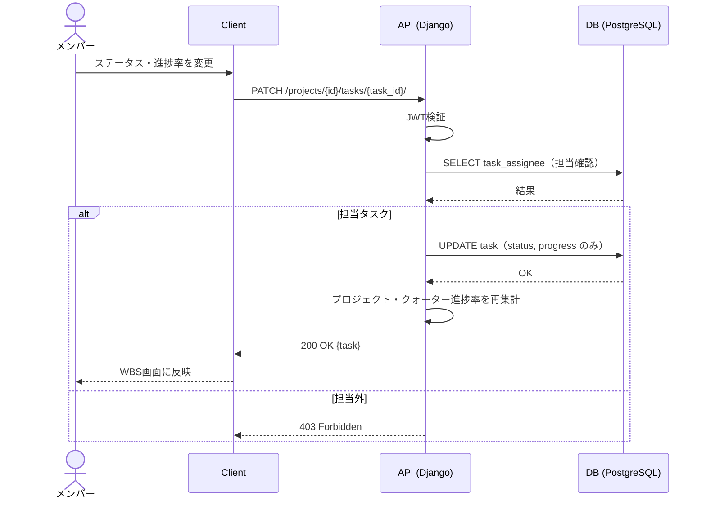
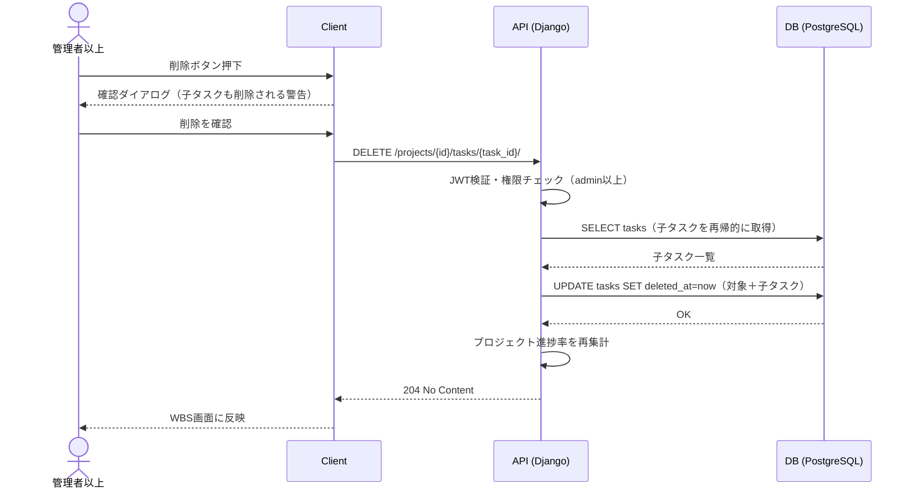
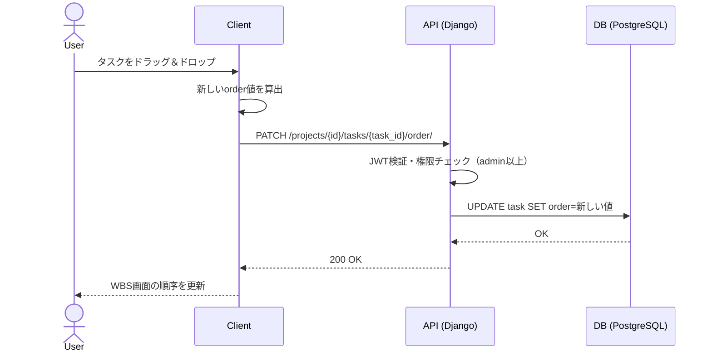

# 機能仕様 04 - WBS・タスク管理

**作成日：** 2026年4月12日  
**バージョン：** 1.1

---

## 1. 機能概要

プロジェクト内のタスクを最大5階層の木構造で管理する。タスクは自己参照（parent_task_id）で階層を表現し、ドラッグ＆ドロップによる並び替えや、ステータス・進捗率・担当者・クォーターの管理を行う。

| 項目 | 内容 |
|------|------|
| 対象ユーザー | 管理者以上（全タスク編集）、メンバー（担当タスクの進捗・ステータス更新） |
| 階層上限 | 最大5層（第6層以降はバックエンド・フロントエンド双方でブロック） |
| 並び替え | ドラッグ＆ドロップで同階層内の順序を変更可能 |
| 一括作成 | 複数タスクをまとめて作成可能。タイトルのみ必須、他項目は任意 |

### タスク階層構造

| 階層 | 例 |
|------|----|
| 第1層（大項目） | 1. 要件定義 |
| 第2層（中項目） | 1.1 ヒアリング |
| 第3層（小項目） | 1.1.1 ユーザーインタビュー |
| 第4層（詳細） | 1.1.1.1 質問票作成 |
| 第5層（作業単位） | 1.1.1.1.1 ドラフト作成 |

### ステータス定義

| ステータス | 説明 |
|-----------|------|
| 未着手 | タスクがまだ開始されていない状態 |
| 進行中 | 現在作業中の状態 |
| レビュー待ち | 作業完了後、承認・確認待ちの状態 |
| 完了 | タスクが完了した状態 |
| 保留 | 何らかの理由で一時停止している状態 |

### 優先度定義

| 優先度 | 説明 |
|--------|------|
| 高 | 最優先で対応が必要 |
| 中 | 通常優先度 |
| 低 | 余裕があれば対応 |

---

## 2. 処理フロー

### 2-1. タスク作成



### 2-2. タスク一括作成



### 2-3. タスク編集



### 2-3. タスク削除



### 2-4. タスク並び替え（ドラッグ＆ドロップ）

```mermaid
flowchart TD
    A([ドラッグ開始]) --> B[同階層内でタスクをドロップ]
    B --> C[新しいorder値を算出]
    C --> D{JWT認証・権限チェック\nadmin以上}
    D -->|NG| E[403 Forbidden\n元の順序に戻す]
    D -->|OK| F[PATCH /tasks/{id}/order/\norder値を送信]
    F --> G[Taskレコードのorder更新]
    G --> H([WBS画面の順序を更新])
```

### 2-5. 階層バリデーション



---

## 3. シーケンス図

### 3-1. タスク作成



### 3-2. タスク一括作成



### 3-3. タスク編集（メンバー）



### 3-3. タスク削除



### 3-4. 並び替え



---

## 4. ステップ記述

### 4-1. タスク作成

| ステップ | 処理 | 担当 | エラー処理 |
|---------|------|------|-----------|
| 1 | タスクフォームにタイトル・説明・開始日・終了日・工数・優先度・担当者・クォーターを入力 | フロントエンド | 必須チェック（タイトル） |
| 2 | POST /projects/{id}/tasks/ にリクエスト送信 | フロントエンド | - |
| 3 | JWTで権限（admin以上）を確認 | バックエンド | 403 Forbidden |
| 4 | 親タスクが指定されている場合、階層数を再帰的にカウント | バックエンド | 400（5層超過） |
| 5 | 終了日が開始日より後であることを確認 | バックエンド | 400 Bad Request |
| 6 | Taskレコードを作成 | バックエンド | 500 Server Error |
| 7 | TaskAssigneeレコードを担当者分作成 | バックエンド | - |
| 8 | WBS画面に新しいタスクを反映 | フロントエンド | - |

### 4-2. タスク一括作成

| ステップ | 処理 | 担当 | エラー処理 |
|---------|------|------|-----------|
| 1 | 一括作成フォームで複数タスクのタイトルを入力（他項目は任意） | フロントエンド | タイトル必須チェック |
| 2 | 親タスクを指定する場合は選択（任意） | フロントエンド | - |
| 3 | POST /projects/{id}/tasks/bulk/ にリクエスト送信 | フロントエンド | - |
| 4 | JWTで権限（admin以上）を確認 | バックエンド | 403 Forbidden |
| 5 | 親タスクが指定されている場合、階層数を確認 | バックエンド | 400（5層超過） |
| 6 | 各タスクのバリデーション（タイトル必須） | バックエンド | 400（エラーのタスク番号を返却） |
| 7 | Taskレコードを一括INSERT | バックエンド | 500 Server Error |
| 8 | WBS画面に新しいタスクを反映 | フロントエンド | - |

### 4-3. タスク編集

| ステップ | 処理 | 担当 | エラー処理 |
|---------|------|------|-----------|
| 1 | 編集フォームで各項目を変更 | フロントエンド | 必須チェック |
| 2 | PATCH /projects/{id}/tasks/{task_id}/ にリクエスト送信 | フロントエンド | - |
| 3 | JWTで認証・権限チェック | バックエンド | 401 / 403 |
| 4 | memberの場合は担当タスクであることを確認 | バックエンド | 403 Forbidden |
| 5 | memberの場合はステータス・進捗率のみ更新を許可 | バックエンド | - |
| 6 | Taskレコードを更新 | バックエンド | 500 Server Error |
| 7 | プロジェクト・クォーターの進捗率を再集計 | バックエンド | - |
| 8 | WBS画面に反映 | フロントエンド | - |

### 4-3. タスク削除

| ステップ | 処理 | 担当 | エラー処理 |
|---------|------|------|-----------|
| 1 | 削除ボタンを押下 | フロントエンド | - |
| 2 | 確認ダイアログを表示（子タスクも削除される旨の警告） | フロントエンド | キャンセル時は何もしない |
| 3 | DELETE /projects/{id}/tasks/{task_id}/ にリクエスト送信 | フロントエンド | - |
| 4 | JWTで権限（admin以上）を確認 | バックエンド | 403 Forbidden |
| 5 | 子タスクを再帰的に取得 | バックエンド | - |
| 6 | 対象タスクと子タスクすべてを論理削除 | バックエンド | 500 Server Error |
| 7 | プロジェクト進捗率を再集計 | バックエンド | - |
| 8 | WBS画面に反映 | フロントエンド | - |

### 4-4. 並び替え

| ステップ | 処理 | 担当 | エラー処理 |
|---------|------|------|-----------|
| 1 | タスクをドラッグ＆ドロップ | フロントエンド | - |
| 2 | ドロップ位置から新しいorder値を算出 | フロントエンド | - |
| 3 | PATCH /projects/{id}/tasks/{task_id}/order/ にリクエスト送信 | フロントエンド | - |
| 4 | JWTで権限（admin以上）を確認 | バックエンド | 403→元の順序に戻す |
| 5 | Taskレコードのorder値を更新 | バックエンド | 500→元の順序に戻す |
| 6 | WBS画面の表示順を更新 | フロントエンド | - |

---

## 5. APIエンドポイント一覧

| メソッド | エンドポイント | 説明 | 権限 |
|---------|--------------|------|------|
| GET | /projects/{id}/tasks/ | タスク一覧取得（ツリー構造） | メンバー以上 |
| POST | /projects/{id}/tasks/ | タスク作成 | admin以上 |
| POST | /projects/{id}/tasks/bulk/ | タスク一括作成（タイトル必須・他任意） | admin以上 |
| GET | /projects/{id}/tasks/{task_id}/ | タスク詳細取得 | メンバー以上 |
| PUT | /projects/{id}/tasks/{task_id}/ | タスク全項目編集 | admin以上 |
| PATCH | /projects/{id}/tasks/{task_id}/ | タスク部分編集（ステータス・進捗率） | メンバー以上（担当タスクのみ） |
| DELETE | /projects/{id}/tasks/{task_id}/ | タスク削除（子タスク含む論理削除） | admin以上 |
| PATCH | /projects/{id}/tasks/{task_id}/order/ | タスク並び替え | admin以上 |
| GET | /projects/{id}/tasks/{task_id}/assignees/ | 担当者一覧取得 | メンバー以上 |
| POST | /projects/{id}/tasks/{task_id}/assignees/ | 担当者追加 | admin以上 |
| DELETE | /projects/{id}/tasks/{task_id}/assignees/{user_id}/ | 担当者削除 | admin以上 |
