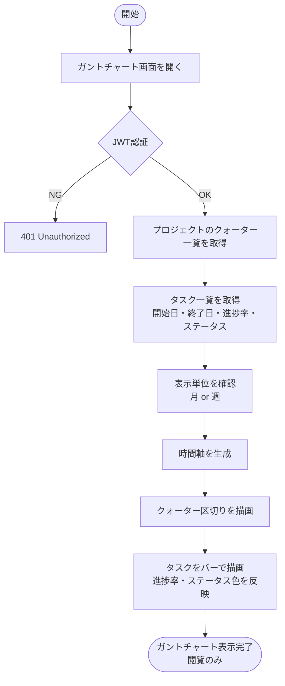
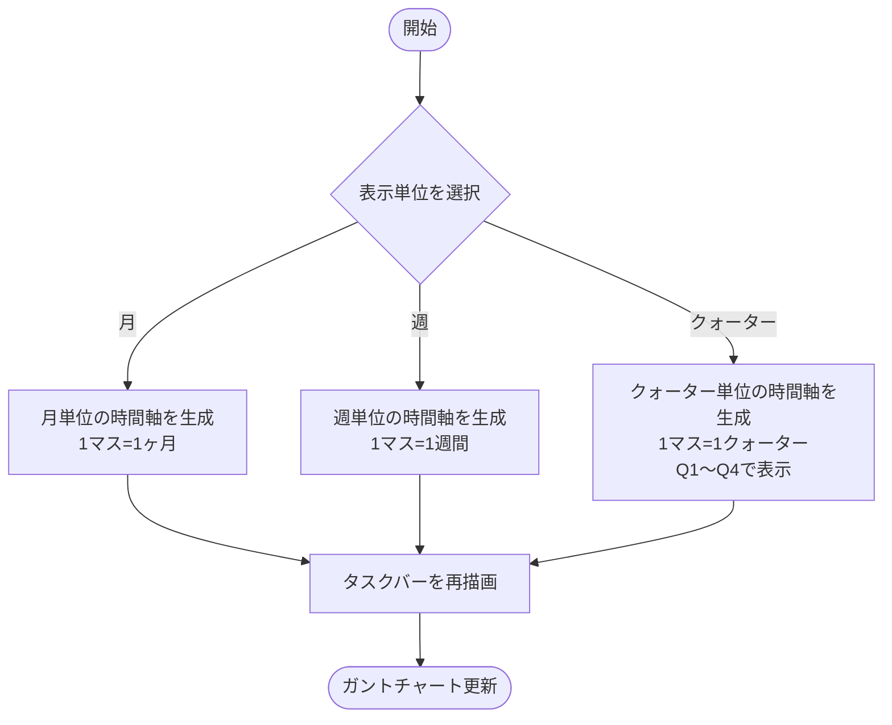
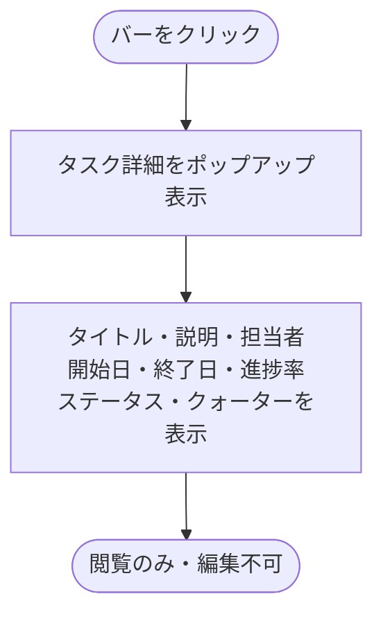
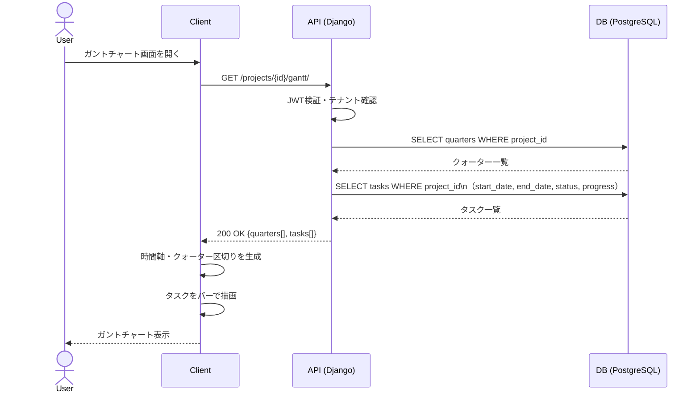
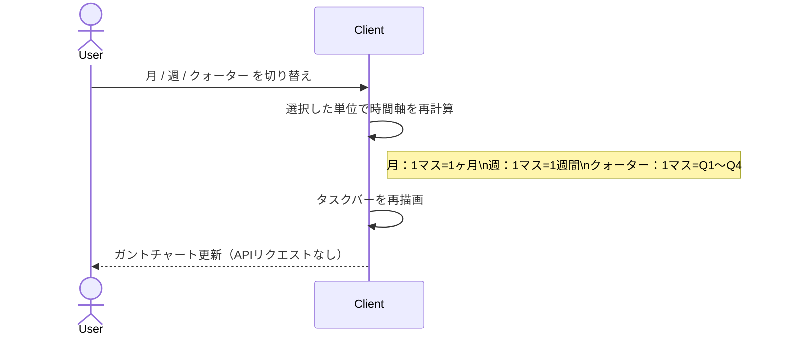
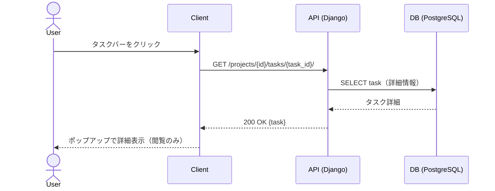

# 機能仕様 07 - ガントチャート

**作成日：** 2026年4月12日  
**バージョン：** 1.1

---

## 1. 機能概要

プロジェクト内のタスクをスケジュール軸で可視化する。閲覧専用のため編集操作は提供しない。クォーターの区切り・進捗率・ステータスをバーで表現し、月・週単位での表示切り替えが可能。

| 項目 | 内容 |
|------|------|
| 対象ユーザー | 全ユーザー（閲覧のみ） |
| 編集操作 | なし（閲覧専用） |
| 表示単位 | 月・週・クォーターの切り替え |
| 表示範囲 | プロジェクト単位 |
| 時間軸 | タスクの開始日〜終了日をバーで表示 |
| クォーター | ガントチャート上部にクォーター区切りを表示 |

### バーの表示仕様

| 要素 | 表示内容 |
|------|---------|
| バー全体 | タスクの開始日〜終了日 |
| バー内の塗り | 進捗率（%）に応じた塗りつぶし |
| バーの色 | ステータスに応じて色分け |
| クォーター区切り | 縦線でクォーター境界を表示 |

### ステータスとバー色の対応

| ステータス | バー色 |
|-----------|--------|
| 未着手 | グレー |
| 進行中 | ブルー |
| レビュー待ち | オレンジ |
| 完了 | グリーン |
| 保留 | レッド |

---

## 2. 処理フロー

### 2-1. ガントチャート表示

### 2-2. 表示単位切り替え

### 2-3. タスク詳細ポップアップ

---

## 3. シーケンス図

### 3-1. ガントチャート初期表示

### 3-2. 表示単位切り替え

### 3-3. タスク詳細ポップアップ

---

## 4. ステップ記述

### 4-1. ガントチャート初期表示

| ステップ | 処理 | 担当 | エラー処理 |
|---------|------|------|-----------|
| 1 | ガントチャート画面を開く | フロントエンド | - |
| 2 | GET /projects/{id}/gantt/ にリクエスト送信 | フロントエンド | - |
| 3 | JWT認証・テナント確認 | バックエンド | 401 Unauthorized |
| 4 | クォーター一覧を取得 | バックエンド | - |
| 5 | タスク一覧を開始日順で取得 | バックエンド | - |
| 6 | クォーター・タスク情報をレスポンスで返却 | バックエンド | - |
| 7 | 時間軸（月単位をデフォルト）を生成 | フロントエンド | - |
| 8 | クォーター区切りを縦線で描画 | フロントエンド | - |
| 9 | タスクをバーで描画（進捗率・ステータス色を反映） | フロントエンド | - |
| 10 | 開始日・終了日が未設定のタスクはバー非表示 | フロントエンド | - |

### 4-2. 表示単位切り替え

| ステップ | 処理 | 担当 | エラー処理 |
|---------|------|------|-----------|
| 1 | 月 / 週 / クォーター の切り替えボタンを押す | フロントエンド | - |
| 2 | 選択した単位で時間軸を再計算（APIリクエストなし） | フロントエンド | - |
| 3 | クォーター選択時はプロジェクトのQ1〜Q4を時間軸として使用 | フロントエンド | クォーター未設定時はメッセージ表示 |
| 4 | タスクバーを新しい時間軸に合わせて再描画 | フロントエンド | - |

### 4-3. タスク詳細ポップアップ

| ステップ | 処理 | 担当 | エラー処理 |
|---------|------|------|-----------|
| 1 | タスクバーをクリック | フロントエンド | - |
| 2 | GET /projects/{id}/tasks/{task_id}/ にリクエスト送信 | フロントエンド | - |
| 3 | タスク詳細を取得 | バックエンド | 404 Not Found |
| 4 | ポップアップでタスク詳細を表示（閲覧のみ・編集ボタンなし） | フロントエンド | - |

---

## 5. APIエンドポイント一覧

| メソッド | エンドポイント | 説明 | 権限 |
|---------|--------------|------|------|
| GET | /projects/{id}/gantt/ | ガントチャート用データ取得（クォーター＋タスク） | メンバー以上 |

※タスク詳細は機能仕様04のエンドポイントを共用
