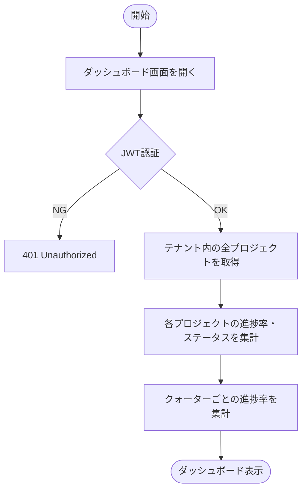
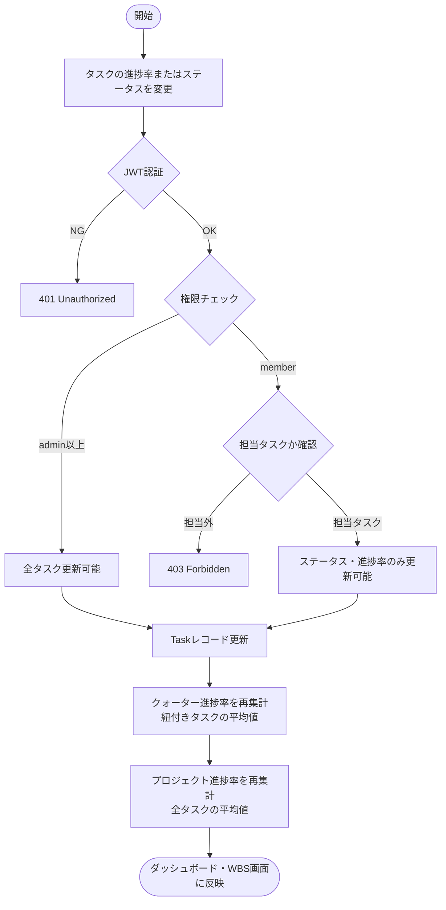
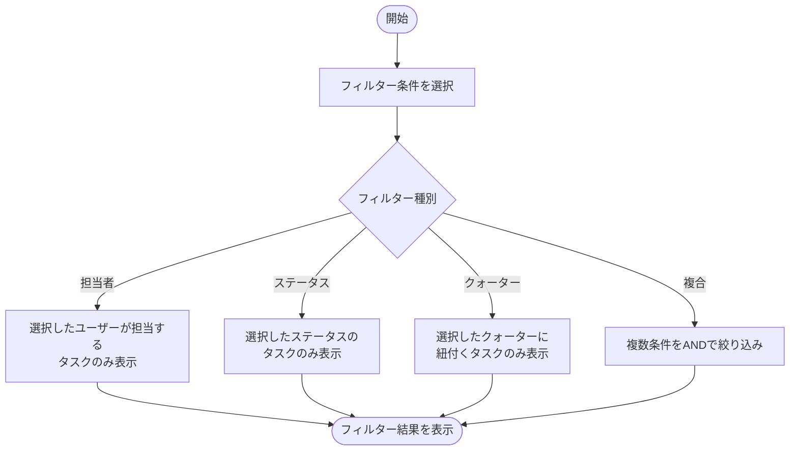
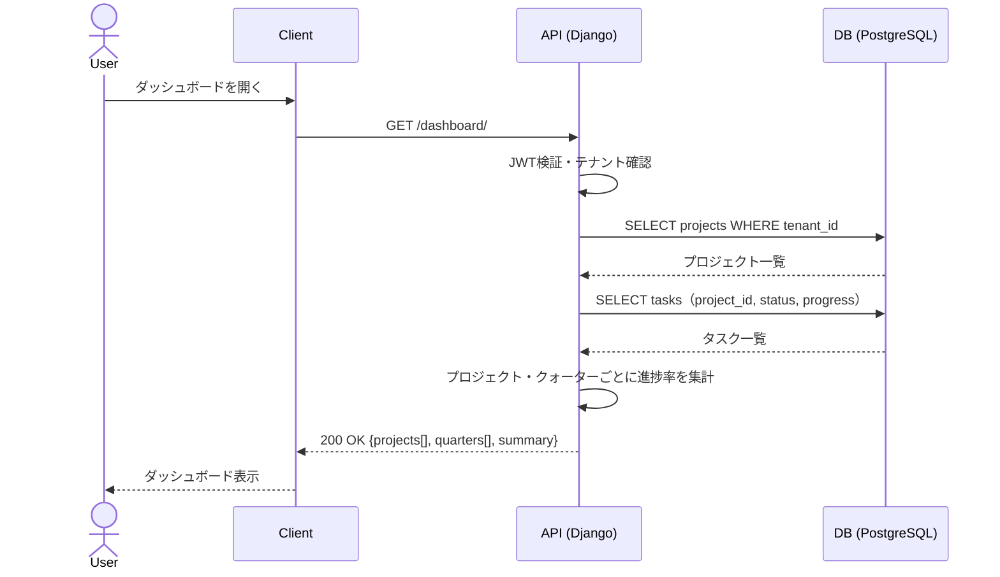
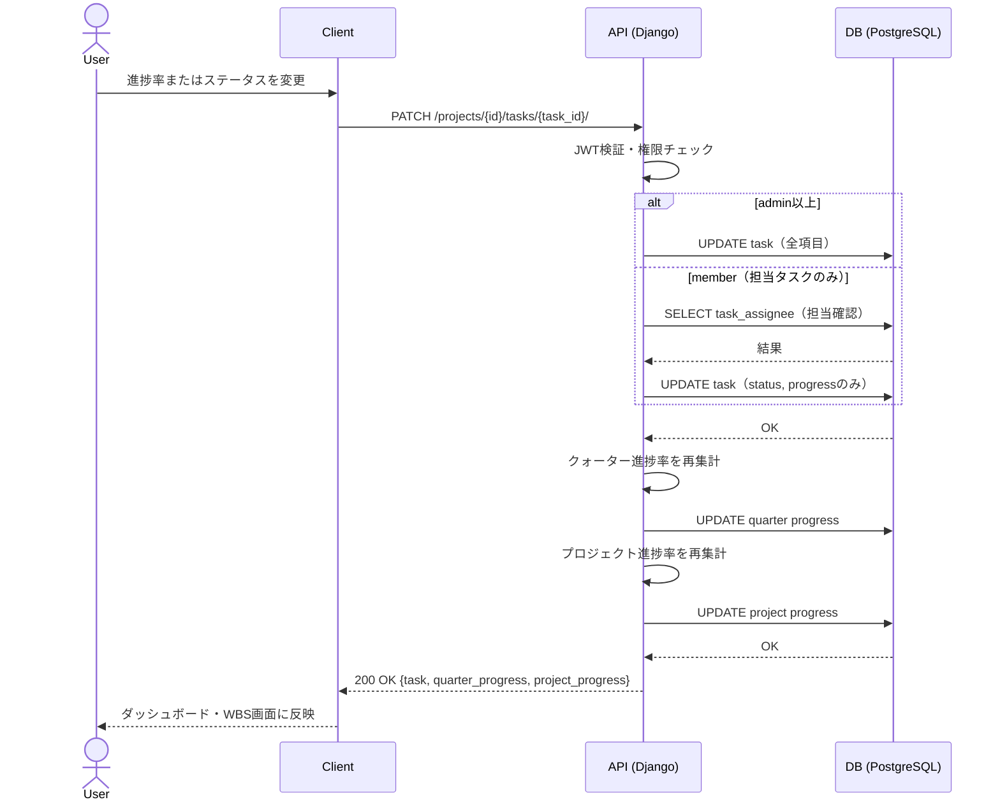
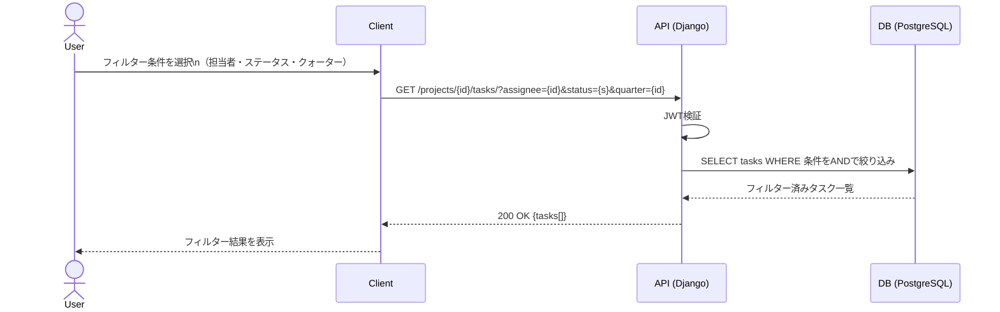

# 機能仕様 08 - 進捗・ステータス管理

**作成日：** 2026年4月12日  
**バージョン：** 1.0

---

## 1. 機能概要

ダッシュボードでテナント内の全プロジェクト・クォーター・タスクの進捗率を一覧表示する。タスクのステータス・進捗率が更新されると、クォーター・プロジェクトの進捗率が自動集計される。担当者・ステータス・クォーターでのフィルタリングも可能。

| 項目 | 内容 |
|------|------|
| 対象ユーザー | 全ユーザー（閲覧）、メンバー以上（進捗・ステータス更新） |
| 集計単位 | タスク → クォーター → プロジェクトの順で自動集計 |
| フィルタリング | 担当者・ステータス・クォーター |
| 更新タイミング | タスク更新時にリアルタイム再集計 |

### 進捗率の集計ロジック

```
タスク進捗率   → ユーザーが手動で入力（0〜100%）
クォーター進捗率 → 紐付きタスクの進捗率の平均値
プロジェクト進捗率 → 全タスクの進捗率の平均値
```

---

## 2. 処理フロー

### 2-1. ダッシュボード表示



### 2-2. タスク進捗率・ステータス更新



### 2-3. フィルタリング



---

## 3. シーケンス図

### 3-1. ダッシュボード表示



### 3-2. タスク進捗率・ステータス更新



### 3-3. フィルタリング



---

## 4. ステップ記述

### 4-1. ダッシュボード表示

| ステップ | 処理 | 担当 | エラー処理 |
|---------|------|------|-----------|
| 1 | ダッシュボード画面を開く | フロントエンド | - |
| 2 | GET /dashboard/ にリクエスト送信 | フロントエンド | - |
| 3 | JWT認証・テナント確認 | バックエンド | 401 Unauthorized |
| 4 | テナント内の全プロジェクトを取得 | バックエンド | - |
| 5 | 各プロジェクトのタスクを取得し進捗率を集計 | バックエンド | - |
| 6 | クォーターごとの進捗率を集計 | バックエンド | - |
| 7 | サマリー情報（完了数・遅延数・進行中数）を集計 | バックエンド | - |
| 8 | ダッシュボードに一覧・グラフで表示 | フロントエンド | - |

### 4-2. タスク進捗率・ステータス更新

| ステップ | 処理 | 担当 | エラー処理 |
|---------|------|------|-----------|
| 1 | タスクの進捗率（0〜100）またはステータスを変更 | フロントエンド | 進捗率は0〜100の数値チェック |
| 2 | PATCH /projects/{id}/tasks/{task_id}/ にリクエスト送信 | フロントエンド | - |
| 3 | JWT認証・権限チェック | バックエンド | 401 / 403 |
| 4 | memberの場合は担当タスクであることを確認 | バックエンド | 403 Forbidden |
| 5 | Taskレコードを更新 | バックエンド | 500 Server Error |
| 6 | 紐付きクォーターの進捗率を平均値で再集計 | バックエンド | - |
| 7 | プロジェクト全体の進捗率を平均値で再集計 | バックエンド | - |
| 8 | ダッシュボード・WBS画面に反映 | フロントエンド | - |

### 4-3. フィルタリング

| ステップ | 処理 | 担当 | エラー処理 |
|---------|------|------|-----------|
| 1 | 担当者・ステータス・クォーターを選択（複数条件可） | フロントエンド | - |
| 2 | クエリパラメータ付きでGETリクエスト送信 | フロントエンド | - |
| 3 | JWT認証 | バックエンド | 401 Unauthorized |
| 4 | 条件をANDで絞り込んでタスクを取得 | バックエンド | - |
| 5 | フィルター結果を表示 | フロントエンド | 結果0件の場合はメッセージ表示 |

---

## 5. ダッシュボード表示項目

### プロジェクトサマリー

| 項目 | 内容 |
|------|------|
| プロジェクト進捗率 | 全タスクの進捗率の平均値（%） |
| タスク数 | 全タスク数 / 完了タスク数 |
| ステータス別件数 | 未着手・進行中・レビュー待ち・完了・保留の件数 |
| 遅延タスク数 | 終了日を過ぎて未完了のタスク数 |

### クォーターサマリー

| 項目 | 内容 |
|------|------|
| クォーター進捗率 | 紐付きタスクの進捗率の平均値（%） |
| クォーター期間 | 開始日〜終了日 |
| タスク数 | クォーター内のタスク数 |

---

## 6. APIエンドポイント一覧

| メソッド | エンドポイント | 説明 | 権限 |
|---------|--------------|------|------|
| GET | /dashboard/ | ダッシュボード情報取得（全プロジェクトサマリー） | 全ユーザー |
| GET | /projects/{id}/dashboard/ | プロジェクト個別ダッシュボード | メンバー以上 |
| GET | /projects/{id}/tasks/ | タスク一覧（フィルタリング対応） | メンバー以上 |
| PATCH | /projects/{id}/tasks/{task_id}/ | タスク進捗率・ステータス更新 | メンバー以上（担当タスクのみ） |
