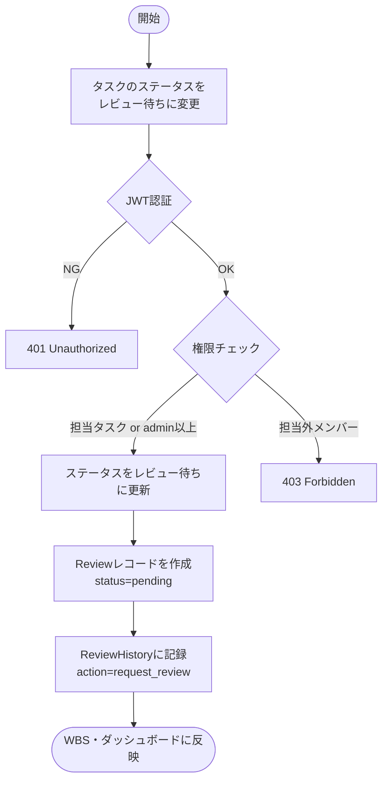
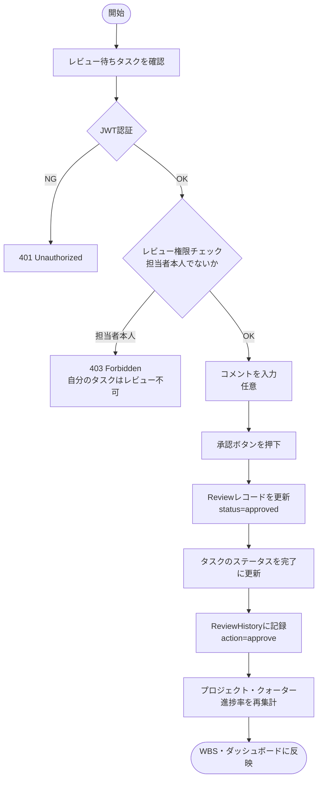
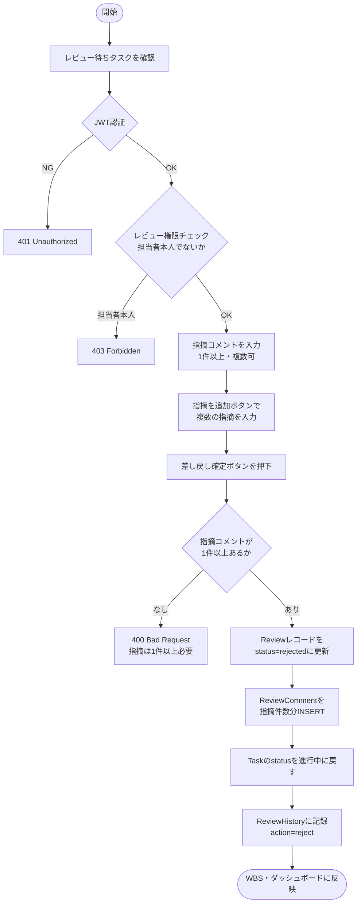
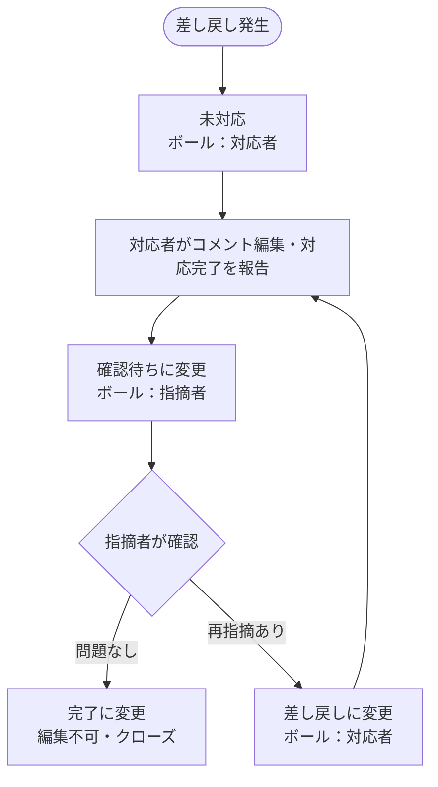
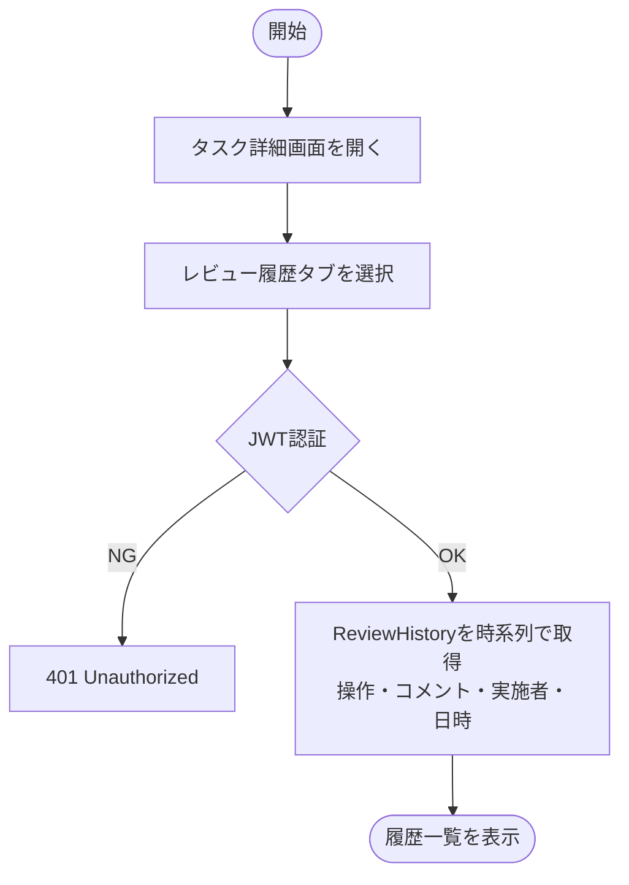
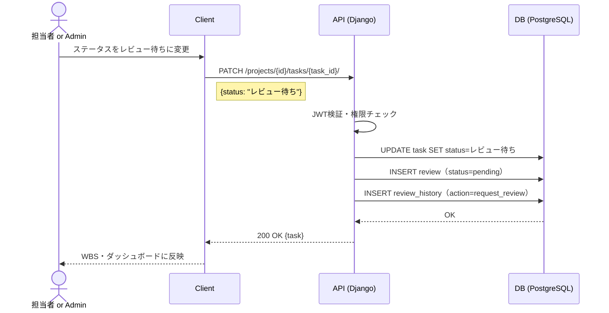
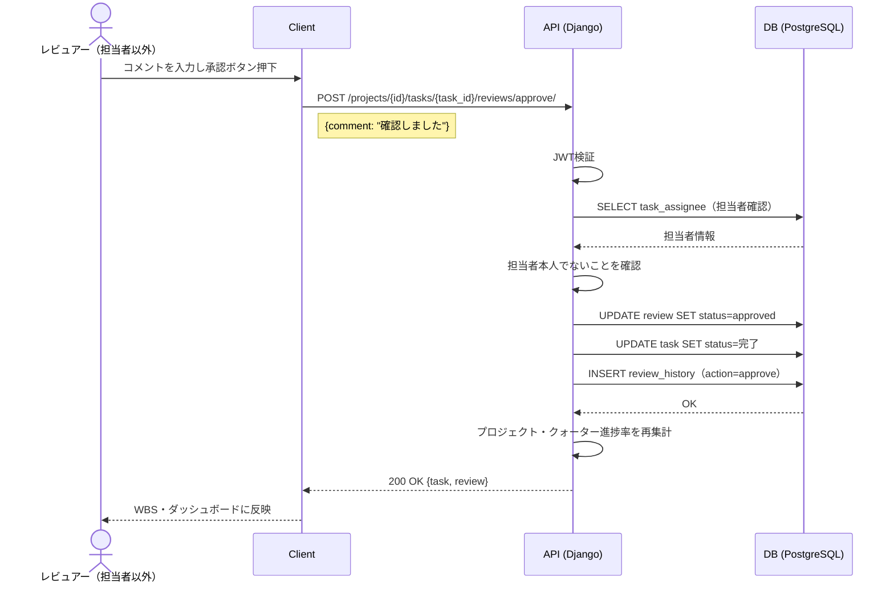
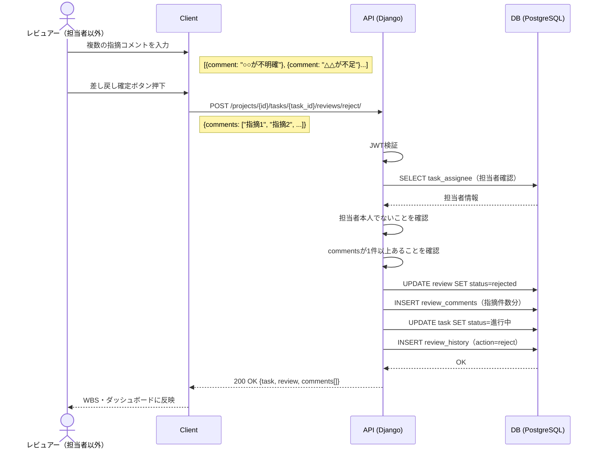
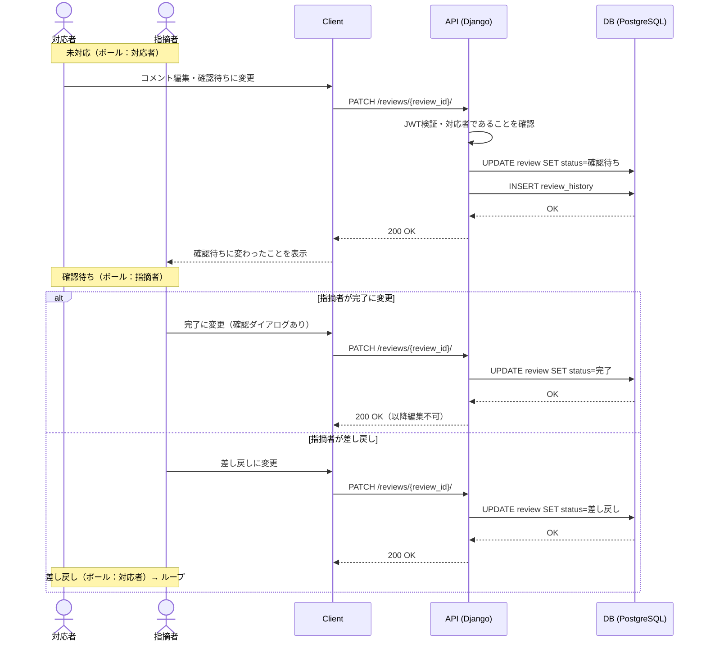
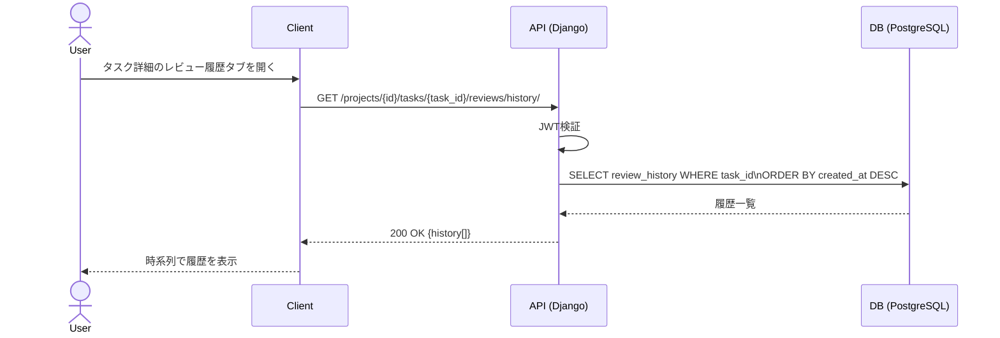

# 機能仕様 09 - レビュー管理

**作成日：** 2026年4月12日  
**バージョン：** 1.4

---

## 1. 機能概要

タスクが「レビュー待ち」ステータスになると、担当者以外のメンバーがレビューを実施できる。承認・差し戻しの操作と、コメントの記入が可能。すべての操作は履歴として記録される。

| 項目 | 内容 |
|------|------|
| 対象ユーザー | 全メンバー（担当者本人を除く）、admin以上（全タスク） |
| レビュー開始条件 | タスクのステータスが「レビュー待ち」になった時点 |
| 承認操作 | タスクを「完了」に移行 |
| 差し戻し操作 | タスクを「進行中」に戻す |
| コメント（承認時） | 任意で1件記入可能 |
| コメント（差し戻し時） | 複数の指摘コメントを入力可能（1コメント=1指摘事項） |
| レビューステータス | 未対応 / 確認待ち / 差し戻し / 完了 |
| コメント編集権限 | 指摘者・対応者の両方が編集可能（レビューが完了になったら編集不可） |
| 編集時の記録 | 編集時に先頭へ「ユーザー名 / 日時」を自動記録 |
| 履歴 | 全操作をReviewHistoryに記録・閲覧可能 |

### レビューフロー

```
差し戻し発生 → 未対応（ボール：対応者）
対応者が対応完了を報告 → 確認待ち（ボール：指摘者）
指摘者が再確認 → 差し戻し（ボール：対応者）← ループ
             → 完了（ボール：なし・クローズ）
```

### レビューステータス定義

| ステータス | ボールの所在 | コメント編集 | 変更できるユーザー |
|-----------|------------|------------|-----------------|
| 未対応 | 対応者 | 編集可 | 対応者 |
| 確認待ち | 指摘者 | 編集可 | 対応者 |
| 差し戻し | 対応者 | 編集可 | 指摘者 |
| 完了 | なし（クローズ） | **編集不可** | 指摘者 |

---

## 2. 処理フロー

### 2-1. レビュー待ちへの移行



### 2-2. 承認



### 2-3. 差し戻し



### 2-4. レビューステータス更新・コメント編集



### 2-5. レビュー履歴確認



---

## 3. シーケンス図

### 3-1. レビュー待ちへの移行



### 3-2. 承認



### 3-3. 差し戻し



### 3-4. レビューステータス更新・コメント編集



### 3-5. レビュー履歴確認



---

## 4. ステップ記述

### 4-1. レビュー待ちへの移行

| ステップ | 処理 | 担当 | エラー処理 |
|---------|------|------|-----------|
| 1 | タスクのステータスをレビュー待ちに変更 | フロントエンド | - |
| 2 | PATCH /projects/{id}/tasks/{task_id}/ にリクエスト送信 | フロントエンド | - |
| 3 | JWT認証・権限チェック（担当タスクまたはadmin以上） | バックエンド | 403 Forbidden |
| 4 | Taskレコードのstatusをレビュー待ちに更新 | バックエンド | 500 Server Error |
| 5 | Reviewレコードを新規作成（status=pending） | バックエンド | - |
| 6 | ReviewHistoryに記録（action=request_review） | バックエンド | - |
| 7 | WBS・ダッシュボードに反映 | フロントエンド | - |

### 4-2. 承認

| ステップ | 処理 | 担当 | エラー処理 |
|---------|------|------|-----------|
| 1 | レビュー待ちタスクのコメントを入力（任意） | フロントエンド | - |
| 2 | 承認ボタンを押下 | フロントエンド | - |
| 3 | POST /projects/{id}/tasks/{task_id}/reviews/approve/ にリクエスト送信 | フロントエンド | - |
| 4 | JWT認証 | バックエンド | 401 Unauthorized |
| 5 | 担当者本人でないことを確認 | バックエンド | 403 Forbidden |
| 6 | Reviewレコードをstatus=approvedに更新 | バックエンド | 500 Server Error |
| 7 | Taskレコードのstatusを完了に更新 | バックエンド | - |
| 8 | ReviewHistoryに記録（action=approve） | バックエンド | - |
| 9 | プロジェクト・クォーター進捗率を再集計 | バックエンド | - |
| 10 | WBS・ダッシュボードに反映 | フロントエンド | - |

### 4-3. 差し戻し

| ステップ | 処理 | 担当 | エラー処理 |
|---------|------|------|-----------|
| 1 | 指摘コメントを入力（1件以上・複数可） | フロントエンド | - |
| 2 | 「指摘を追加」ボタンで入力欄を追加 | フロントエンド | - |
| 3 | 差し戻し確定ボタンを押下 | フロントエンド | 指摘コメント0件の場合はボタンを非活性 |
| 4 | POST /projects/{id}/tasks/{task_id}/reviews/reject/ にリクエスト送信 | フロントエンド | - |
| 5 | JWT認証 | バックエンド | 401 Unauthorized |
| 6 | 担当者本人でないことを確認 | バックエンド | 403 Forbidden |
| 7 | commentsが1件以上あることを確認 | バックエンド | 400 Bad Request |
| 8 | Reviewレコードをstatus=rejectedに更新 | バックエンド | 500 Server Error |
| 9 | ReviewCommentを指摘件数分INSERT | バックエンド | - |
| 10 | Taskレコードのstatusを進行中に戻す | バックエンド | - |
| 11 | ReviewHistoryに記録（action=reject） | バックエンド | - |
| 12 | WBS・ダッシュボードに反映 | フロントエンド | - |

### 4-4. レビューステータス更新・コメント編集

| ステップ | 処理 | 担当 | エラー処理 |
|---------|------|------|-----------|
| 1 | レビューのステータスを変更 または コメント本文を編集 | フロントエンド | 完了の場合は編集欄・ボタンを非表示 |
| 2 | PATCH /reviews/{review_id}/ にリクエスト送信 | フロントエンド | - |
| 3 | JWT認証 | バックエンド | 401 Unauthorized |
| 4 | レビューが完了でないことを確認 | バックエンド | 403 Forbidden（編集不可） |
| 5 | 指摘者または対応者であることを確認 | バックエンド | 403 Forbidden |
| 6 | コメント本文編集の場合、先頭に「ユーザー名 日時」を自動付与 | バックエンド | - |
| 7 | 完了への変更の場合、確認ダイアログを表示 | フロントエンド | キャンセル時は何もしない |
| 8 | Reviewレコードのステータスを更新 | バックエンド | 500 Server Error |
| 9 | ReviewHistoryに記録 | バックエンド | - |
| 10 | レビュー一覧に反映 | フロントエンド | - |

### 4-5. レビュー履歴確認

| ステップ | 処理 | 担当 | エラー処理 |
|---------|------|------|-----------|
| 1 | タスク詳細画面のレビュー履歴タブを開く | フロントエンド | - |
| 2 | GET /projects/{id}/tasks/{task_id}/reviews/history/ にリクエスト送信 | フロントエンド | - |
| 3 | JWT認証 | バックエンド | 401 Unauthorized |
| 4 | ReviewHistoryを作成日時の降順で取得 | バックエンド | - |
| 5 | 時系列で履歴一覧を表示（操作・コメント・実施者・日時） | フロントエンド | 履歴なしの場合はメッセージ表示 |

---

## 5. レビューステータス定義

| ステータス | ボールの所在 | コメント編集 | 変更できるユーザー |
|-----------|------------|------------|-----------------|
| 未対応 | 対応者 | 編集可 | 対応者 |
| 確認待ち | 指摘者 | 編集可 | 対応者 |
| 差し戻し | 対応者 | 編集可 | 指摘者 |
| 完了 | なし（クローズ） | **編集不可** | 指摘者 |

**ループの流れ**

```
未対応（対応者）→ 確認待ち（指摘者）→ 差し戻し（対応者）→ 確認待ち → ...→ 完了
```

### コメント本文の編集履歴フォーマット

編集するたびに先頭へ自動追記される：

```
山田太郎 2026-04-12 10:30
（編集後の本文）

鈴木花子 2026-04-11 15:00
（初回の本文）
```

---

## 6. APIエンドポイント一覧

| メソッド | エンドポイント | 説明 | 権限 |
|---------|--------------|------|------|
| GET | /projects/{id}/tasks/{task_id}/reviews/ | レビュー情報取得 | メンバー以上 |
| POST | /projects/{id}/tasks/{task_id}/reviews/approve/ | 承認（コメント任意・1件） | メンバー以上（担当者以外） |
| POST | /projects/{id}/tasks/{task_id}/reviews/reject/ | 差し戻し（指摘コメント複数・1件以上必須） | メンバー以上（担当者以外） |
| PATCH | /projects/{id}/tasks/{task_id}/reviews/{review_id}/ | レビューステータス更新・コメント編集 | 指摘者 or 対応者（完了は不可） |
| GET | /projects/{id}/tasks/{task_id}/reviews/history/ | レビュー履歴取得 | メンバー以上 |
