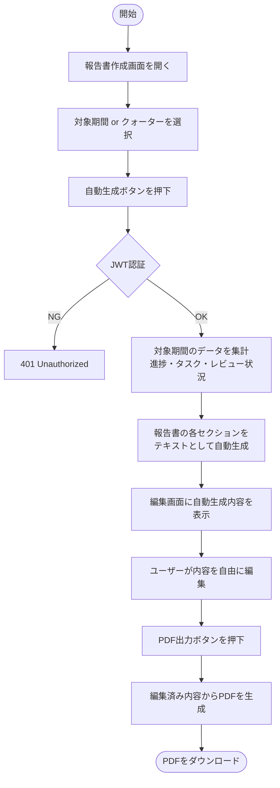
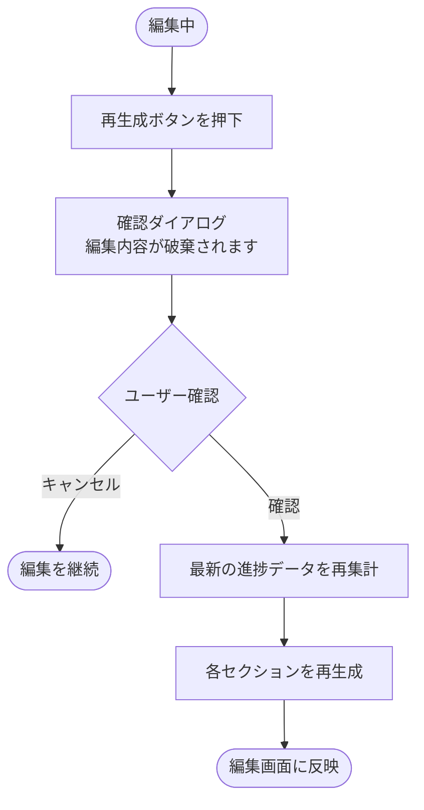
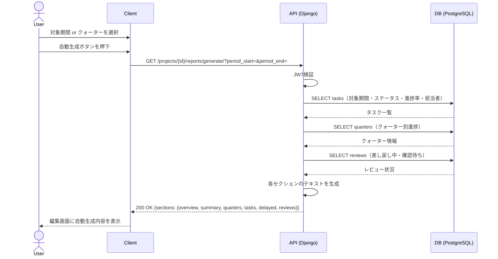
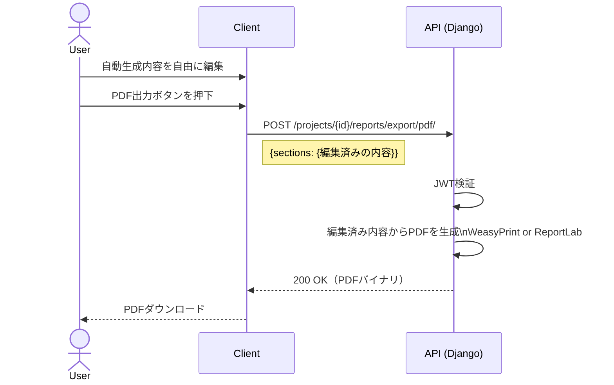

# 機能仕様 10 - 報告書管理

**作成日：** 2026年4月12日  
**バージョン：** 2.0

---

## 1. 機能概要

プロジェクトの進捗データをもとに報告書の内容を自動生成し、ユーザーが手動で編集してPDFとして出力する。DBへの保存は行わない。

| 項目 | 内容 |
|------|------|
| 対象ユーザー | admin以上（作成・編集・出力）、メンバー（閲覧・出力） |
| 出力形式 | PDFのみ |
| DB保存 | なし（都度生成） |
| 定期自動作成 | なし |
| 自動生成内容 | 対象期間を指定すると進捗データを自動で埋め込む |
| 編集 | 自動生成された内容をユーザーが自由に編集可能 |

### 報告書の自動生成セクション

| セクション | 自動生成内容 |
|-----------|------------|
| プロジェクト概要 | 名前・期間・メンバー数 |
| 進捗サマリー | プロジェクト全体の進捗率・ステータス別タスク数 |
| クォーター別進捗 | 各クォーターの進捗率・タスク数 |
| タスク一覧 | 対象期間のタスク・ステータス・担当者・進捗率 |
| 遅延タスク | 終了日超過の未完了タスク一覧 |
| レビュー状況 | 差し戻し中・確認待ちのレビュー一覧 |

---

## 2. 処理フロー

### 2-1. 報告書作成（自動生成 → 手動編集 → PDF出力）

### 2-2. 再生成（編集内容を破棄して再取得）

---

## 3. シーケンス図

### 3-1. 報告書自動生成

### 3-2. 手動編集 → PDF出力

---

## 4. ステップ記述

### 4-1. 報告書自動生成

| ステップ | 処理 | 担当 | エラー処理 |
|---------|------|------|-----------|
| 1 | 報告書作成画面を開く | フロントエンド | - |
| 2 | 対象期間（開始日・終了日）またはクォーターを選択 | フロントエンド | 必須チェック |
| 3 | 自動生成ボタンを押下 | フロントエンド | - |
| 4 | GET /projects/{id}/reports/generate/ にリクエスト送信 | フロントエンド | - |
| 5 | JWT認証 | バックエンド | 401 Unauthorized |
| 6 | 対象期間のタスク・クォーター・レビューデータを集計 | バックエンド | - |
| 7 | 各セクションのテキストを生成してレスポンスで返却 | バックエンド | 500 Server Error |
| 8 | 編集画面に自動生成内容を表示 | フロントエンド | - |

### 4-2. 手動編集 → PDF出力

| ステップ | 処理 | 担当 | エラー処理 |
|---------|------|------|-----------|
| 1 | 自動生成された各セクションの内容を自由に編集 | フロントエンド | - |
| 2 | PDF出力ボタンを押下 | フロントエンド | - |
| 3 | POST /projects/{id}/reports/export/pdf/ に編集済み内容を送信 | フロントエンド | - |
| 4 | JWT認証 | バックエンド | 401 Unauthorized |
| 5 | 送信された内容からPDFを生成 | バックエンド | 500 Server Error |
| 6 | PDFバイナリをレスポンスで返却 | バックエンド | - |
| 7 | ブラウザでPDFをダウンロード | フロントエンド | - |

### 4-3. 再生成

| ステップ | 処理 | 担当 | エラー処理 |
|---------|------|------|-----------|
| 1 | 再生成ボタンを押下 | フロントエンド | - |
| 2 | 確認ダイアログを表示（編集内容が破棄される旨の警告） | フロントエンド | キャンセル時は何もしない |
| 3 | 確認後、自動生成リクエストを再送信 | フロントエンド | - |
| 4 | 最新の進捗データで各セクションを再生成 | バックエンド | - |
| 5 | 編集画面に反映（編集内容は上書き） | フロントエンド | - |

---

## 5. APIエンドポイント一覧

| メソッド | エンドポイント | 説明 | 権限 |
|---------|--------------|------|------|
| GET | /projects/{id}/reports/generate/ | 報告書内容の自動生成（DB保存なし） | メンバー以上 |
| POST | /projects/{id}/reports/export/pdf/ | 編集済み内容からPDF出力 | メンバー以上 |
