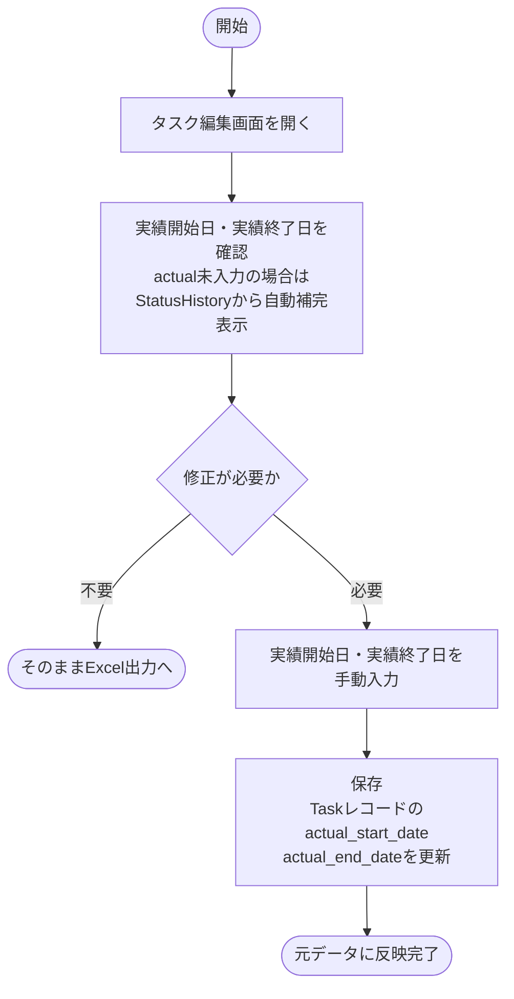
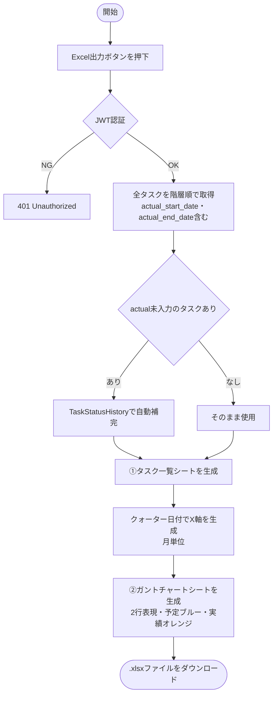
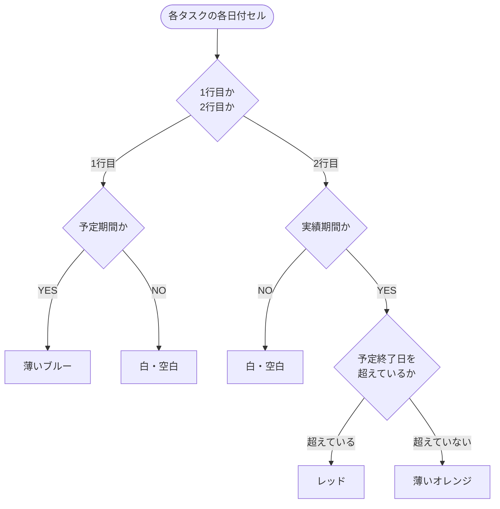
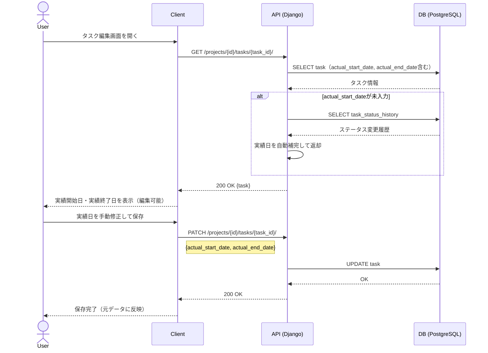
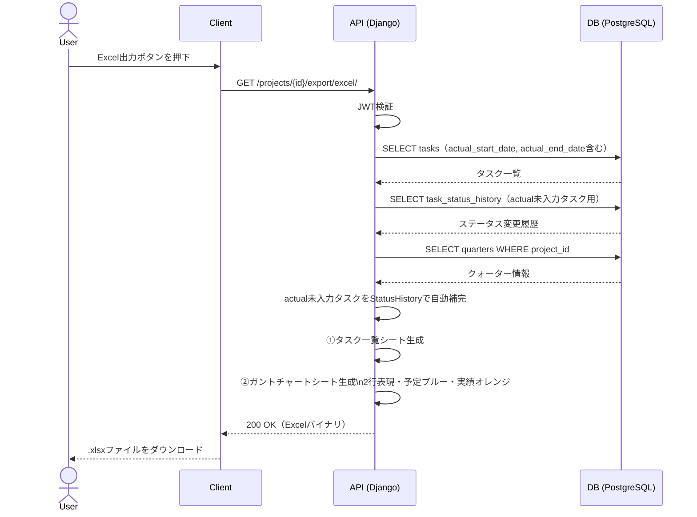

# 機能仕様 11 - WBS Excel出力

**作成日：** 2026年4月12日  
**バージョン：** 1.4

---

## 1. 機能概要

WBSのタスク情報をExcel（.xlsx）形式でエクスポートする。実績期間はTaskStatusHistoryから自動取得するが、タスク編集画面（元データ）で実績開始日・実績終了日を手動で上書きできる。Excelはその値をそのまま反映して生成する。

| 項目 | 内容 |
|------|------|
| 対象ユーザー | 全ユーザー |
| 出力形式 | Excel（.xlsx）のみ |
| 出力単位 | プロジェクト全体 / クォーター単位 |
| シート構成 | ①タスク一覧シート ②ガントチャートシート |
| DB保存 | なし（都度生成） |
| 使用ライブラリ | openpyxl |
| 実績日の編集 | アプリのタスク編集画面（元データ）で手動編集・保存 |

### 実績期間の取得・優先順位

| 優先度 | 内容 |
|--------|------|
| ① 手動入力値（優先） | タスク編集画面で保存したactual_start_date・actual_end_date |
| ② 自動取得（フォールバック） | TaskStatusHistoryの「進行中」になった日・「完了」になった日 |

---

## 2. シート仕様

### ① タスク一覧シート

| カラム | 内容 |
|--------|------|
| No. | 階層番号（例：1.1.2） |
| タスク名 | 階層に応じてインデントで表現 |
| 担当者 | 担当者名（複数はカンマ区切り） |
| 予定開始日 | start_date |
| 予定終了日 | end_date |
| 実績開始日 | actual_start_date（未入力時はStatusHistoryから補完） |
| 実績終了日 | actual_end_date（未入力時はStatusHistoryから補完） |
| 工数（時間） | estimated_hours |
| ステータス | 現在のステータス |
| 進捗率 | 0〜100% |
| クォーター | 紐付きクォーター名 |

### ② ガントチャートシート

タスク1件につき **2行** で表現する。X軸はクォーターの日付（月単位）。

```
           | Q1（1月〜3月）         | Q2（4月〜6月）         |
           | 1月  | 2月  | 3月  | 4月  | 5月  | 6月  |
タスクA 予定| ████ | ████ |      |      |      |      |  ← 薄いブルー
        実績|      | ░░░░ | ░░░░ |      |      |      |  ← 薄いオレンジ
タスクB 予定|      |      | ████ | ████ |      |      |
        実績|      |      |      | ░░░░ | ░░░░ |██████|  ← 遅延部分レッド
```

| 行 | 内容 | 色 | カラーコード |
|----|------|-----|------------|
| 1行目（予定） | start_date 〜 end_date | 薄いブルー | #BDD7EE |
| 2行目（実績） | actual_start_date 〜 actual_end_date | 薄いオレンジ | #FFD966 |
| 遅延（予定終了日を実績が超える） | 超過した部分のセル | レッド | #FF4C4C |
| クォーターヘッダー | - | ネイビー | #1F4E79 |

---

## 3. 処理フロー

### 3-1. 実績日の手動編集（タスク編集画面・元データ）



### 3-2. Excel出力



### 3-3. セル色の判定ロジック



---

## 4. シーケンス図

### 4-1. 実績日の手動編集



### 4-2. Excel生成・ダウンロード



---

## 5. ステップ記述

### 5-1. 実績日の手動編集

| ステップ | 処理 | 担当 | エラー処理 |
|---------|------|------|-----------|
| 1 | タスク編集画面を開く | フロントエンド | - |
| 2 | actual未入力の場合、TaskStatusHistoryから自動補完して表示 | バックエンド | - |
| 3 | 実績開始日・実績終了日を手動で修正（任意） | フロントエンド | - |
| 4 | PATCH /projects/{id}/tasks/{task_id}/ にリクエスト送信 | フロントエンド | - |
| 5 | Taskレコードのactual_start_date・actual_end_dateを更新 | バックエンド | 500 Server Error |
| 6 | 元データに反映完了 | フロントエンド | - |

### 5-2. Excel生成・ダウンロード

| ステップ | 処理 | 担当 | エラー処理 |
|---------|------|------|-----------|
| 1 | Excel出力ボタンを押下 | フロントエンド | - |
| 2 | GET /projects/{id}/export/excel/ にリクエスト送信 | フロントエンド | - |
| 3 | JWT認証 | バックエンド | 401 Unauthorized |
| 4 | 全タスクをactual_start/end含めて取得 | バックエンド | - |
| 5 | actual未入力タスクはTaskStatusHistoryで自動補完 | バックエンド | - |
| 6 | ①タスク一覧シートを生成 | バックエンド | 500 Server Error |
| 7 | クォーター日付でX軸を生成（月単位） | バックエンド | クォーター未設定時はプロジェクト期間で代替 |
| 8 | ②ガントチャートシートを2行表現で生成 | バックエンド | - |
| 9 | 1行目（予定）：薄いブルーでセルを塗る | バックエンド | - |
| 10 | 2行目（実績）：薄いオレンジ（遅延部分はレッド）でセルを塗る | バックエンド | - |
| 11 | Excelバイナリをレスポンスで返却 | バックエンド | - |
| 12 | .xlsxファイルをダウンロード | フロントエンド | - |

---

## 6. ファイル名仕様

```
{プロジェクト名}_WBS_{出力日}.xlsx
例）ECサイト開発_WBS_20260412.xlsx

クォーター指定時：
{プロジェクト名}_WBS_{クォーター名}_{出力日}.xlsx
例）ECサイト開発_WBS_Q1_20260412.xlsx
```

---

## 7. データモデルへの追加

| テーブル | 追加カラム | 説明 |
|---------|-----------|------|
| Task | actual_start_date | 実績開始日（手動入力・NULLの場合はStatusHistoryで補完） |
| Task | actual_end_date | 実績終了日（手動入力・NULLの場合はStatusHistoryで補完） |
| TaskStatusHistory | id, task_id, status, changed_at, changed_by | ステータス変更時に自動記録 |

---

## 8. APIエンドポイント一覧

| メソッド | エンドポイント | 説明 | 権限 |
|---------|--------------|------|------|
| GET | /projects/{id}/export/excel/ | WBS全体のExcel出力（2シート） | 全ユーザー |
| GET | /projects/{id}/export/excel/?quarter_id={id} | クォーター単位のExcel出力 | 全ユーザー |

※実績日の編集は機能仕様04のタスク編集エンドポイント（PATCH /tasks/{id}/）を使用
