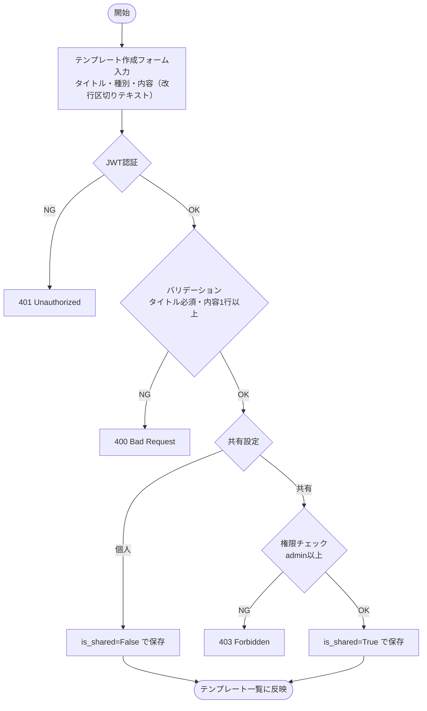
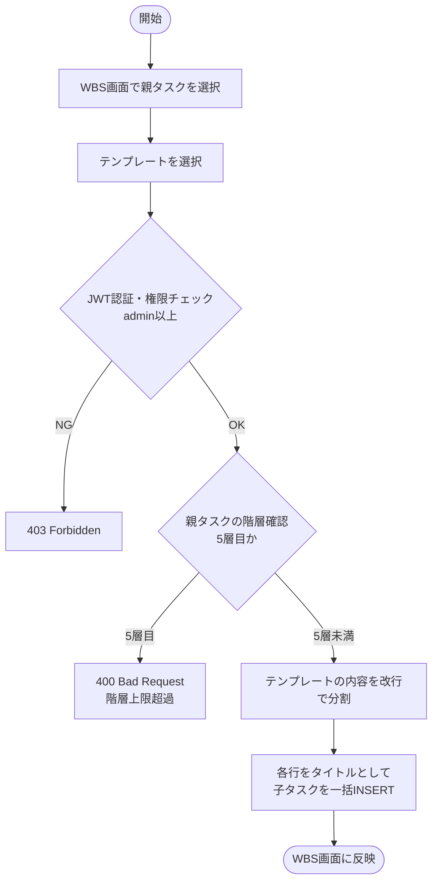
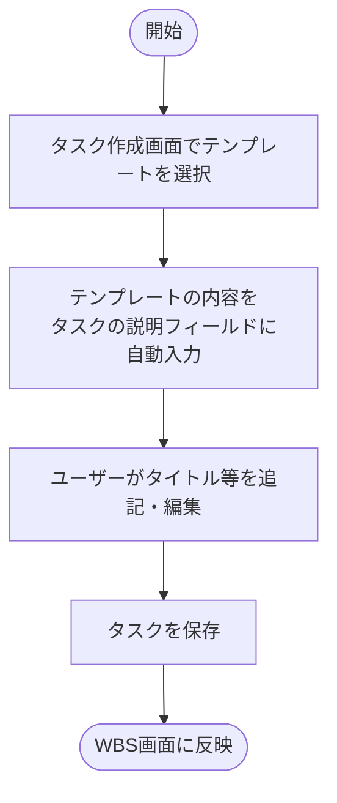
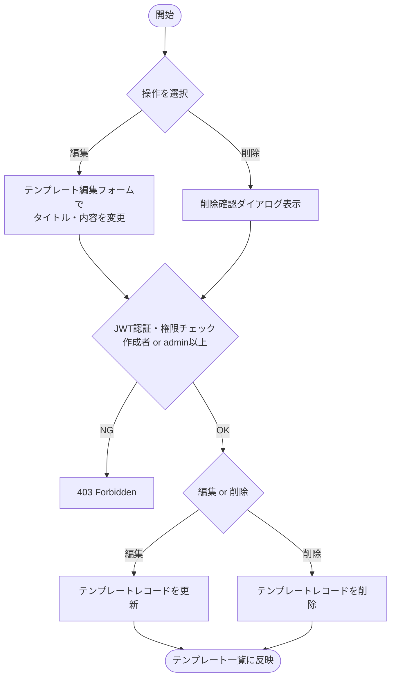
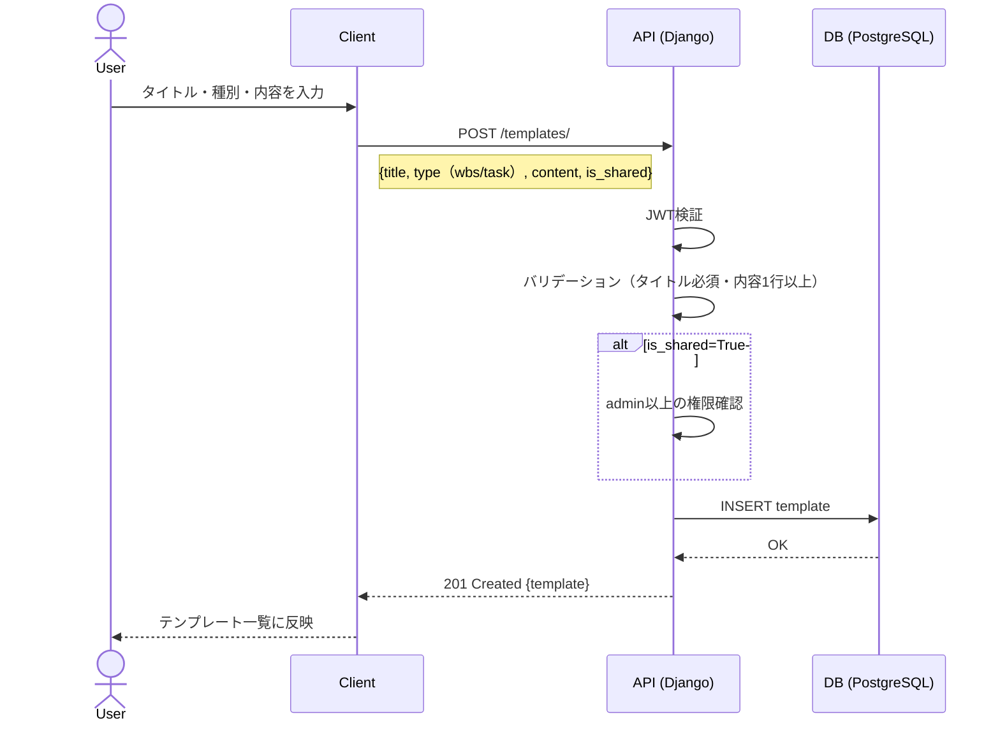
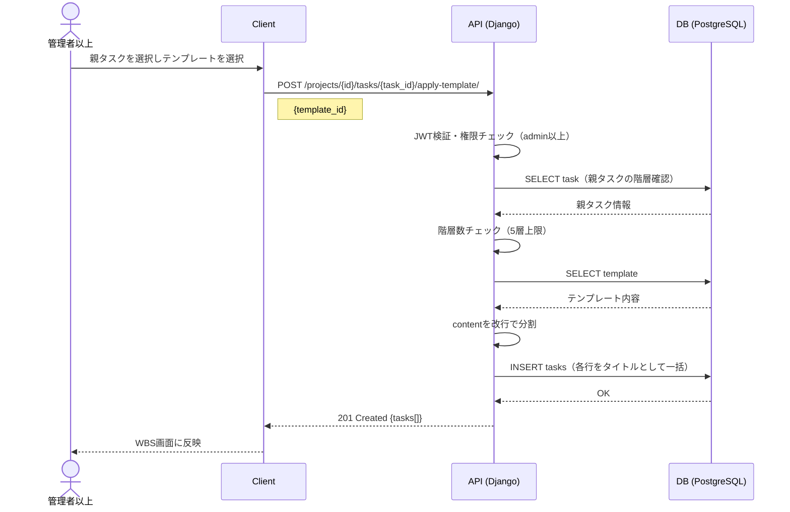
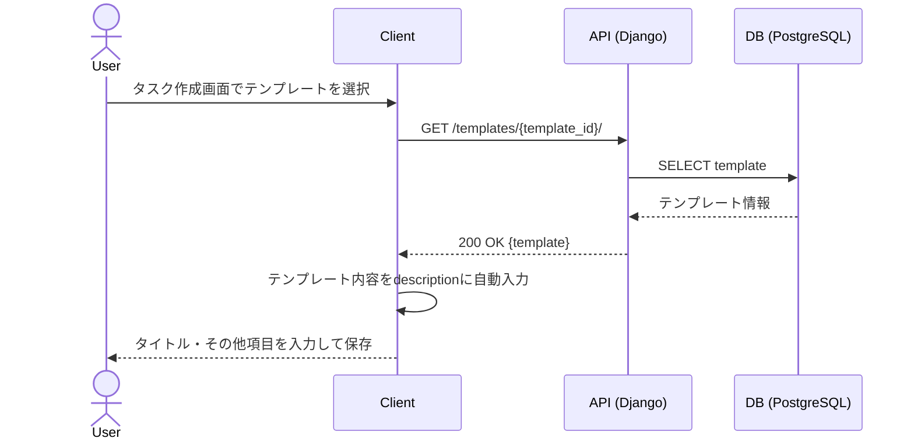

# 機能仕様 12 - テンプレート管理

**作成日：** 2026年4月12日  
**バージョン：** 1.0

---

## 1. 機能概要

WBSの子タスク一括生成テンプレートと、タスク（Issue形式）のテンプレートを管理する。テンプレートは改行区切りのテキストで定義し、プロジェクト横断で再利用できる。管理者が作成したテンプレートはチーム全体で共有可能。

| 項目 | 内容 |
|------|------|
| 対象ユーザー | 全ユーザー（作成・利用）、管理者以上（共有設定） |
| テンプレート種別 | ① WBSテンプレート ② タスクテンプレート（Issue形式） |
| 保存形式 | 改行区切りのテキスト（対応内容のみ） |
| スコープ | 個人テンプレート（自分のみ）/ 共有テンプレート（チーム全体） |

---

## 2. テンプレート種別

### ① WBSテンプレート（直下1層一括生成）

選択したタスクの直下1層分の子タスクを一括生成する。

**テンプレート例：**
```
フロントエンド実装
バックエンド実装
テスト確認
レビュー依頼
```

- 改行ごとに1タスクとして生成
- 適用すると選択タスクの子として一括追加
- タイトルのみ生成（他項目は空欄・後から個別編集）

### ② タスクテンプレート（Issue形式）

テンプレートを選択してタスクを1件作成する。

**テンプレート例：**
```
仕様確認
実装
動作確認
レビュー依頼
```

- 改行ごとに1項目として認識
- タスクの説明フィールドにそのまま格納

---

## 3. 処理フロー

### 3-1. テンプレート作成



### 3-2. WBSテンプレート適用（子タスク一括生成）



### 3-3. タスクテンプレート適用（Issue形式）



### 3-4. テンプレート編集・削除



---

## 4. シーケンス図

### 4-1. テンプレート作成



### 4-2. WBSテンプレート適用



### 4-3. タスクテンプレート適用



---

## 5. ステップ記述

### 5-1. テンプレート作成

| ステップ | 処理 | 担当 | エラー処理 |
|---------|------|------|-----------|
| 1 | タイトル・種別（WBS/タスク）・内容（改行区切り）を入力 | フロントエンド | タイトル・内容の必須チェック |
| 2 | 共有設定（個人/チーム共有）を選択 | フロントエンド | - |
| 3 | POST /templates/ にリクエスト送信 | フロントエンド | - |
| 4 | JWT認証 | バックエンド | 401 Unauthorized |
| 5 | is_shared=Trueの場合はadmin以上の権限を確認 | バックエンド | 403 Forbidden |
| 6 | バリデーション（タイトル必須・内容1行以上） | バックエンド | 400 Bad Request |
| 7 | テンプレートレコードを作成 | バックエンド | 500 Server Error |
| 8 | テンプレート一覧に反映 | フロントエンド | - |

### 5-2. WBSテンプレート適用

| ステップ | 処理 | 担当 | エラー処理 |
|---------|------|------|-----------|
| 1 | WBS画面で親タスクを選択しテンプレートを選択 | フロントエンド | - |
| 2 | POST /projects/{id}/tasks/{task_id}/apply-template/ にリクエスト送信 | フロントエンド | - |
| 3 | JWT認証・権限チェック（admin以上） | バックエンド | 403 Forbidden |
| 4 | 親タスクの階層数を確認（5層上限） | バックエンド | 400（階層超過） |
| 5 | テンプレートのcontentを改行で分割 | バックエンド | - |
| 6 | 各行をタイトルとして子タスクを一括INSERT | バックエンド | 500 Server Error |
| 7 | WBS画面に新しい子タスクを反映 | フロントエンド | - |

### 5-3. タスクテンプレート適用

| ステップ | 処理 | 担当 | エラー処理 |
|---------|------|------|-----------|
| 1 | タスク作成画面でテンプレートを選択 | フロントエンド | - |
| 2 | GET /templates/{template_id}/ にリクエスト送信 | フロントエンド | - |
| 3 | テンプレート内容を取得 | バックエンド | 404 Not Found |
| 4 | テンプレート内容をdescriptionフィールドに自動入力 | フロントエンド | - |
| 5 | タイトル・その他項目を入力してタスクを保存 | フロントエンド | - |

### 5-4. テンプレート削除

| ステップ | 処理 | 担当 | エラー処理 |
|---------|------|------|-----------|
| 1 | 削除ボタンを押下 | フロントエンド | - |
| 2 | 確認ダイアログを表示 | フロントエンド | キャンセル時は何もしない |
| 3 | DELETE /templates/{template_id}/ にリクエスト送信 | フロントエンド | - |
| 4 | JWT認証・権限チェック（作成者 or admin以上） | バックエンド | 403 Forbidden |
| 5 | テンプレートレコードを削除 | バックエンド | 500 Server Error |
| 6 | テンプレート一覧に反映 | フロントエンド | - |

---

## 6. APIエンドポイント一覧

| メソッド | エンドポイント | 説明 | 権限 |
|---------|--------------|------|------|
| GET | /templates/ | テンプレート一覧取得（個人＋共有） | 全ユーザー |
| POST | /templates/ | テンプレート作成 | 全ユーザー（共有はadmin以上） |
| GET | /templates/{id}/ | テンプレート詳細取得 | 全ユーザー |
| PUT | /templates/{id}/ | テンプレート編集 | 作成者 or admin以上 |
| DELETE | /templates/{id}/ | テンプレート削除 | 作成者 or admin以上 |
| POST | /projects/{id}/tasks/{task_id}/apply-template/ | WBSテンプレート適用（子タスク一括生成） | admin以上 |
