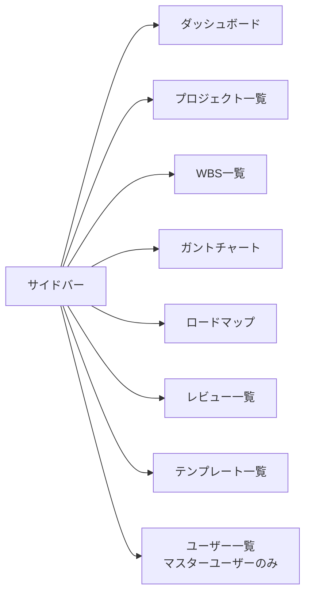
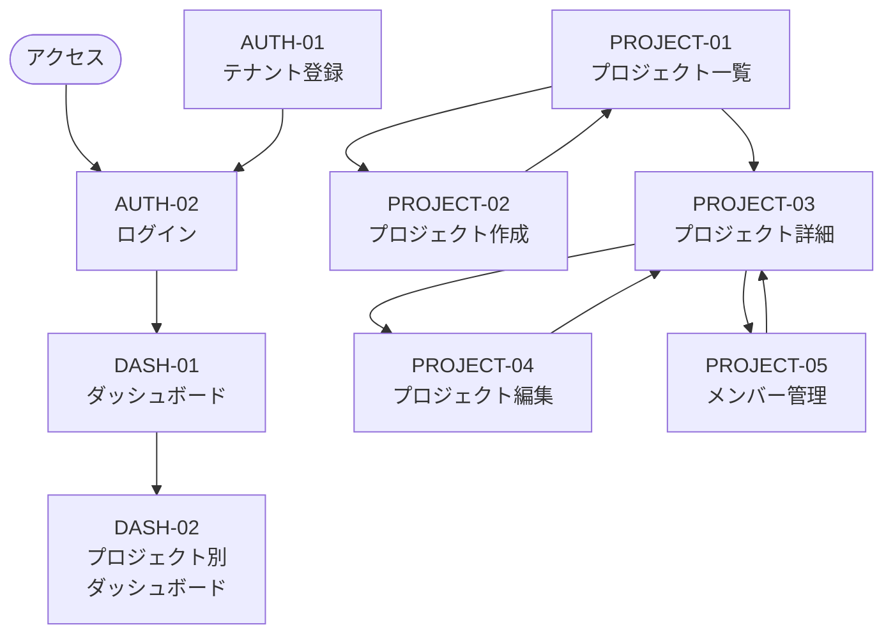
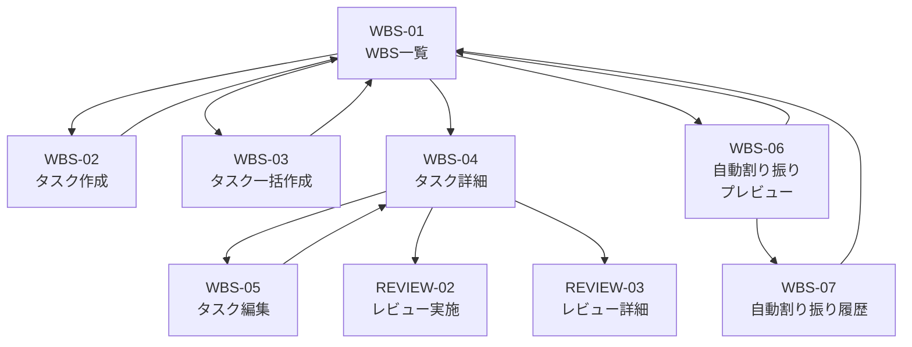
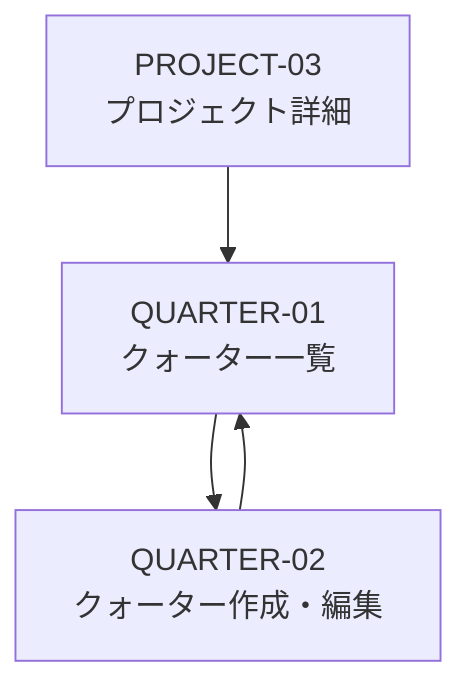
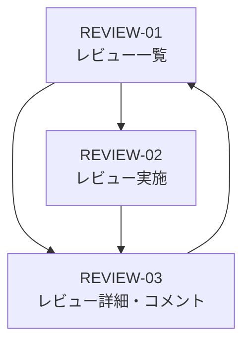
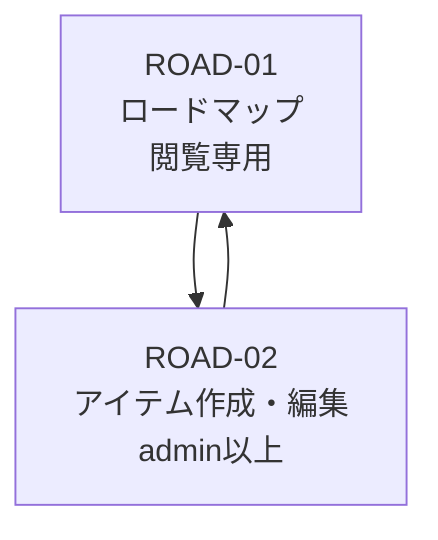
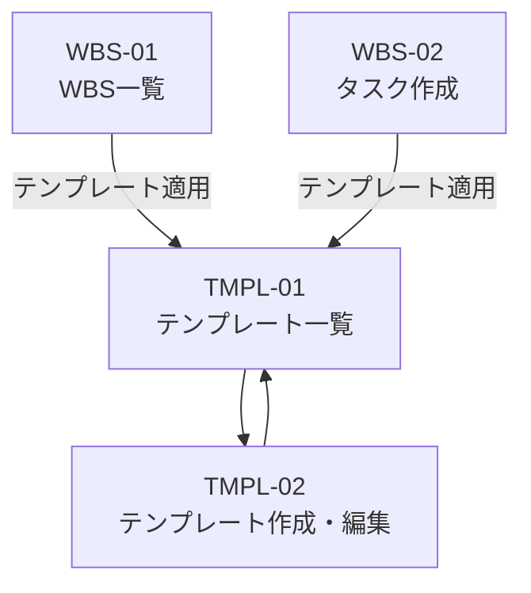
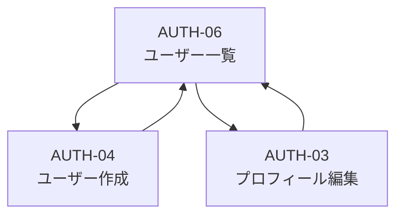
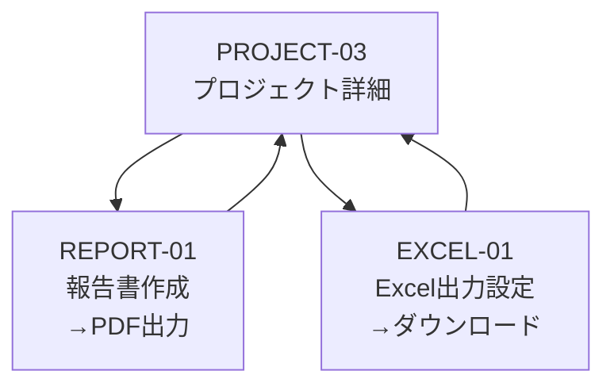

# 画面遷移図

**作成日：** 2026年4月12日  
**バージョン：** 1.0

---

## 1. サイドバーナビゲーション

ログイン後、全画面でサイドバーが表示される。サイドバーから各一覧画面へ直接遷移できる。

---

## 2. 全体遷移図

---

## 3. WBS・タスク管理

---

## 4. クォーター管理

---

## 5. レビュー管理

---

## 6. ロードマップ

---

## 7. テンプレート管理

---

## 8. ユーザー管理

---

## 9. 報告書・Excel出力

---

## 10. 遷移ルール

| ルール | 内容 |
|--------|------|
| 未ログイン | ログイン画面（AUTH-02）に強制リダイレクト |
| ログイン後のトップ | ダッシュボード（DASH-01） |
| サイドバー | 全画面で常に表示。各一覧画面へ直接遷移可能 |
| CRUD遷移 | 作成・編集・削除はすべて一覧画面を経由する |
| 権限不足 | 403画面を表示して前の画面に戻る |
| ブラウザバック | 前の画面に戻る（モーダルはモーダルを閉じる） |
| 論理削除済みプロジェクト | プロジェクト一覧に表示しない |
