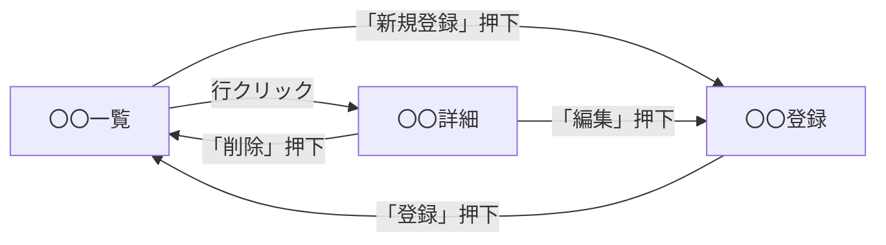

# 機能仕様書：画面遷移図

## 1. ■概要・目的

本機能で利用する画面間の遷移関係を **mermaid** で図示します。画面概要（04）で列挙した画面が、どのような操作によりどの画面へ遷移するかを明確にします。

## 2. ■事前準備

- [ ] 画面概要（04）の記述完了

## 3. ■作業手順（Issueのタスクリストとして利用）

- [ ] **遷移関係の整理**：画面概要で列挙した各画面について、遷移元・遷移先・遷移トリガー（ボタン押下・メニュー選択等）を整理します。
- [ ] **mermaid図の作成**：`flowchart` で画面をノード、操作をエッジのラベルとして記述します。
- [ ] **外部画面への遷移の記載**：本機能の範囲外の画面に遷移する場合は、そこまでを示し「※外部画面」等の注記を付けます。

## 4. ■セルフチェック項目（作業完了後の最終確認）

- [ ] 画面概要（04）に列挙した画面がすべて遷移図に登場している
- [ ] 各エッジに遷移トリガー（ボタン名・操作名）が記載されている
- [ ] **画面ID・URLは記載していない**（画面仕様書で定義）
- [ ] mermaid で記述されており、レンダリング時に正しく表示される

## 5. ■成果物・参考資料

- 成果物の場所：機能仕様書内「5. 画面遷移図」
- 関連ドキュメント：[02_データ・共通設計/03_画面遷移図/](../../../02_データ・共通設計/03_画面遷移図/)（共通の画面遷移図）、画面仕様書（詳細設計）

## 6. ■サンプル

