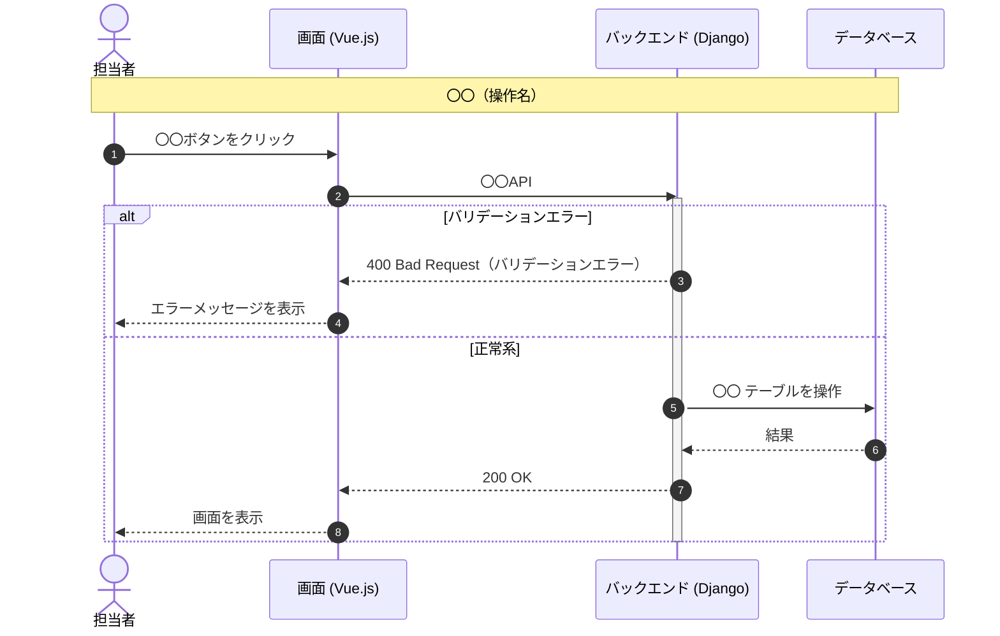

# 機能仕様書：シーケンス図

## 1. ■概要・目的

画面・API・DBなどの主体間のやり取りを時系列で可視化し、正常系・異常系の処理フローを明確にします。

## 2. ■事前準備

- [ ] ワークフロー（03）の記述完了
- [ ] 登場する主体（アクター・システム）の洗い出し

## 3. ■作業手順（Issueのタスクリストとして利用）

- [ ] **主体の定義**：処理に関わる actor / participant を定義します。
- [ ] **正常系フローの記述**：ユーザー操作からDB処理・画面表示までを時系列で描きます。
- [ ] **異常系の記述**：各操作のエラーケースを alt ブロックで追記します。
- [ ] **整合性確認**：処理フロー（05）と順序・用語が一致していることを確認します。

## 4. ■セルフチェック項目（作業完了後の最終確認）

- [ ] 正常系の主要ステップが時系列で記載されている
- [ ] 異常系（バリデーションエラー・存在チェック等）の分岐が記載されている
- [ ] APIパスではなくAPI名で記述している
- [ ] 処理フロー（05）と順序・用語が一致している

## 5. ■成果物・参考資料

- 成果物の場所：
- 参照手順書：[シーケンス図手順書](../02_シーケンス図.md)

## 6. ■サンプル

