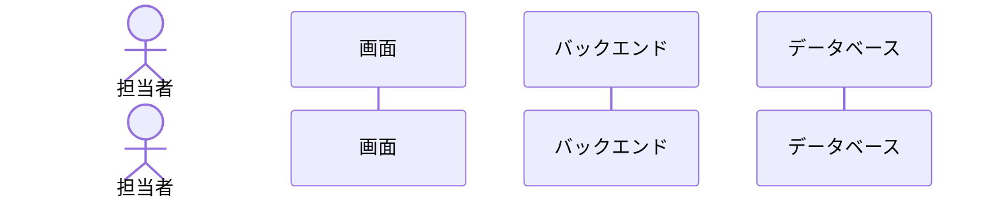

# 【機能仕様書】（名称：〇〇機能）

<!--
記述方針：
- 機能仕様書は概念レベルの業務仕様書。実装用語（変数名・カラム名・クラス名・enum名・APIパス・HTTPメソッド等）は原則記載しない。
- 唯一の例外：「10. テーブル概要」は物理テーブル名・カラム名を記載する（対応表として必要）。
- 状態・操作種別・権限は日本語の業務用語で表現する。
- 詳細は `01_共通定義・ルール/06_手順書・セルフチェック/01_基本設計/機能仕様書/手順書.md` の「記述方針」を参照。
-->

## 1. 処理概要

- **目的**：
- **背景**：

## 2. アクター

| アクター | 種別 | 役割 |
| --- | --- | --- |
| | | |

## 3. ワークフロー

```mermaid
flowchart TD
```

## 4. 画面概要

<!-- 各画面の「目的（何のための画面か）」を業務レベルで記述する。画面ID・URL・画面項目等の実装詳細は画面仕様書で定義する。 -->

| 画面名 | 目的 |
| :--- | :--- |
| | |

## 5. 画面遷移図

<!-- 画面概要（4）で列挙した画面間の遷移を mermaid で記述する。エッジには遷移トリガー（ボタン名等）を記載する。画面ID・URLは記載しない。 -->

```mermaid
flowchart LR
```

## 6. シーケンス図



## 7. 処理フロー

### 7.x 〇〇（操作名）

1. **バリデーション**：〇〇（詳細は8.1参照）
   - バリデーションエラー：400 エラーを返す。
2. **DB操作**：〇〇（詳細は8.2, 8.3参照）
   - DB失敗：トランザクションをロールバックし、500 エラーを返す。
3. **画面遷移**：〇〇

## 8. 処理ロジック詳細

### 8.1 バリデーション条件（What）

<!-- 7. 処理フロー の「バリデーション」ステップに対応 -->
<!--
  操作種別が1つの場合：単一テーブルで記述する。
  操作種別が複数ある場合：操作ごとに #### ▶ 8.1.x 小項目で区切り、
  処理フロー側は「（詳細は 8.1.x 参照）」で紐づける。
-->

<!-- 操作種別が1つの場合 -->
| No | 項目名 | 条件 | 備考 |
| :--- | :--- | :--- | :--- |
| 1 | | | |

<!-- 操作種別が複数の場合（上の単一テーブルと差し替えて使用）
#### ▶ 8.1.1　〇〇の登録（7.1）

| No | 項目名 | 条件 | 備考 |
| :--- | :--- | :--- | :--- |
| 1 | | | |

#### ▶ 8.1.2　〇〇の変更（7.2）

| No | 項目名 | 条件 | 備考 |
| :--- | :--- | :--- | :--- |
| 1 | | | |
-->

### 8.2 登録内容（What）

<!-- 7. 処理フロー の「DB操作」ステップに対応 -->

| No | 項目 | 登録内容 | 備考 |
| :--- | :--- | :--- | :--- |
| 1 | | | |

### 8.3 処理制御（How）

<!--
7. 処理フロー の「DB操作」ステップに対応
記述ルール：
- 単一の方針・宣言（条件分岐を伴わないもの）は箇条書きで記述する。
- 判定・制御（条件によって処理結果が分岐するロジック）は必ず表形式で記述する（箇条書きのネストで条件分岐を表現しない）。
-->

#### ▶ 方針（条件分岐なし）

- **〇〇**：

#### ▶ 判定・制御（条件分岐あり）

| No | 判定・制御項目 | 条件 | 処理結果 | 備考 |
| :--- | :--- | :--- | :--- | :--- |
| 1 | | | | |

## 9. API概要

<!-- 機能仕様書は概念レベル。APIパス・HTTPメソッドは記載せず、日本語で「何をするAPIか」を記述する。詳細は詳細設計（API設計書）で定義。 -->

| API名 | 役割・概要 |
| :--- | :--- |
| | |

## 10. テーブル概要

<!-- テーブルごとに小項目（H3）として切り出し、テーブル単位の表で記述する。 -->

### ■ `xxx_table`（テーブル論理名）

| カラム名 | 操作 | 備考 |
| :--- | :--- | :--- |
| | | |
