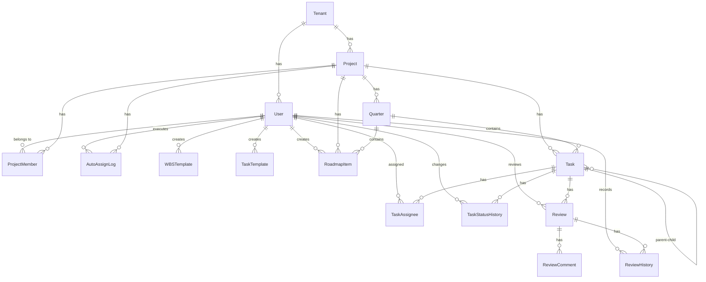

# DB設計

**作成日：** 2026年4月12日  
**バージョン：** 1.0  
**DB：** PostgreSQL

---

## 1. ER図

---

## 2. テーブル定義

### Tenant（テナント）

| カラム名 | 型 | NULL | デフォルト | 説明 |
|---------|-----|------|-----------|------|
| id | UUID | NOT NULL | gen_random_uuid() | PK |
| name | VARCHAR(100) | NOT NULL | - | テナント名 |
| created_at | TIMESTAMP | NOT NULL | NOW() | 作成日時 |
| updated_at | TIMESTAMP | NOT NULL | NOW() | 更新日時 |

---

### User（ユーザー）

| カラム名 | 型 | NULL | デフォルト | 説明 |
|---------|-----|------|-----------|------|
| id | UUID | NOT NULL | gen_random_uuid() | PK |
| tenant_id | UUID | NOT NULL | - | FK → Tenant |
| username | VARCHAR(50) | NOT NULL | - | ユーザー名 |
| email | VARCHAR(255) | NOT NULL | - | メールアドレス（テナント内でユニーク） |
| password | VARCHAR(255) | NOT NULL | - | ハッシュ化パスワード |
| role | VARCHAR(20) | NOT NULL | 'member' | master / admin / member |
| created_at | TIMESTAMP | NOT NULL | NOW() | 作成日時 |
| updated_at | TIMESTAMP | NOT NULL | NOW() | 更新日時 |

**インデックス**
- UNIQUE (tenant_id, email)

---

### Project（プロジェクト）

| カラム名 | 型 | NULL | デフォルト | 説明 |
|---------|-----|------|-----------|------|
| id | UUID | NOT NULL | gen_random_uuid() | PK |
| tenant_id | UUID | NOT NULL | - | FK → Tenant |
| name | VARCHAR(100) | NOT NULL | - | プロジェクト名 |
| description | TEXT | NULL | - | 説明 |
| start_date | DATE | NULL | - | 開始日 |
| end_date | DATE | NULL | - | 終了日 |
| progress | INTEGER | NOT NULL | 0 | 進捗率（0〜100） |
| created_by | UUID | NOT NULL | - | FK → User（作成者） |
| deleted_at | TIMESTAMP | NULL | - | 論理削除日時 |
| created_at | TIMESTAMP | NOT NULL | NOW() | 作成日時 |
| updated_at | TIMESTAMP | NOT NULL | NOW() | 更新日時 |

**インデックス**
- INDEX (tenant_id)
- INDEX (deleted_at)

---

### ProjectMember（プロジェクトメンバー）

| カラム名 | 型 | NULL | デフォルト | 説明 |
|---------|-----|------|-----------|------|
| id | UUID | NOT NULL | gen_random_uuid() | PK |
| project_id | UUID | NOT NULL | - | FK → Project |
| user_id | UUID | NOT NULL | - | FK → User |
| role | VARCHAR(20) | NOT NULL | 'member' | admin / member |
| created_at | TIMESTAMP | NOT NULL | NOW() | 作成日時 |

**インデックス**
- UNIQUE (project_id, user_id)

---

### Quarter（クォーター）

| カラム名 | 型 | NULL | デフォルト | 説明 |
|---------|-----|------|-----------|------|
| id | UUID | NOT NULL | gen_random_uuid() | PK |
| project_id | UUID | NOT NULL | - | FK → Project |
| title | VARCHAR(50) | NOT NULL | - | クォーター名（例：Q1） |
| start_date | DATE | NOT NULL | - | 開始日 |
| end_date | DATE | NOT NULL | - | 終了日 |
| progress | INTEGER | NOT NULL | 0 | 進捗率（0〜100） |
| created_at | TIMESTAMP | NOT NULL | NOW() | 作成日時 |
| updated_at | TIMESTAMP | NOT NULL | NOW() | 更新日時 |

**インデックス**
- INDEX (project_id)

---

### Task（タスク）

| カラム名 | 型 | NULL | デフォルト | 説明 |
|---------|-----|------|-----------|------|
| id | UUID | NOT NULL | gen_random_uuid() | PK |
| project_id | UUID | NOT NULL | - | FK → Project |
| quarter_id | UUID | NULL | - | FK → Quarter |
| parent_task_id | UUID | NULL | - | FK → Task（自己参照・NULL=第1層） |
| title | VARCHAR(200) | NOT NULL | - | タスク名 |
| description | TEXT | NULL | - | 説明 |
| order | INTEGER | NOT NULL | 0 | 同階層内の表示順 |
| start_date | DATE | NULL | - | 予定開始日 |
| end_date | DATE | NULL | - | 予定終了日 |
| actual_start_date | DATE | NULL | - | 実績開始日（手動入力） |
| actual_end_date | DATE | NULL | - | 実績終了日（手動入力） |
| estimated_hours | DECIMAL(6,1) | NULL | - | 見積工数（時間） |
| status | VARCHAR(20) | NOT NULL | '未着手' | 未着手/進行中/レビュー待ち/完了/保留 |
| progress | INTEGER | NOT NULL | 0 | 進捗率（0〜100） |
| priority | VARCHAR(10) | NOT NULL | '中' | 高 / 中 / 低 |
| deleted_at | TIMESTAMP | NULL | - | 論理削除日時 |
| created_at | TIMESTAMP | NOT NULL | NOW() | 作成日時 |
| updated_at | TIMESTAMP | NOT NULL | NOW() | 更新日時 |

**インデックス**
- INDEX (project_id)
- INDEX (parent_task_id)
- INDEX (quarter_id)
- INDEX (deleted_at)

---

### TaskAssignee（タスク担当者）

| カラム名 | 型 | NULL | デフォルト | 説明 |
|---------|-----|------|-----------|------|
| id | UUID | NOT NULL | gen_random_uuid() | PK |
| task_id | UUID | NOT NULL | - | FK → Task |
| user_id | UUID | NOT NULL | - | FK → User |
| created_at | TIMESTAMP | NOT NULL | NOW() | 作成日時 |

**インデックス**
- UNIQUE (task_id, user_id)

---

### TaskStatusHistory（タスクステータス変更履歴）

| カラム名 | 型 | NULL | デフォルト | 説明 |
|---------|-----|------|-----------|------|
| id | UUID | NOT NULL | gen_random_uuid() | PK |
| task_id | UUID | NOT NULL | - | FK → Task |
| status | VARCHAR(20) | NOT NULL | - | 変更後ステータス |
| changed_by | UUID | NOT NULL | - | FK → User（変更者） |
| changed_at | TIMESTAMP | NOT NULL | NOW() | 変更日時 |

**インデックス**
- INDEX (task_id, changed_at)

---

### AutoAssignLog（自動割り振り履歴）

| カラム名 | 型 | NULL | デフォルト | 説明 |
|---------|-----|------|-----------|------|
| id | UUID | NOT NULL | gen_random_uuid() | PK |
| project_id | UUID | NOT NULL | - | FK → Project |
| executed_by | UUID | NOT NULL | - | FK → User（実行者） |
| result | JSONB | NOT NULL | - | 割り振り結果（task_id: user_idのマップ） |
| executed_at | TIMESTAMP | NOT NULL | NOW() | 実行日時 |

**インデックス**
- INDEX (project_id)

---

### Review（レビュー）

| カラム名 | 型 | NULL | デフォルト | 説明 |
|---------|-----|------|-----------|------|
| id | UUID | NOT NULL | gen_random_uuid() | PK |
| task_id | UUID | NOT NULL | - | FK → Task |
| reviewer_id | UUID | NOT NULL | - | FK → User（指摘者） |
| status | VARCHAR(20) | NOT NULL | '未対応' | 未対応/確認待ち/差し戻し/完了 |
| approve_comment | TEXT | NULL | - | 承認時のコメント |
| created_at | TIMESTAMP | NOT NULL | NOW() | 作成日時 |
| updated_at | TIMESTAMP | NOT NULL | NOW() | 更新日時 |

**インデックス**
- INDEX (task_id)

---

### ReviewComment（レビュー指摘コメント）

| カラム名 | 型 | NULL | デフォルト | 説明 |
|---------|-----|------|-----------|------|
| id | UUID | NOT NULL | gen_random_uuid() | PK |
| review_id | UUID | NOT NULL | - | FK → Review |
| content | TEXT | NOT NULL | - | 指摘内容（編集時に先頭へユーザー名・日時が自動付与） |
| order | INTEGER | NOT NULL | 0 | 表示順 |
| created_at | TIMESTAMP | NOT NULL | NOW() | 作成日時 |
| updated_at | TIMESTAMP | NOT NULL | NOW() | 更新日時 |

**インデックス**
- INDEX (review_id)

---

### ReviewHistory（レビュー操作履歴）

| カラム名 | 型 | NULL | デフォルト | 説明 |
|---------|-----|------|-----------|------|
| id | UUID | NOT NULL | gen_random_uuid() | PK |
| review_id | UUID | NOT NULL | - | FK → Review |
| action | VARCHAR(30) | NOT NULL | - | request_review / approve / reject / status_change / edit |
| actor_id | UUID | NOT NULL | - | FK → User（操作者） |
| note | TEXT | NULL | - | 操作メモ |
| created_at | TIMESTAMP | NOT NULL | NOW() | 操作日時 |

**インデックス**
- INDEX (review_id)

---

### RoadmapItem（ロードマップアイテム）

| カラム名 | 型 | NULL | デフォルト | 説明 |
|---------|-----|------|-----------|------|
| id | UUID | NOT NULL | gen_random_uuid() | PK |
| project_id | UUID | NOT NULL | - | FK → Project |
| quarter_id | UUID | NOT NULL | - | FK → Quarter |
| title | VARCHAR(100) | NOT NULL | - | タイトル |
| description | TEXT | NULL | - | 説明 |
| status | VARCHAR(20) | NOT NULL | '計画中' | 計画中/進行中/完了/保留 |
| created_by | UUID | NOT NULL | - | FK → User |
| created_at | TIMESTAMP | NOT NULL | NOW() | 作成日時 |
| updated_at | TIMESTAMP | NOT NULL | NOW() | 更新日時 |

**インデックス**
- INDEX (project_id, quarter_id)

---

### WBSTemplate（WBSテンプレート）

| カラム名 | 型 | NULL | デフォルト | 説明 |
|---------|-----|------|-----------|------|
| id | UUID | NOT NULL | gen_random_uuid() | PK |
| tenant_id | UUID | NOT NULL | - | FK → Tenant |
| title | VARCHAR(100) | NOT NULL | - | テンプレート名 |
| content | TEXT | NOT NULL | - | 改行区切りのタスクタイトル一覧 |
| is_shared | BOOLEAN | NOT NULL | FALSE | TRUE=チーム共有 / FALSE=個人 |
| created_by | UUID | NOT NULL | - | FK → User |
| created_at | TIMESTAMP | NOT NULL | NOW() | 作成日時 |
| updated_at | TIMESTAMP | NOT NULL | NOW() | 更新日時 |

**インデックス**
- INDEX (tenant_id, is_shared)

---

### TaskTemplate（タスクテンプレート）

| カラム名 | 型 | NULL | デフォルト | 説明 |
|---------|-----|------|-----------|------|
| id | UUID | NOT NULL | gen_random_uuid() | PK |
| tenant_id | UUID | NOT NULL | - | FK → Tenant |
| title | VARCHAR(100) | NOT NULL | - | テンプレート名 |
| content | TEXT | NOT NULL | - | 改行区切りの対応内容一覧 |
| is_shared | BOOLEAN | NOT NULL | FALSE | TRUE=チーム共有 / FALSE=個人 |
| created_by | UUID | NOT NULL | - | FK → User |
| created_at | TIMESTAMP | NOT NULL | NOW() | 作成日時 |
| updated_at | TIMESTAMP | NOT NULL | NOW() | 更新日時 |

**インデックス**
- INDEX (tenant_id, is_shared)

---

## 3. テーブル数サマリー

| テーブル名 | 説明 |
|-----------|------|
| Tenant | テナント |
| User | ユーザー |
| Project | プロジェクト |
| ProjectMember | プロジェクトメンバー |
| Quarter | クォーター |
| Task | タスク（自己参照） |
| TaskAssignee | タスク担当者 |
| TaskStatusHistory | ステータス変更履歴 |
| AutoAssignLog | 自動割り振り履歴 |
| Review | レビュー |
| ReviewComment | レビュー指摘コメント |
| ReviewHistory | レビュー操作履歴 |
| RoadmapItem | ロードマップアイテム |
| WBSTemplate | WBSテンプレート |
| TaskTemplate | タスクテンプレート |
| **合計** | **15テーブル** |

---

## 4. 共通設計ルール

| ルール | 内容 |
|--------|------|
| PK | すべてUUID型（gen_random_uuid()） |
| 論理削除 | Project・Taskのみ deleted_at で管理 |
| タイムスタンプ | 全テーブルに created_at を付与、更新があるテーブルは updated_at も付与 |
| テナント分離 | テナントをまたいだデータ参照はアプリ層でブロック |
| ステータス | VARCHAR型で日本語文字列で管理 |
| 進捗率 | INTEGER（0〜100）で管理 |
