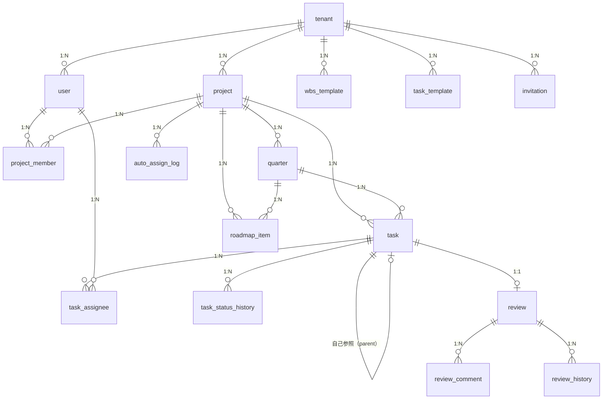

# DB設計

- **最終更新日**：2026-04-26
- **バージョン**：v1.1

---

## 1. ER図

---

## 2. テーブル定義

### 2.1 tenant（テナント）

| カラム名 | 型 | NOT NULL | デフォルト | 説明 |
|---|---|:---:|---|---|
| id | UUID | ✓ | gen_random_uuid() | PK |
| name | VARCHAR(100) | ✓ | — | テナント名（一意） |
| created_at | TIMESTAMPTZ | ✓ | now() | 作成日時 |

**制約**：`name` UNIQUE

---

### 2.2 user（ユーザー）

| カラム名 | 型 | NOT NULL | デフォルト | 説明 |
|---|---|:---:|---|---|
| id | UUID | ✓ | gen_random_uuid() | PK |
| tenant_id | UUID | ✓ | — | FK → tenant.id |
| username | VARCHAR(100) | ✓ | — | 表示名 |
| email | VARCHAR(254) | ✓ | — | メールアドレス |
| password | VARCHAR(255) | ✓ | — | ハッシュ済みパスワード |
| role | VARCHAR(20) | ✓ | 'member' | master / admin / member |
| created_at | TIMESTAMPTZ | ✓ | now() | 作成日時 |

**制約**：`(tenant_id, email)` UNIQUE

---

### 2.3 invitation（招待）

| カラム名 | 型 | NOT NULL | デフォルト | 説明 |
|---|---|:---:|---|---|
| id | UUID | ✓ | gen_random_uuid() | PK |
| tenant_id | UUID | ✓ | — | FK → tenant.id |
| email | VARCHAR(254) | ✓ | — | 招待先メール |
| role | VARCHAR(20) | ✓ | 'member' | 付与するロール |
| token | VARCHAR(128) | ✓ | — | ランダムトークン（一意） |
| expires_at | TIMESTAMPTZ | ✓ | — | トークン有効期限 |
| created_at | TIMESTAMPTZ | ✓ | now() | 作成日時 |

**制約**：`token` UNIQUE

---

### 2.4 project（プロジェクト）

| カラム名 | 型 | NOT NULL | デフォルト | 説明 |
|---|---|:---:|---|---|
| id | UUID | ✓ | gen_random_uuid() | PK |
| tenant_id | UUID | ✓ | — | FK → tenant.id |
| name | VARCHAR(200) | ✓ | — | プロジェクト名 |
| description | TEXT | — | NULL | 説明 |
| start_date | DATE | ✓ | — | 開始日 |
| end_date | DATE | ✓ | — | 終了日 |
| progress | SMALLINT | ✓ | 0 | 進捗率（0〜100） |
| created_by | UUID | ✓ | — | FK → user.id |
| deleted_at | TIMESTAMPTZ | — | NULL | 論理削除日時 |
| created_at | TIMESTAMPTZ | ✓ | now() | 作成日時 |

---

### 2.5 project_member（プロジェクトメンバー）

| カラム名 | 型 | NOT NULL | デフォルト | 説明 |
|---|---|:---:|---|---|
| id | UUID | ✓ | gen_random_uuid() | PK |
| project_id | UUID | ✓ | — | FK → project.id |
| user_id | UUID | ✓ | — | FK → user.id |
| role | VARCHAR(20) | ✓ | 'member' | admin / member |

**制約**：`(project_id, user_id)` UNIQUE

---

### 2.6 quarter（クォーター）

| カラム名 | 型 | NOT NULL | デフォルト | 説明 |
|---|---|:---:|---|---|
| id | UUID | ✓ | gen_random_uuid() | PK |
| project_id | UUID | ✓ | — | FK → project.id |
| title | VARCHAR(100) | ✓ | — | クォーター名（例：Q1） |
| start_date | DATE | ✓ | — | 開始日 |
| end_date | DATE | ✓ | — | 終了日 |
| progress | SMALLINT | ✓ | 0 | 進捗率（0〜100・タスクから集計） |

---

### 2.7 roadmap_item（ロードマップアイテム）

| カラム名 | 型 | NOT NULL | デフォルト | 説明 |
|---|---|:---:|---|---|
| id | UUID | ✓ | gen_random_uuid() | PK |
| project_id | UUID | ✓ | — | FK → project.id |
| quarter_id | UUID | — | NULL | FK → quarter.id |
| title | VARCHAR(200) | ✓ | — | タイトル |
| description | TEXT | — | NULL | 説明 |
| status | VARCHAR(20) | ✓ | '未着手' | 未着手 / 進行中 / 完了 |
| order | INTEGER | ✓ | 0 | 表示順 |

---

### 2.8 task（タスク）

| カラム名 | 型 | NOT NULL | デフォルト | 説明 |
|---|---|:---:|---|---|
| id | UUID | ✓ | gen_random_uuid() | PK |
| project_id | UUID | ✓ | — | FK → project.id |
| quarter_id | UUID | — | NULL | FK → quarter.id |
| parent_task_id | UUID | — | NULL | FK → task.id（自己参照） |
| title | VARCHAR(300) | ✓ | — | タスクタイトル |
| description | TEXT | — | NULL | 説明 |
| order | INTEGER | ✓ | 0 | 同階層内の表示順 |
| start_date | DATE | — | NULL | 開始日 |
| end_date | DATE | — | NULL | 終了日 |
| estimated_hours | NUMERIC(6,1) | — | NULL | 工数（時間） |
| status | VARCHAR(20) | ✓ | 'Todo' | Todo / InProgress / InReview / Done / OnHold |
| task_kind | VARCHAR(20) | — | NULL | 実装 / ドキュメント作成 / レビュー依頼 / レビュー修正（task_type='task' 時のみ設定可） |
| progress | SMALLINT | ✓ | 0 | 進捗率（0〜100） |
| priority | VARCHAR(10) | ✓ | '中' | 高 / 中 / 低 |
| actual_start_date | DATE | — | NULL | 実績開始日 |
| actual_end_date | DATE | — | NULL | 実績終了日 |
| deleted_at | TIMESTAMPTZ | — | NULL | 論理削除日時 |
| created_at | TIMESTAMPTZ | ✓ | now() | 作成日時 |

**備考**：`parent_task_id` を再帰的にたどったとき深さが5を超えるものはバックエンドで拒否する。`task_kind` は `task_type='task'` の場合のみ設定可能（それ以外はNULL）。

---

### 2.9 task_assignee（タスク担当者）

| カラム名 | 型 | NOT NULL | デフォルト | 説明 |
|---|---|:---:|---|---|
| id | UUID | ✓ | gen_random_uuid() | PK |
| task_id | UUID | ✓ | — | FK → task.id |
| user_id | UUID | ✓ | — | FK → user.id |

**制約**：`(task_id, user_id)` UNIQUE

---

### 2.10 task_status_history（ステータス変更履歴）

| カラム名 | 型 | NOT NULL | デフォルト | 説明 |
|---|---|:---:|---|---|
| id | UUID | ✓ | gen_random_uuid() | PK |
| task_id | UUID | ✓ | — | FK → task.id |
| status | VARCHAR(20) | ✓ | — | 変更後ステータス |
| changed_by | UUID | ✓ | — | FK → user.id |
| changed_at | TIMESTAMPTZ | ✓ | now() | 変更日時 |

---

### 2.11 auto_assign_log（自動割り振り履歴）

| カラム名 | 型 | NOT NULL | デフォルト | 説明 |
|---|---|:---:|---|---|
| id | UUID | ✓ | gen_random_uuid() | PK |
| project_id | UUID | ✓ | — | FK → project.id |
| executed_by | UUID | ✓ | — | FK → user.id |
| executed_at | TIMESTAMPTZ | ✓ | now() | 実行日時 |
| result | JSONB | ✓ | — | 割り振り結果（タスクID→ユーザーID のマッピング） |

---

### 2.12 review（レビュー）

| カラム名 | 型 | NOT NULL | デフォルト | 説明 |
|---|---|:---:|---|---|
| id | UUID | ✓ | gen_random_uuid() | PK |
| task_id | UUID | ✓ | — | FK → task.id（1タスク1レビュー） |
| reviewer_id | UUID | ✓ | — | FK → user.id（レビュー実施者） |
| status | VARCHAR(20) | ✓ | 'pending' | pending / approved / rejected / 確認待ち / 完了 |
| created_at | TIMESTAMPTZ | ✓ | now() | 作成日時 |

---

### 2.13 review_comment（レビューコメント）

| カラム名 | 型 | NOT NULL | デフォルト | 説明 |
|---|---|:---:|---|---|
| id | UUID | ✓ | gen_random_uuid() | PK |
| review_id | UUID | ✓ | — | FK → review.id |
| body | TEXT | ✓ | — | コメント本文 |
| author_id | UUID | ✓ | — | FK → user.id |
| created_at | TIMESTAMPTZ | ✓ | now() | 作成日時 |

---

### 2.14 review_history（レビュー操作履歴）

| カラム名 | 型 | NOT NULL | デフォルト | 説明 |
|---|---|:---:|---|---|
| id | UUID | ✓ | gen_random_uuid() | PK |
| review_id | UUID | ✓ | — | FK → review.id |
| task_id | UUID | ✓ | — | FK → task.id |
| action | VARCHAR(30) | ✓ | — | request_review / approve / reject 等 |
| user_id | UUID | ✓ | — | FK → user.id（操作者） |
| created_at | TIMESTAMPTZ | ✓ | now() | 記録日時 |

---

### 2.15 wbs_template（WBSテンプレート）

| カラム名 | 型 | NOT NULL | デフォルト | 説明 |
|---|---|:---:|---|---|
| id | UUID | ✓ | gen_random_uuid() | PK |
| tenant_id | UUID | ✓ | — | FK → tenant.id |
| title | VARCHAR(200) | ✓ | — | テンプレート名 |
| content | TEXT | ✓ | — | 子タスク定義（改行区切り） |
| created_by | UUID | ✓ | — | FK → user.id |
| is_shared | BOOLEAN | ✓ | false | 管理者が全員に共有するかどうか |
| created_at | TIMESTAMPTZ | ✓ | now() | 作成日時 |

---

### 2.16 task_template（タスクテンプレート）

| カラム名 | 型 | NOT NULL | デフォルト | 説明 |
|---|---|:---:|---|---|
| id | UUID | ✓ | gen_random_uuid() | PK |
| tenant_id | UUID | ✓ | — | FK → tenant.id |
| title | VARCHAR(200) | ✓ | — | テンプレート名 |
| content | TEXT | ✓ | — | 対応内容（改行区切り） |
| created_by | UUID | ✓ | — | FK → user.id |
| is_shared | BOOLEAN | ✓ | false | 管理者が全員に共有するかどうか |
| created_at | TIMESTAMPTZ | ✓ | now() | 作成日時 |

---

## 3. インデックス方針

| テーブル | カラム | 理由 |
|---|---|---|
| user | tenant_id, email | ログイン時の検索 |
| project | tenant_id, deleted_at | テナント別一覧取得 |
| task | project_id, parent_task_id, deleted_at | ツリー構造の再帰取得 |
| task | quarter_id | クォーター別集計 |
| task_assignee | task_id, user_id | 担当者確認 |
| review | task_id | タスク別レビュー取得 |
| review_history | review_id, created_at | 時系列履歴表示 |
