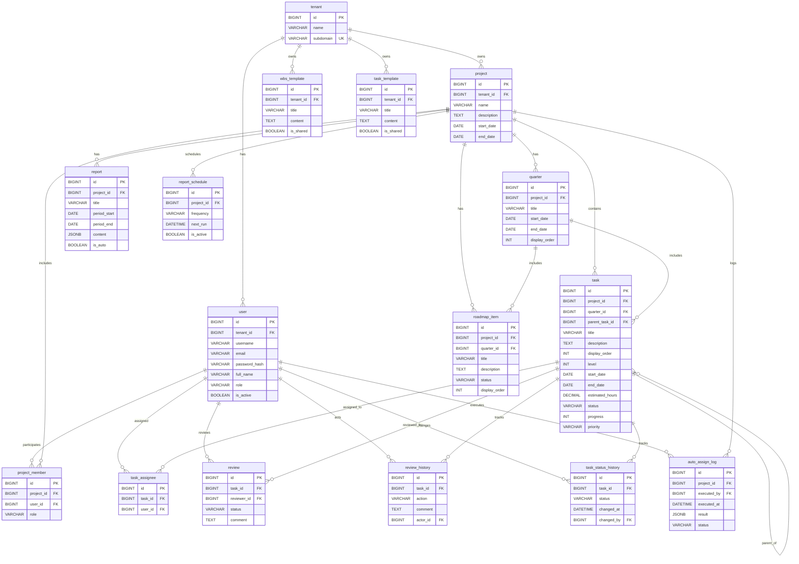

# DB設計

WBS管理ソフトの物理データベース設計を定義する。命名規則・データ型・共通カラムは [DB設計規約](../00_ルール/04_開発規約/04_DB設計規約.md) に従う。

- **RDBMS**：PostgreSQL 15 以上
- **文字コード**：UTF-8（照合順序：`C.UTF-8`）
- **作成日**：2026-04-23
- **バージョン**：1.0

---

## 1. 全体方針

| 項目 | 方針 |
|------|------|
| テナント分離 | 全業務テーブルは `tenant_id` を保持、またはテナント配下リソース（Project 等）を介して間接的に紐付ける |
| 論理削除 | 全テーブルで `deleted_at` を使用（未削除は `NULL`） |
| ENUM | DB の ENUM 型は使わず、すべて `VARCHAR(20)` ＋ アプリ側定数で管理 |
| 日時 | UTC で保存し、表示時に JST へ変換 |
| 主キー | `BIGINT` 自動採番 |
| 外部キー | `{参照テーブル名}_id`、`on_delete` を必ず指定 |

---

## 2. ER図

---

## 3. テーブル一覧

| # | テーブル名 | 論理名 | 関連機能 |
|---|-----------|--------|---------|
| 1 | `tenant` | テナント | 01_認証・ユーザー管理 |
| 2 | `user` | ユーザー | 01_認証・ユーザー管理 |
| 3 | `project` | プロジェクト | 02_プロジェクト管理 |
| 4 | `project_member` | プロジェクトメンバー | 02_プロジェクト管理 |
| 5 | `quarter` | クォーター | 03_クォーター管理 |
| 6 | `task` | タスク | 04_WBS・タスク管理 |
| 7 | `task_assignee` | タスク担当者 | 04_WBS・タスク管理 |
| 8 | `task_status_history` | タスクステータス履歴 | 08_進捗・ステータス管理 |
| 9 | `auto_assign_log` | 自動割り振り履歴 | 05_タスク自動割り振り |
| 10 | `roadmap_item` | ロードマップアイテム | 06_プロダクトロードマップ |
| 11 | `review` | レビュー | 09_レビュー管理 |
| 12 | `review_history` | レビュー履歴 | 09_レビュー管理 |
| 13 | `wbs_template` | WBSテンプレート | 12_テンプレート管理 |
| 14 | `task_template` | タスクテンプレート | 12_テンプレート管理 |
| 15 | `report` | 報告書 | 10_報告書管理 |
| 16 | `report_schedule` | 定期レポートスケジュール | 10_報告書管理 |

---

## 4. 共通カラム

全テーブルに以下を必ず持たせる（Django の抽象基底モデル `TimestampedModel` で統一）。

| カラム名 | 型 | NULL | デフォルト | 内容 |
|---------|---|:---:|-----------|------|
| `id` | BIGINT | ✗ | auto | 主キー（自動採番） |
| `created_at` | DATETIME | ✗ | 現在日時 | 登録日時 |
| `updated_at` | DATETIME | ✗ | 現在日時 | 更新日時（更新時に自動更新） |
| `created_by` | BIGINT | ✓ | NULL | 登録ユーザーID（`user.id`） |
| `updated_by` | BIGINT | ✓ | NULL | 更新ユーザーID（`user.id`） |
| `deleted_at` | DATETIME | ✓ | NULL | 論理削除日時（未削除は NULL） |

以降の各テーブル定義では共通カラムを省略する。

---

## 5. テーブル定義

### 5.1 `tenant`（テナント）

テナント（組織）情報。WBS管理ソフトは完全テナント分離モデルを採用する。

| カラム名 | 型 | NULL | 制約/備考 |
|---------|---|:---:|----------|
| `name` | VARCHAR(100) | ✗ | テナント名 |
| `subdomain` | VARCHAR(63) | ✗ | サブドメイン（`{subdomain}.wbs-app.jp` の形式でアクセス）。UNIQUE |
| `is_active` | BOOLEAN | ✗ | 有効フラグ（利用停止時に false） |

**インデックス**
- `uk_tenant_subdomain`（subdomain, UNIQUE, ただし `deleted_at IS NULL` に限定）

---

### 5.2 `user`（ユーザー）

テナント配下のユーザー。

| カラム名 | 型 | NULL | 制約/備考 |
|---------|---|:---:|----------|
| `tenant_id` | BIGINT | ✗ | FK → `tenant.id`（ON DELETE RESTRICT） |
| `username` | VARCHAR(50) | ✗ | ログインID。テナント内で UNIQUE |
| `email` | VARCHAR(254) | ✗ | メールアドレス。テナント内で UNIQUE |
| `password_hash` | VARCHAR(255) | ✗ | ハッシュ化済パスワード（bcrypt / Argon2） |
| `full_name` | VARCHAR(100) | ✗ | 氏名 |
| `role` | VARCHAR(20) | ✗ | ロール：`master` / `admin` / `member`（§6.1 参照） |
| `is_active` | BOOLEAN | ✗ | 有効フラグ |
| `last_login_at` | DATETIME | ✓ | 最終ログイン日時 |

**インデックス**
- `uk_user_tenant_username`（tenant_id, username, UNIQUE）
- `uk_user_tenant_email`（tenant_id, email, UNIQUE）
- `idx_user_tenant_id`（tenant_id）

---

### 5.3 `project`（プロジェクト）

| カラム名 | 型 | NULL | 制約/備考 |
|---------|---|:---:|----------|
| `tenant_id` | BIGINT | ✗ | FK → `tenant.id`（ON DELETE RESTRICT） |
| `name` | VARCHAR(100) | ✗ | プロジェクト名 |
| `description` | TEXT | ✓ | 説明 |
| `start_date` | DATE | ✗ | 開始日 |
| `end_date` | DATE | ✓ | 終了日（未定時は NULL） |
| `status` | VARCHAR(20) | ✗ | `active` / `archived`（§6.2 参照） |

**インデックス**
- `idx_project_tenant_id`（tenant_id）
- `idx_project_status`（tenant_id, status）

---

### 5.4 `project_member`（プロジェクトメンバー）

プロジェクトへの参加者とプロジェクト内ロール。

| カラム名 | 型 | NULL | 制約/備考 |
|---------|---|:---:|----------|
| `project_id` | BIGINT | ✗ | FK → `project.id`（ON DELETE CASCADE） |
| `user_id` | BIGINT | ✗ | FK → `user.id`（ON DELETE RESTRICT） |
| `role` | VARCHAR(20) | ✗ | `admin` / `member`（§6.3 参照） |

**インデックス**
- `uk_project_member_project_user`（project_id, user_id, UNIQUE, ただし `deleted_at IS NULL` に限定）
- `idx_project_member_user_id`（user_id）

---

### 5.5 `quarter`（クォーター）

| カラム名 | 型 | NULL | 制約/備考 |
|---------|---|:---:|----------|
| `project_id` | BIGINT | ✗ | FK → `project.id`（ON DELETE CASCADE） |
| `title` | VARCHAR(50) | ✗ | `Q1`、`2026 Q2` 等 |
| `start_date` | DATE | ✗ | 開始日 |
| `end_date` | DATE | ✗ | 終了日 |
| `display_order` | INT | ✗ | 表示順 |

**制約**
- `chk_quarter_period`：`end_date >= start_date`

**インデックス**
- `idx_quarter_project_id`（project_id）
- `idx_quarter_project_order`（project_id, display_order）

---

### 5.6 `task`（タスク）

自己参照による階層構造（最大5層）。

| カラム名 | 型 | NULL | 制約/備考 |
|---------|---|:---:|----------|
| `project_id` | BIGINT | ✗ | FK → `project.id`（ON DELETE CASCADE） |
| `quarter_id` | BIGINT | ✓ | FK → `quarter.id`（ON DELETE SET NULL） |
| `parent_task_id` | BIGINT | ✓ | FK → `task.id`（ON DELETE CASCADE）。最上位は NULL |
| `title` | VARCHAR(200) | ✗ | タスク名 |
| `description` | TEXT | ✓ | 説明（改行区切りで対応内容を列挙） |
| `display_order` | INT | ✗ | 兄弟内の表示順 |
| `level` | INT | ✗ | 階層レベル（1〜5）。バリデーションで上限チェック |
| `start_date` | DATE | ✓ | 開始予定日 |
| `end_date` | DATE | ✓ | 終了予定日 |
| `estimated_hours` | DECIMAL(8,2) | ✓ | 工数（時間） |
| `status` | VARCHAR(20) | ✗ | `not_started` / `in_progress` / `review` / `done` / `on_hold`（§6.4） |
| `progress` | INT | ✗ | 進捗率（0〜100） |
| `priority` | VARCHAR(10) | ✗ | `high` / `medium` / `low`（§6.5） |

**制約**
- `chk_task_level`：`level BETWEEN 1 AND 5`
- `chk_task_progress`：`progress BETWEEN 0 AND 100`
- `chk_task_period`：`end_date IS NULL OR start_date IS NULL OR end_date >= start_date`

**インデックス**
- `idx_task_project_id`（project_id）
- `idx_task_quarter_id`（quarter_id）
- `idx_task_parent_task_id`（parent_task_id）
- `idx_task_status`（project_id, status）
- `idx_task_project_order`（project_id, parent_task_id, display_order）

---

### 5.7 `task_assignee`（タスク担当者）

タスクと担当ユーザーの多対多。

| カラム名 | 型 | NULL | 制約/備考 |
|---------|---|:---:|----------|
| `task_id` | BIGINT | ✗ | FK → `task.id`（ON DELETE CASCADE） |
| `user_id` | BIGINT | ✗ | FK → `user.id`（ON DELETE RESTRICT） |

**インデックス**
- `uk_task_assignee_task_user`（task_id, user_id, UNIQUE, ただし `deleted_at IS NULL` に限定）
- `idx_task_assignee_user_id`（user_id）

---

### 5.8 `task_status_history`（タスクステータス履歴）

ステータス変更の履歴。実績期間算出に使用。

| カラム名 | 型 | NULL | 制約/備考 |
|---------|---|:---:|----------|
| `task_id` | BIGINT | ✗ | FK → `task.id`（ON DELETE CASCADE） |
| `status` | VARCHAR(20) | ✗ | 変更後のステータス（§6.4） |
| `previous_status` | VARCHAR(20) | ✓ | 変更前のステータス（初回は NULL） |
| `changed_at` | DATETIME | ✗ | 変更日時 |
| `changed_by` | BIGINT | ✗ | FK → `user.id`（ON DELETE RESTRICT） |

**インデックス**
- `idx_task_status_history_task_id`（task_id, changed_at DESC）

---

### 5.9 `auto_assign_log`（自動割り振り履歴）

| カラム名 | 型 | NULL | 制約/備考 |
|---------|---|:---:|----------|
| `project_id` | BIGINT | ✗ | FK → `project.id`（ON DELETE CASCADE） |
| `executed_by` | BIGINT | ✗ | FK → `user.id`（ON DELETE RESTRICT） |
| `executed_at` | DATETIME | ✗ | 実行日時 |
| `status` | VARCHAR(20) | ✗ | `preview` / `confirmed` / `cancelled`（§6.6） |
| `result` | JSONB | ✗ | 割り振り結果（task_id / user_id / priority の配列） |

**インデックス**
- `idx_auto_assign_log_project_id`（project_id, executed_at DESC）

---

### 5.10 `roadmap_item`（ロードマップアイテム）

| カラム名 | 型 | NULL | 制約/備考 |
|---------|---|:---:|----------|
| `project_id` | BIGINT | ✗ | FK → `project.id`（ON DELETE CASCADE） |
| `quarter_id` | BIGINT | ✓ | FK → `quarter.id`（ON DELETE SET NULL） |
| `title` | VARCHAR(100) | ✗ | アイテム名 |
| `description` | TEXT | ✓ | 説明 |
| `status` | VARCHAR(20) | ✗ | `planned` / `in_progress` / `done` / `cancelled`（§6.7） |
| `display_order` | INT | ✗ | 表示順 |

**インデックス**
- `idx_roadmap_item_project_id`（project_id）
- `idx_roadmap_item_quarter_id`（quarter_id）

---

### 5.11 `review`（レビュー）

各タスクに対するレビュー実施結果。

| カラム名 | 型 | NULL | 制約/備考 |
|---------|---|:---:|----------|
| `task_id` | BIGINT | ✗ | FK → `task.id`（ON DELETE CASCADE） |
| `reviewer_id` | BIGINT | ✗ | FK → `user.id`（ON DELETE RESTRICT） |
| `status` | VARCHAR(20) | ✗ | `pending` / `approved` / `rejected`（§6.8） |
| `comment` | TEXT | ✓ | コメント |
| `reviewed_at` | DATETIME | ✓ | 承認／差し戻し日時（未実施は NULL） |

**インデックス**
- `idx_review_task_id`（task_id, created_at DESC）
- `idx_review_reviewer_id`（reviewer_id）

---

### 5.12 `review_history`（レビュー履歴）

レビュー関連のすべての操作履歴を時系列で記録する。

| カラム名 | 型 | NULL | 制約/備考 |
|---------|---|:---:|----------|
| `task_id` | BIGINT | ✗ | FK → `task.id`（ON DELETE CASCADE） |
| `action` | VARCHAR(20) | ✗ | `request` / `approve` / `reject` / `comment`（§6.9） |
| `comment` | TEXT | ✓ | 操作時のコメント |
| `actor_id` | BIGINT | ✗ | FK → `user.id`（ON DELETE RESTRICT） |

**インデックス**
- `idx_review_history_task_id`（task_id, created_at DESC）

---

### 5.13 `wbs_template`（WBSテンプレート）

選択タスクの直下1層を一括生成するテンプレート。

| カラム名 | 型 | NULL | 制約/備考 |
|---------|---|:---:|----------|
| `tenant_id` | BIGINT | ✗ | FK → `tenant.id`（ON DELETE RESTRICT） |
| `title` | VARCHAR(100) | ✗ | テンプレート名 |
| `content` | TEXT | ✗ | 改行区切りで子タスク名を列挙 |
| `is_shared` | BOOLEAN | ✗ | テナント内で共有するか（admin/master のみ true 設定可） |

**インデックス**
- `idx_wbs_template_tenant_id`（tenant_id, is_shared）

---

### 5.14 `task_template`（タスクテンプレート）

1件のタスクを生成するテンプレート（Issue 形式）。

| カラム名 | 型 | NULL | 制約/備考 |
|---------|---|:---:|----------|
| `tenant_id` | BIGINT | ✗ | FK → `tenant.id`（ON DELETE RESTRICT） |
| `title` | VARCHAR(100) | ✗ | テンプレート名 |
| `content` | TEXT | ✗ | タスク説明（改行区切りで対応内容） |
| `is_shared` | BOOLEAN | ✗ | テナント内で共有するか |

**インデックス**
- `idx_task_template_tenant_id`（tenant_id, is_shared）

---

### 5.15 `report`（報告書）

| カラム名 | 型 | NULL | 制約/備考 |
|---------|---|:---:|----------|
| `project_id` | BIGINT | ✗ | FK → `project.id`（ON DELETE CASCADE） |
| `title` | VARCHAR(200) | ✗ | 報告書タイトル |
| `period_start` | DATE | ✗ | 対象期間開始 |
| `period_end` | DATE | ✗ | 対象期間終了 |
| `content` | JSONB | ✗ | 報告書本文（章立て・データスナップショット） |
| `pdf_path` | VARCHAR(500) | ✓ | 生成済み PDF の保存パス |
| `is_auto` | BOOLEAN | ✗ | 定期レポート（自動生成）フラグ |

**制約**
- `chk_report_period`：`period_end >= period_start`

**インデックス**
- `idx_report_project_id`（project_id, period_end DESC）
- `idx_report_is_auto`（project_id, is_auto）

---

### 5.16 `report_schedule`（定期レポートスケジュール）

| カラム名 | 型 | NULL | 制約/備考 |
|---------|---|:---:|----------|
| `project_id` | BIGINT | ✗ | FK → `project.id`（ON DELETE CASCADE） |
| `frequency` | VARCHAR(20) | ✗ | `weekly` / `biweekly` / `monthly` / `quarterly`（§6.10） |
| `next_run` | DATETIME | ✗ | 次回実行予定日時 |
| `is_active` | BOOLEAN | ✗ | 有効フラグ |
| `notify_members` | BOOLEAN | ✗ | 作成完了時にメンバーへ通知するか |

**インデックス**
- `idx_report_schedule_project_id`（project_id）
- `idx_report_schedule_next_run`（is_active, next_run）

---

## 6. 列挙値定義

各列挙値は `VARCHAR(20)` で保持し、アプリ側の定数クラスで集中管理する（DB の ENUM 型は使用禁止）。

### 6.1 `user.role`

| 値 | 表示名 | 説明 |
|----|--------|------|
| `master` | マスター | テナント管理者。テナント設定・ユーザー管理全権 |
| `admin` | 管理者 | プロジェクト作成・全タスク編集・自動割り振り |
| `member` | メンバー | 担当タスクの更新・レビュー・テンプレート利用 |

### 6.2 `project.status`

| 値 | 表示名 |
|----|--------|
| `active` | 進行中 |
| `archived` | アーカイブ |

### 6.3 `project_member.role`

| 値 | 表示名 |
|----|--------|
| `admin` | プロジェクト管理者 |
| `member` | プロジェクトメンバー |

### 6.4 `task.status` / `task_status_history.status`

| 値 | 表示名 |
|----|--------|
| `not_started` | 未着手 |
| `in_progress` | 進行中 |
| `review` | レビュー待ち |
| `done` | 完了 |
| `on_hold` | 保留 |

### 6.5 `task.priority`

| 値 | 表示名 |
|----|--------|
| `high` | 高 |
| `medium` | 中 |
| `low` | 低 |

### 6.6 `auto_assign_log.status`

| 値 | 表示名 |
|----|--------|
| `preview` | プレビュー（未確定） |
| `confirmed` | 確定 |
| `cancelled` | キャンセル |

### 6.7 `roadmap_item.status`

| 値 | 表示名 |
|----|--------|
| `planned` | 計画中 |
| `in_progress` | 進行中 |
| `done` | 完了 |
| `cancelled` | キャンセル |

### 6.8 `review.status`

| 値 | 表示名 |
|----|--------|
| `pending` | 審査中 |
| `approved` | 承認 |
| `rejected` | 差し戻し |

### 6.9 `review_history.action`

| 値 | 表示名 |
|----|--------|
| `request` | レビュー依頼 |
| `approve` | 承認 |
| `reject` | 差し戻し |
| `comment` | コメント追加 |

### 6.10 `report_schedule.frequency`

| 値 | 表示名 |
|----|--------|
| `weekly` | 週次 |
| `biweekly` | 隔週 |
| `monthly` | 月次 |
| `quarterly` | クォーター |

---

## 7. テナント分離の方針

| リソース種別 | テナント特定方法 |
|-------------|-----------------|
| `user` / `project` / `wbs_template` / `task_template` | 直接 `tenant_id` を保持 |
| `project_member` / `quarter` / `task` / `roadmap_item` / `auto_assign_log` / `report` / `report_schedule` | `project` 経由で間接的に決まる |
| `task_assignee` / `task_status_history` / `review` / `review_history` | `task` → `project` 経由 |

- アプリ層（Django ミドルウェア）でリクエスト時のテナントを特定し、すべてのクエリに `tenant_id` フィルタを自動付与する。
- サブドメイン（`{subdomain}.wbs-app.jp`）からテナントを識別する。
- 異テナント間のデータ漏洩を防ぐため、`id` のみを条件とする取得は禁止（必ず `tenant_id` / `project_id` とセットで絞り込む）。

---

## 8. 主な制約・整合性ルール

| No | ルール | 実装箇所 |
|----|--------|---------|
| C1 | タスクの階層は最大5層（`task.level <= 5`） | DB CHECK + Django バリデータ + フロント |
| C2 | タスクの進捗率は 0〜100 | DB CHECK + バリデータ |
| C3 | タスクの開始日 ≤ 終了日 | DB CHECK + バリデータ |
| C4 | クォーターの開始日 ≤ 終了日 | DB CHECK |
| C5 | 報告書の期間 開始 ≤ 終了 | DB CHECK |
| C6 | `project_member`・`task_assignee` は論理削除下で一意 | 部分 UNIQUE インデックス |
| C7 | 親タスクと子タスクは同一プロジェクトに属する | Django シグナル／バリデータ |
| C8 | レビュー実施者はタスク担当者本人であってはならない | Django バリデータ |
| C9 | `master` ロールのユーザーは各テナントで1名以上常在する | アプリ層チェック（削除時） |

---

## 9. 初期データ

| テーブル | 内容 |
|---------|------|
| `user`（システムユーザー） | `id=1`、`username=system`、バッチ実行時の `created_by` / `updated_by` として使用 |
| `wbs_template`（サンプル） | 「実装タスク一式」「レビュー依頼セット」等をテナント作成時に同梱 |

---

## 10. バックアップ・保守

| 項目 | 方針 |
|------|------|
| バックアップ | 日次 `pg_dump`、世代7日分を保持 |
| 論理削除データのパージ | 90日経過した `deleted_at != NULL` レコードは夜間バッチで物理削除 |
| インデックス再構築 | 月次メンテナンスウィンドウで `REINDEX CONCURRENTLY` |

---

## 11. 改版履歴

| バージョン | 日付 | 変更内容 |
|-----------|------|---------|
| 1.0 | 2026-04-23 | 初版作成（要件定義書 v1.9 に基づく全16テーブル定義） |
