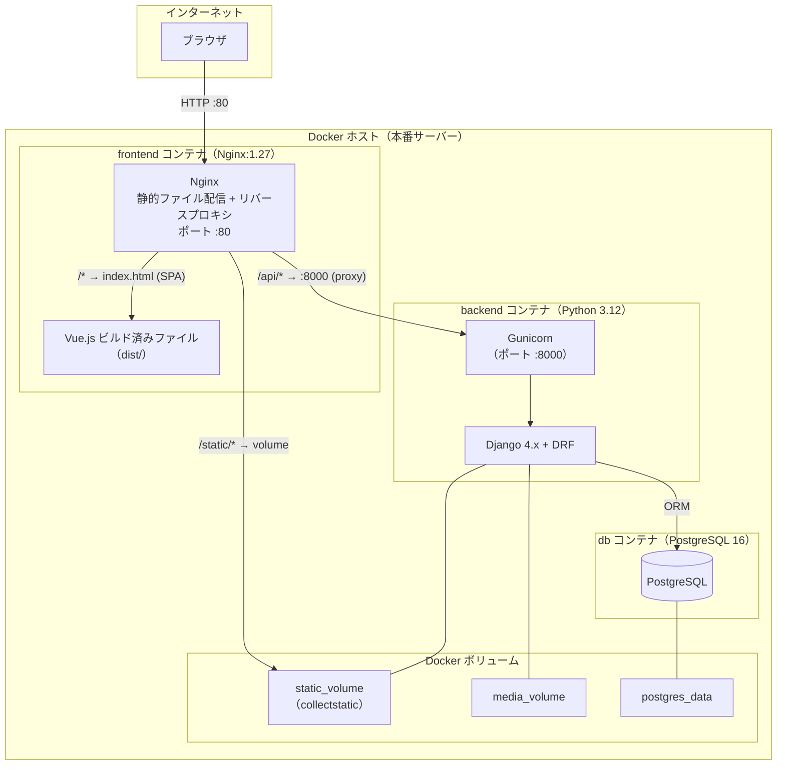
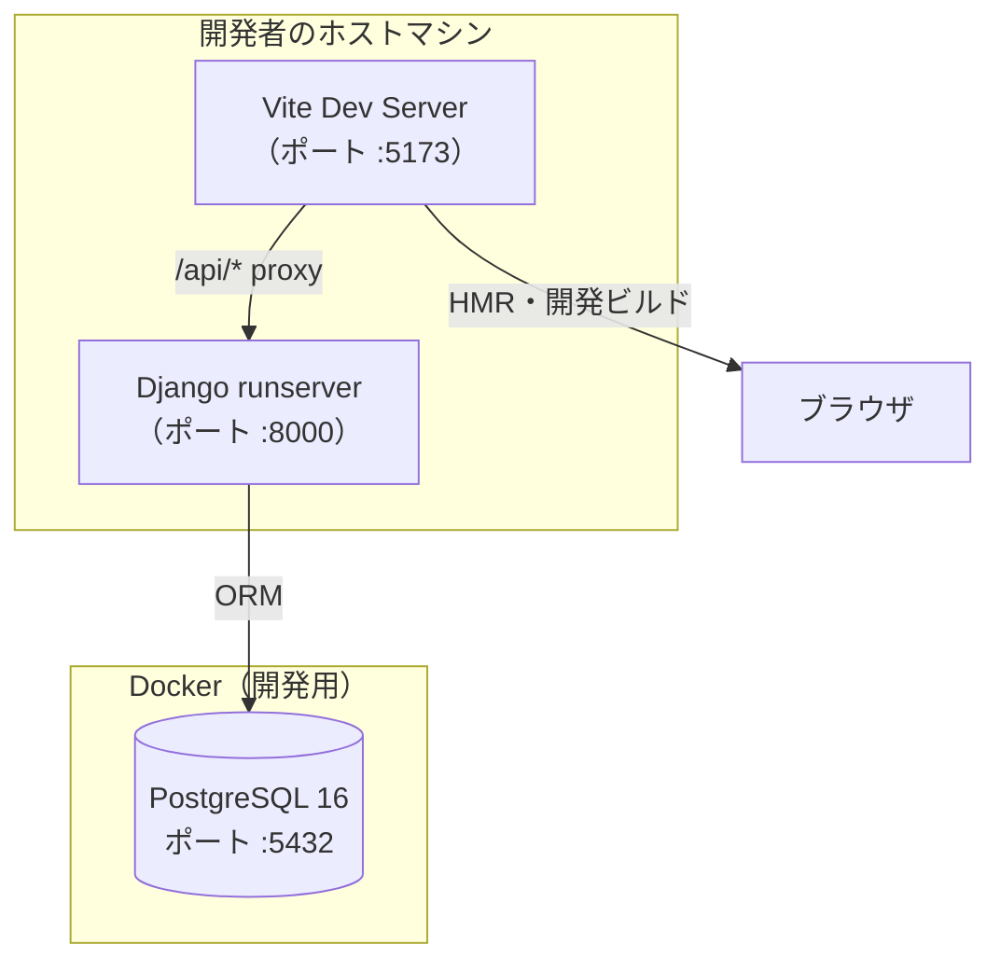
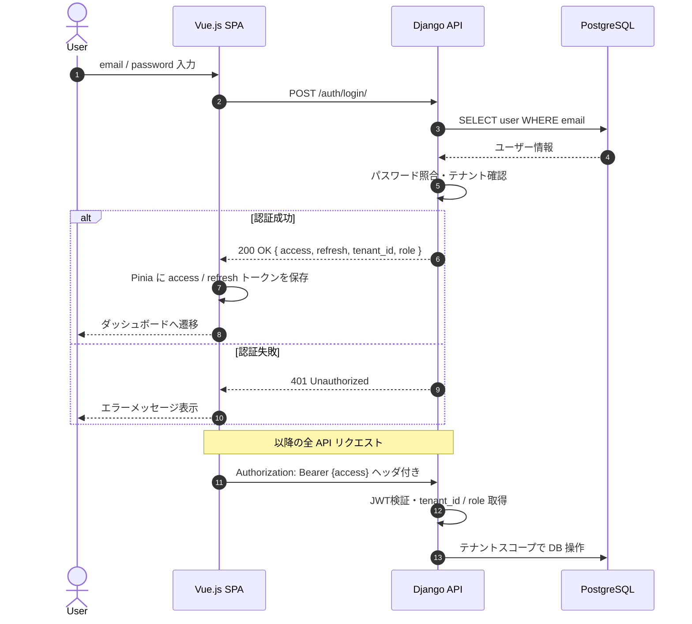
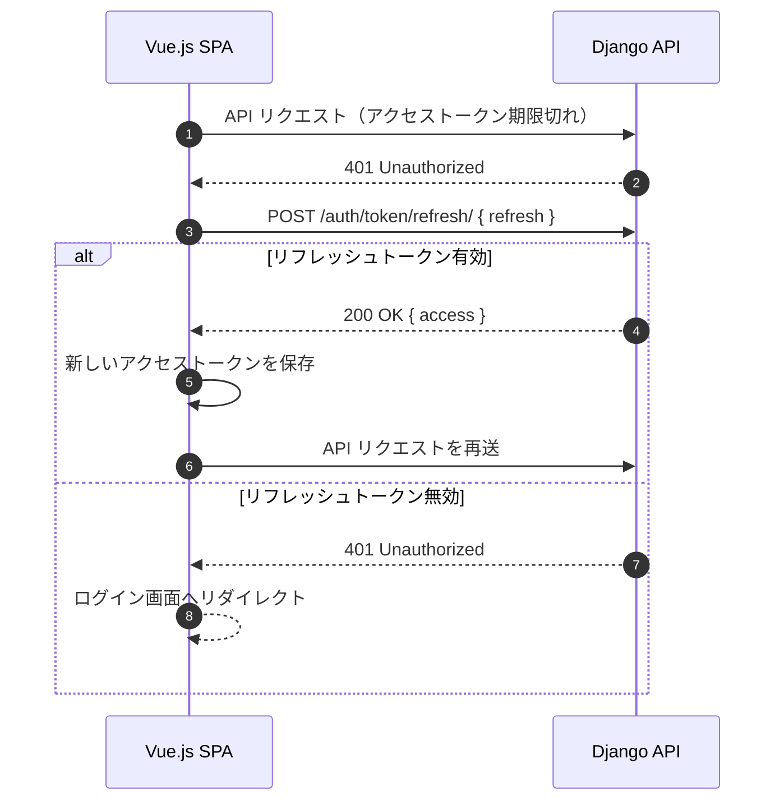
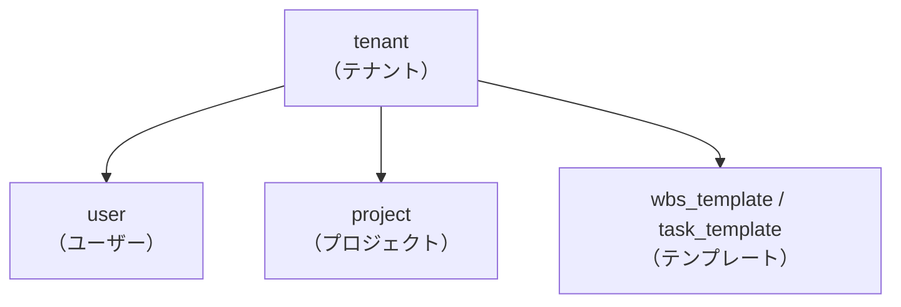
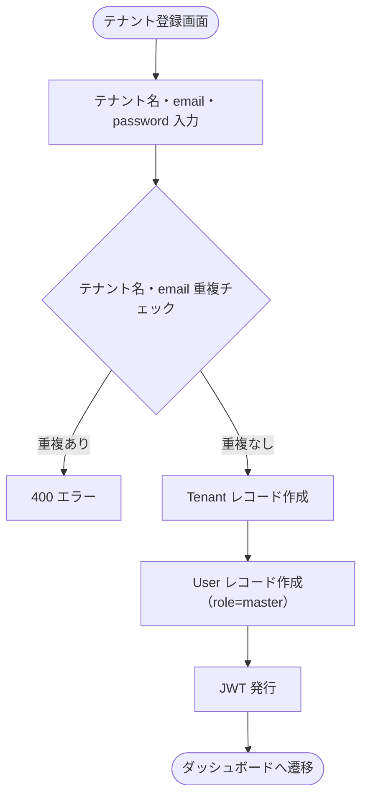

# システム構成図

- **最終更新日**：2026-04-26
- **バージョン**：v1.1

---

## 1. 全体構成

### 1.1 アーキテクチャ概要

- **フロントエンド**：Vue.js 3 (Composition API + Pinia) SPA。Axios でバックエンド REST API と通信する。Nginx コンテナにビルド済み静的ファイルを配置し配信する。
- **バックエンド**：Django 4.x + Django REST Framework + Gunicorn。JWT による認証を行い、テナント単位でデータを分離する。
- **データベース**：PostgreSQL 16。全テーブルに `tenant_id` を持たせ、アプリケーション層でテナント分離を保証する（シェアードスキーマ方式）。
- **ファイル生成**：openpyxl（Excel）、WeasyPrint（PDF）。定期実行処理は持たず、すべてリクエスト駆動で処理する。
- **インフラ**：Docker / Docker Compose によるコンテナ管理。開発・本番で同一コンテナイメージを使用する。

### 1.2 本番構成図

### 1.3 開発構成図

### 1.4 Docker コンテナ構成

| コンテナ | イメージ | 役割 | 公開ポート |
|---|---|---|---|
| frontend | Nginx 1.27-alpine（マルチステージビルド） | Vue.js 静的配信・リバースプロキシ | 80 |
| backend | Python 3.12-slim（Gunicorn） | Django REST API | なし（内部のみ） |
| db | postgres:16-alpine | データ永続化 | なし（内部のみ） |

### 1.5 コンポーネント説明

| コンポーネント | 技術 | 役割 |
|---|---|---|
| SPA | Vue.js 3 + Pinia | 画面描画・状態管理 |
| API通信 | Axios | JWT付きHTTPリクエスト |
| ガントチャート | 自作 SVG | 時系列タスク可視化 |
| リバースプロキシ | Nginx 1.27 | 静的配信・`/api/` プロキシ・セキュリティヘッダー |
| API サーバー | Django + DRF | ビジネスロジック・DB操作 |
| WSGI サーバー | Gunicorn | 本番用マルチワーカー HTTP サーバー |
| 認証 | simplejwt | JWT発行・検証 |
| DB | PostgreSQL 16 | 全データの永続化 |
| Excel生成 | openpyxl | WBS Excel出力 |
| PDF生成 | WeasyPrint | 報告書 PDF 出力（都度生成） |
| コンテナ管理 | Docker / Docker Compose | 開発・本番環境の統一 |

---

## 2. 認証フロー

### 2.1 JWT 2トークン方式

| トークン | 有効期限 | 用途 |
|---|---|---|
| アクセストークン | 短命（例：30分） | API リクエスト認証 |
| リフレッシュトークン | 長命（例：7日） | アクセストークン再発行 |

### 2.2 認証シーケンス

### 2.3 トークンリフレッシュフロー

---

## 3. マルチテナント方式

### 3.1 テナント分離方針

**シェアードスキーマ方式**を採用する。全テーブルで同一 PostgreSQL スキーマを共有し、`tenant_id` 外部キーでテナントデータを論理分離する。

| 方針 | 内容 |
|---|---|
| 分離手法 | シェアードスキーマ（`tenant_id` FK による論理分離） |
| テナント確認 | JWT ペイロードに `tenant_id` を含め、全 API で検証 |
| ORM フィルタ | 全クエリに `WHERE tenant_id = <JWTのtenant_id>` を適用 |
| クロステナント防止 | DRF の `get_queryset` で常にテナントスコープを強制 |

### 3.2 テナントデータ構造

### 3.3 テナント作成フロー

