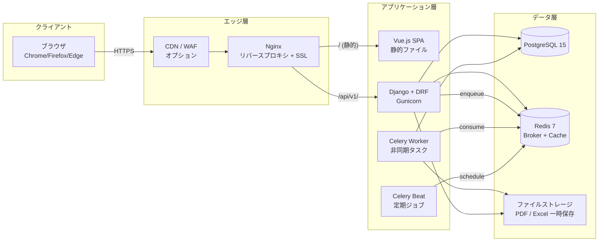
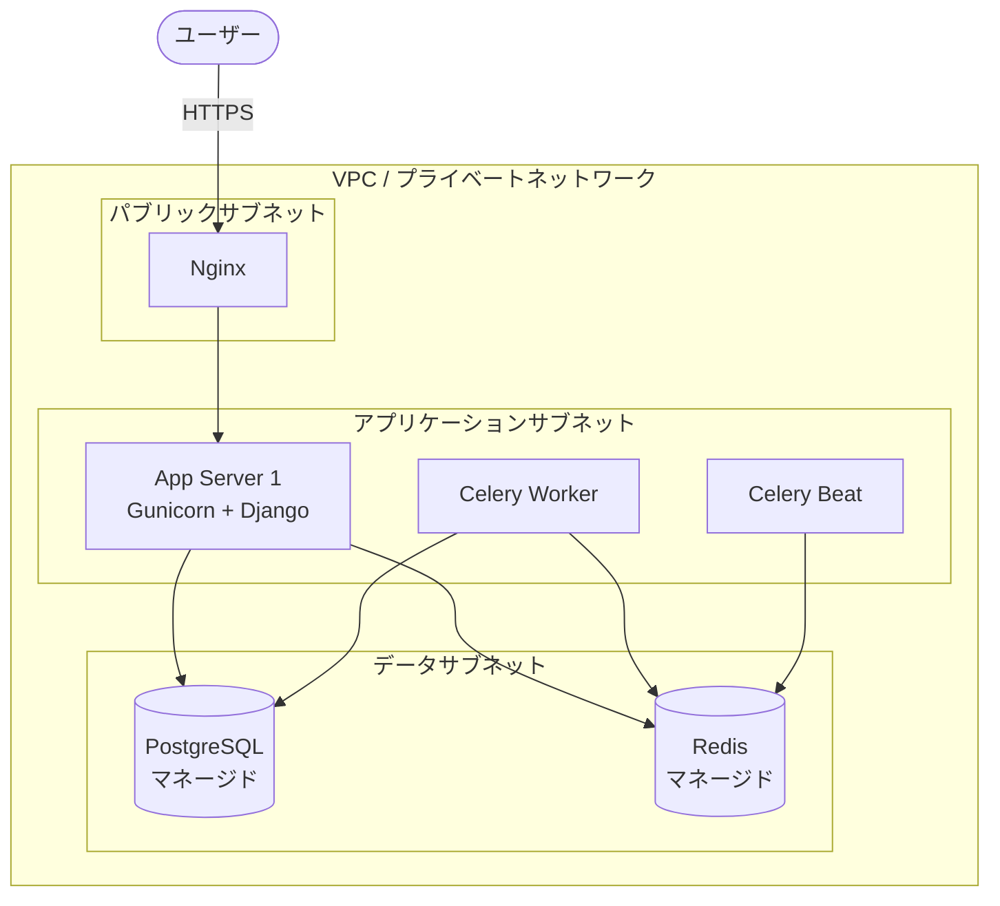
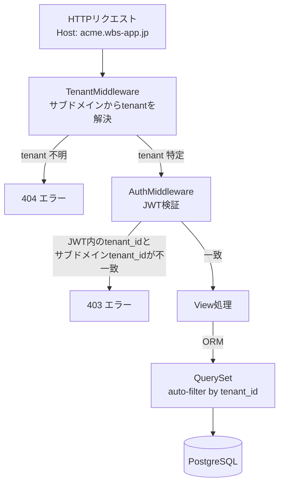
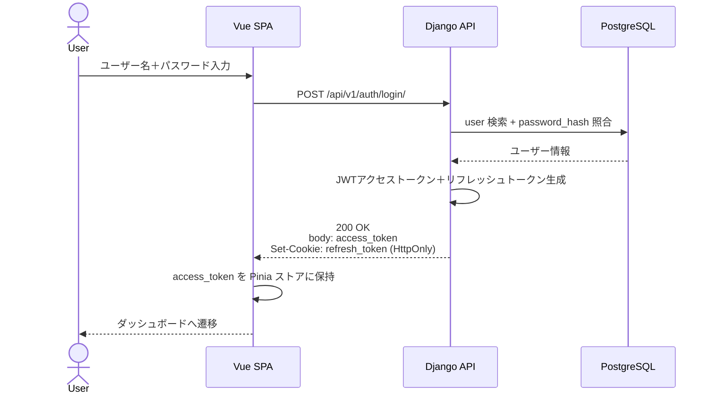
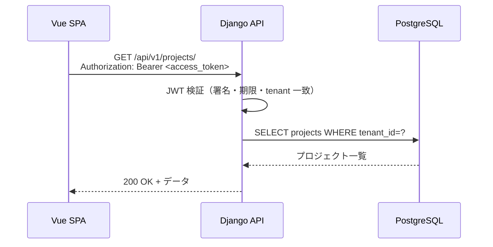
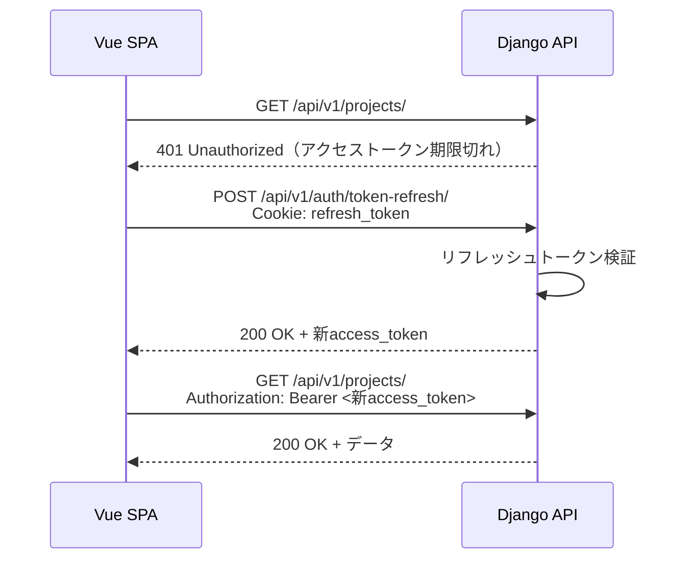
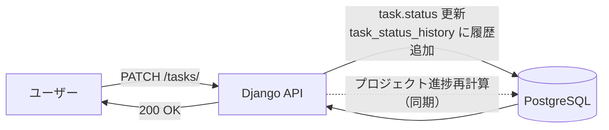
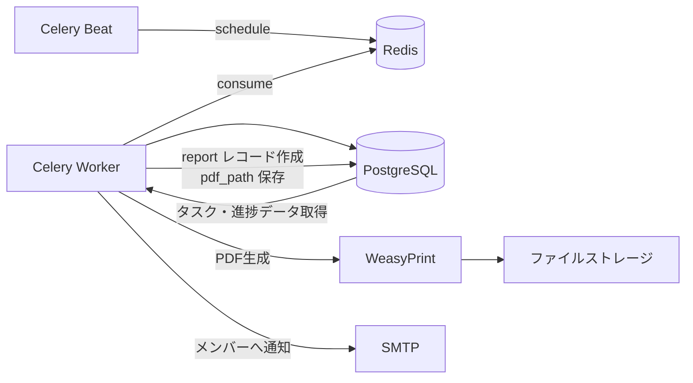

# システム構成図

WBS管理ソフトの全体アーキテクチャ・デプロイ構成・認証フロー・マルチテナント方式を定義する。

- **作成日**：2026-04-23
- **バージョン**：1.0

---

## 1. 技術スタック

| レイヤー | 技術 | バージョン目安 | 役割 |
|---------|------|-------------|------|
| フロントエンド | Vue.js 3（Composition API） | 3.4+ | SPA |
| 状態管理 | Pinia | 2.1+ | ストア |
| スタイリング | Tailwind CSS | 3.4+ | ユーティリティファースト CSS |
| API 通信 | Axios | 1.6+ | HTTP クライアント |
| ガント描画 | 自作（Canvas / SVG） | - | ガントチャート |
| バックエンド | Django | 4.2+ | アプリケーションフレームワーク |
| REST | Django REST Framework | 3.14+ | API 層 |
| 認証 | djangorestframework-simplejwt | - | JWT 発行・検証 |
| ORM | Django ORM | - | DB アクセス |
| データベース | PostgreSQL | 15+ | RDBMS |
| キュー | Celery | 5+ | 非同期タスク（定期レポート・自動割り振り） |
| ブローカ | Redis | 7+ | Celery broker + キャッシュ |
| Excel 生成 | openpyxl | - | .xlsx 出力 |
| PDF 生成 | WeasyPrint | - | PDF レポート |
| リバースプロキシ | Nginx | 1.24+ | 静的配信・SSL 終端 |
| アプリサーバ | Gunicorn | - | WSGI |

---

## 2. 全体アーキテクチャ



---

## 3. デプロイ構成（想定）

小〜中規模（最大10名テナント × 数十）までを想定したシンプル構成。将来的に水平スケール可能。



| コンポーネント | 目安スペック | 備考 |
|---------------|------------|------|
| Nginx | 2 vCPU / 4GB | SSL 終端・静的ファイル配信 |
| App Server | 2 vCPU / 4GB × 1〜2 | 将来は水平スケール |
| Celery Worker | 2 vCPU / 4GB | PDF/Excel 生成時に CPU を使う |
| PostgreSQL | マネージド（小〜中） | 自動バックアップ有効 |
| Redis | マネージド（小） | 永続化 ON |

---

## 4. マルチテナント方式

**採用方式**：シングルデータベース / シングルスキーマ（テナント識別カラム方式）

- 1 つの PostgreSQL インスタンス・1 つのスキーマ・1 つのテーブル群を全テナント共有
- すべての業務テーブルは `tenant_id`（直接）または親リソース経由（Project → Tenant）でテナントと紐付く
- アプリケーション層でミドルウェアがテナントを特定し、全 ORM クエリに `tenant_id` フィルタを自動付与

### 4.1 テナント識別フロー



### 4.2 テナント分離の担保

| レイヤー | 施策 |
|---------|------|
| URL | `{subdomain}.wbs-app.jp` でテナントを識別 |
| JWT | アクセストークンに `tenant_id` クレームを含める |
| ミドルウェア | サブドメインから取得した `tenant_id` と JWT の `tenant_id` を必ず照合 |
| ORM | テナント必須のモデルは `TenantManager` を使い `tenant_id` フィルタを強制 |
| 手動クエリ禁止 | 生 SQL・`Model.objects.raw()` を原則禁止（規約で統制） |
| 外部キー | `tenant_id` を持たないテーブル（Task 等）も親リソースを通じてテナントが確定する設計 |

---

## 5. 認証フロー（JWT）

**方式**：アクセストークン（短命）＋ リフレッシュトークン（長命）の 2 トークン方式。

| トークン | 有効期限 | 保存場所 | 用途 |
|---------|---------|---------|------|
| アクセストークン | 15 分 | メモリ / SessionStorage | API リクエストの `Authorization` ヘッダ |
| リフレッシュトークン | 7 日 | HttpOnly Cookie（Secure, SameSite=Strict） | アクセストークン再発行時に送信 |

### 5.1 ログインフロー



### 5.2 通常 API リクエストフロー



### 5.3 トークンリフレッシュフロー



### 5.4 ログアウトフロー

```mermaid
sequenceDiagram
    participant SPA as Vue SPA
    participant API as Django API
    participant REDIS as Redis

    SPA->>API: POST /api/v1/auth/logout/<br>Authorization: Bearer<br>Cookie: refresh_token
    API->>REDIS: リフレッシュトークンをブラックリストに登録
    API-->>SPA: 204 No Content<br>Set-Cookie: refresh_token=; Max-Age=0
    SPA->>SPA: アクセストークンを破棄
    SPA-->>SPA: ログイン画面へ遷移
```

---

## 6. 非同期処理・バッチ構成

| 機能 | 実行方式 | トリガ |
|------|---------|-------|
| 定期レポート自動作成 | Celery Beat → Worker | スケジュール（週次・隔週・月次・クォーター） |
| レポート PDF 生成 | Celery Worker（同期 API から enqueue） | ユーザー操作 |
| Excel 出力 | 同期生成（小規模）または Celery | ユーザー操作 |
| 通知メール送信 | Celery Worker | レポート作成完了、メンバー招待 等 |
| 論理削除データのパージ | Celery Beat（夜間） | 90 日経過データ |
| 自動割り振り計算 | 同期（プレビュー API 内） | ユーザー操作 |

---

## 7. データフロー（主要シナリオ）

### 7.1 WBS タスク更新 → 進捗集計



### 7.2 定期レポート自動生成



---

## 8. セキュリティ方針

| 項目 | 方針 |
|------|------|
| HTTPS | 必須（Nginx で TLS 終端） |
| CORS | 明示オリジン許可（ワイルドカード禁止） |
| パスワード | Argon2 もしくは bcrypt でハッシュ化、平文保存禁止 |
| JWT 署名 | RS256（鍵は環境変数管理） |
| XSS | Vue の自動エスケープ遵守、`v-html` は原則禁止 |
| SQL インジェクション | Django ORM のみ使用、生 SQL 禁止 |
| CSRF | API は JWT Bearer 認証のため Cookie 非依存（リフレッシュのみ Cookie + CSRF トークン併用） |
| レート制限 | DRF throttling で IP / ユーザー単位に制限 |
| セキュリティヘッダ | CSP / X-Frame-Options / Strict-Transport-Security を Nginx で付与 |
| ログ | アクセスログ・アプリログ・エラーログを分離。個人情報・トークンはマスク |

---

## 9. 環境構成

| 環境 | 用途 | 構成 |
|------|------|------|
| 開発（local） | 開発者PC | docker compose（Django + Postgres + Redis） |
| 開発（dev） | 結合テスト | 単一サーバ共用 |
| ステージング | 受入テスト | 本番同等構成（縮小版） |
| 本番 | サービス提供 | §3 の構成 |

---

## 10. 改版履歴

| バージョン | 日付 | 変更内容 |
|-----------|------|---------|
| 1.0 | 2026-04-23 | 初版作成（全体構成・認証フロー・マルチテナント方式） |
