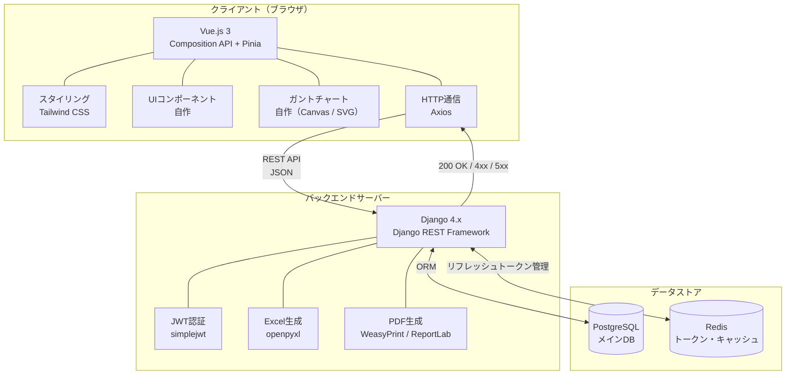
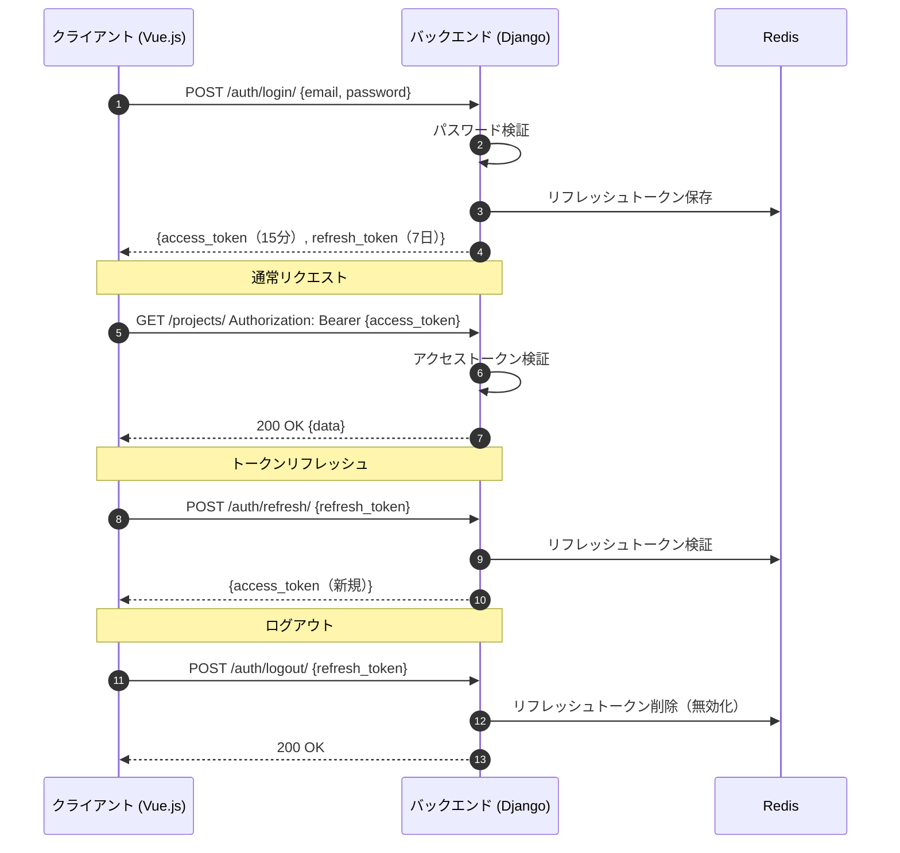
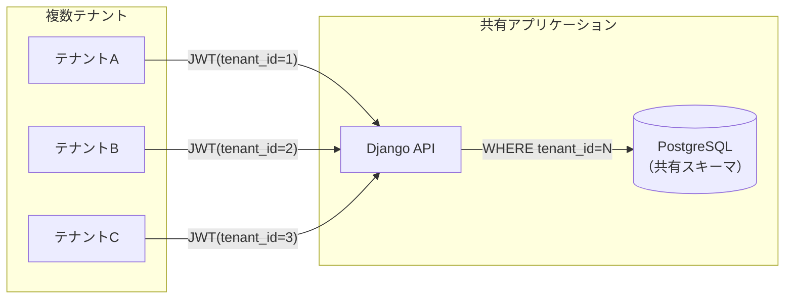

# システム構成図

## 1. 全体構成

## 2. 認証フロー（JWT）

## 3. コンポーネント一覧

| レイヤー | コンポーネント | 技術・バージョン | 用途 |
| :--- | :--- | :--- | :--- |
| フロントエンド | SPA フレームワーク | Vue.js 3（Composition API） | 画面構築 |
| フロントエンド | 状態管理 | Pinia | グローバルステート管理 |
| フロントエンド | スタイリング | Tailwind CSS | スタイル全般 |
| フロントエンド | UIコンポーネント | 自作 | UIパーツ（ライブラリ不使用） |
| フロントエンド | ガントチャート | 自作（Canvas / SVG） | ガントチャート描画 |
| フロントエンド | HTTP通信 | Axios | REST API呼び出し |
| バックエンド | Webフレームワーク | Django 4.x | サーバーサイド処理 |
| バックエンド | REST API | Django REST Framework | APIエンドポイント |
| バックエンド | 認証 | djangorestframework-simplejwt | JWT発行・検証 |
| バックエンド | Excel生成 | openpyxl | .xlsxエクスポート |
| バックエンド | PDF生成 | WeasyPrint / ReportLab | PDF出力 |
| データストア | メインDB | PostgreSQL | 全データ永続化 |
| データストア | トークン管理 | Redis | リフレッシュトークン保存・無効化 |

## 4. マルチテナント方式

- テナント分離方式：**共有スキーマ方式**（全テナントが同一DBスキーマを利用）
- 全テーブルに `tenant_id` を持たせ、APIリクエスト処理時にJWTから `tenant_id` を取得してクエリフィルタリング
- テナント間のデータ混在をバックエンドのORMレイヤーで制御

