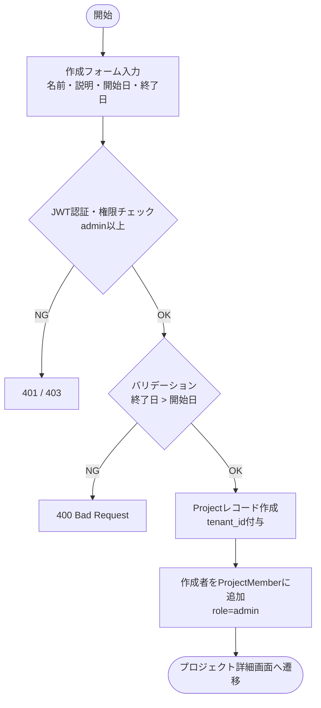
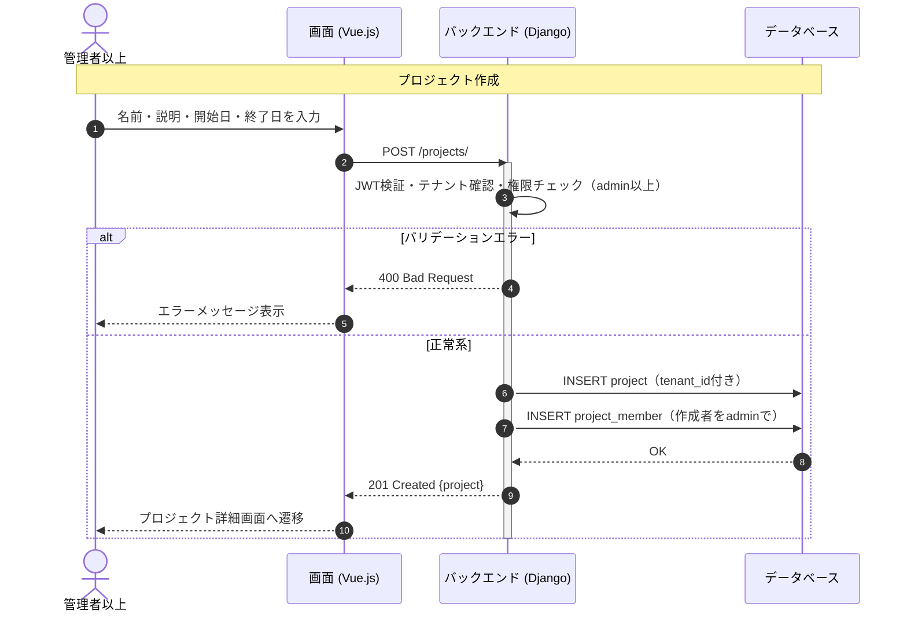

# 【機能仕様書】プロジェクト管理

## 1. 処理概要

- **目的**：テナント内で複数のプロジェクトを作成・管理する。メンバーを招待して共同作業を行い、タスク更新に連動して進捗率を自動集計する。
- **背景**：テナント単位でプロジェクトを分離し、管理者以上がプロジェクトの作成・編集・削除を行える構造が必要。

## 2. アクター

| アクター | 種別 | 役割 |
| --- | --- | --- |
| 管理者以上 | ユーザー | プロジェクト作成・編集・削除・メンバー管理 |
| メンバー | ユーザー | プロジェクト閲覧・タスク作業 |
| システム | 自動処理 | タスク更新時に進捗率を自動再集計 |

## 3. ワークフロー

## 4. シーケンス図

## 5. 処理フロー

### 5.1 プロジェクト作成

1. **バリデーション**：名前必須・終了日が開始日より後であることを確認（詳細は6.1参照）
   - バリデーションエラー：400 Bad Request を返す。
2. **DB操作**：Projectレコードをtenant_id付きで作成 → 作成者をProjectMemberにrole=adminで追加（詳細は6.2, 6.3参照）
   - DB失敗：500 エラーを返す。
3. **画面遷移**：プロジェクト詳細画面へ遷移。

### 5.2 メンバー追加

1. **権限チェック**：admin以上のみ実行可能。
   - 権限不足：403 Forbidden を返す。
2. **バリデーション**：対象ユーザーが同テナント内か・既にメンバーでないかを確認（詳細は6.1参照）
   - テナント外：400 / 重複：409 Conflict を返す。
3. **DB操作**：ProjectMemberレコードを作成。（詳細は6.2参照）
4. **画面遷移**：完了メッセージを表示。

### 5.3 プロジェクト削除

1. **権限チェック**：admin以上のみ実行可能。
2. **確認ダイアログ**：削除確認をユーザーに提示。キャンセル時は何もしない。
3. **DB操作**：deleted_at を付与して論理削除。（詳細は6.3参照）
4. **画面遷移**：プロジェクト一覧へ遷移。

### 5.4 進捗率自動集計

1. タスクのステータス or 進捗率が更新される。
2. 完了タスク数 / 全タスク数 × 100 でプロジェクト進捗率を算出。
3. Projectレコードの progress を更新。
4. プロジェクト一覧・詳細画面に反映。

## 6. 処理ロジック詳細

### 6.1 バリデーション条件（What）

| No | 項目名 | 条件 | 備考 |
| :--- | :--- | :--- | :--- |
| 1 | プロジェクト名 | 必須 | |
| 2 | 開始日 | 必須 | |
| 3 | 終了日 | 開始日より後 | |
| 4 | メンバー追加（ユーザー） | 同テナント内・未登録 | テナント外は400、重複は409 |

### 6.2 登録内容（What）

| No | 対象カラム | 登録内容 | 備考 |
| :--- | :--- | :--- | :--- |
| 1 | project.name | 入力値 | |
| 2 | project.tenant_id | JWTのtenant_id | |
| 3 | project.start_date / end_date | 入力値 | |
| 4 | project_member.user_id | 対象ユーザーID | |
| 5 | project_member.role | 指定ロール（admin/member） | |

### 6.3 処理制御（How）

- **論理削除**：DELETE時はレコードを物理削除せず deleted_at にタイムスタンプを付与。一覧取得時は deleted_at IS NULL で除外。
- **進捗率集計**：タスク更新APIのレスポンス後に同期的に再集計し、projectレコードを更新する。

## 7. API概要

| API名 | メソッド | 役割・概要 |
| :--- | :---: | :--- |
| プロジェクト一覧API | `GET` | テナント内プロジェクト一覧・進捗率付き |
| プロジェクト作成API | `POST` | プロジェクト新規作成 |
| プロジェクト詳細API | `GET` | プロジェクト詳細情報取得 |
| プロジェクト編集API | `PUT` | プロジェクト情報更新 |
| プロジェクト削除API | `DELETE` | 論理削除 |
| メンバー一覧API | `GET` | プロジェクトメンバー一覧 |
| メンバー追加API | `POST` | メンバー追加・ロール設定 |
| メンバーロール変更API | `PUT` | メンバーのロール変更 |
| メンバー削除API | `DELETE` | プロジェクトからメンバーを除外 |

## 8. テーブル概要

| テーブル名 | カラム名 | 操作 | 備考 |
| :--- | :--- | :--- | :--- |
| project | id, name, description, start_date, end_date, progress, tenant_id, deleted_at | INSERT / SELECT / UPDATE | |
| project_member | id, project_id, user_id, role | INSERT / SELECT / UPDATE / DELETE | |
