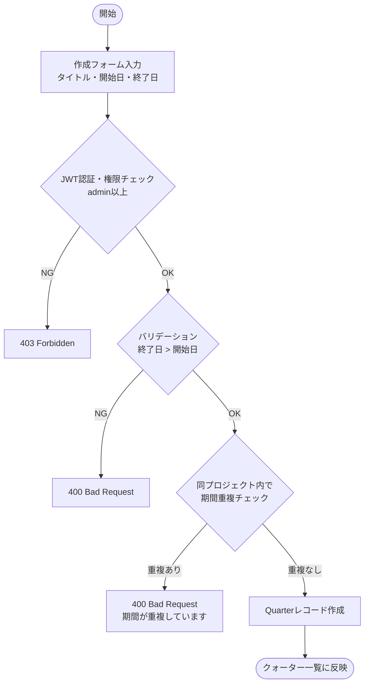
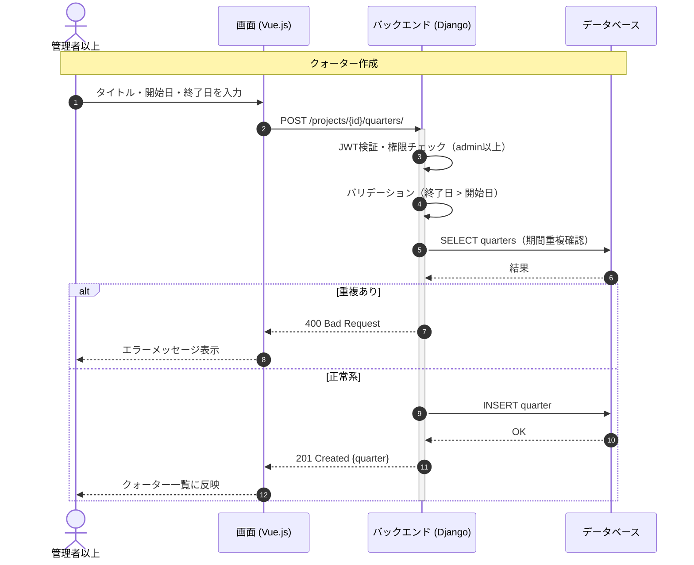

# 【機能仕様書】クォーター管理

## 1. 処理概要

- **目的**：プロジェクト内をQ1/Q2/Q3/Q4などのクォーター単位で期間区切りし、タスクをクォーターに紐付けてスケジュール管理を行う。クォーターごとの進捗率を集計し、ガントチャートにも区切りとして表示する。
- **背景**：プロジェクトを四半期単位で区分することで、タスクの計画・管理・可視化を容易にする。

## 2. アクター

| アクター | 種別 | 役割 |
| --- | --- | --- |
| 管理者以上 | ユーザー | クォーターの作成・編集・削除 |
| メンバー | ユーザー | クォーター一覧・進捗の閲覧 |
| システム | 自動処理 | タスク更新時にクォーター進捗率を再集計 |

## 3. ワークフロー

## 4. シーケンス図

## 5. 処理フロー

### 5.1 クォーター作成

1. **バリデーション**：タイトル・開始日必須、終了日が開始日より後、同プロジェクト内で期間重複なし（詳細は6.1参照）
   - バリデーションエラー：400 Bad Request を返す。
2. **DB操作**：Quarterレコードを作成。（詳細は6.2参照）
   - DB失敗：500 エラーを返す。
3. **画面遷移**：クォーター一覧・ガントチャートに反映。

### 5.2 クォーター編集

1. **バリデーション**：終了日が開始日より後、他クォーターとの期間重複なし（自身を除く）（詳細は6.1参照）
   - バリデーションエラー：400 Bad Request を返す。
2. **DB操作**：Quarterレコードを更新。（詳細は6.2参照）
3. **画面遷移**：完了メッセージ表示・ガントチャートに反映。

### 5.3 クォーター削除

1. **確認ダイアログ**：紐付きタスクへの影響を警告。キャンセル時は何もしない。
2. **DB操作**：紐付きタスクのquarter_idをNULLに更新 → Quarterレコードを削除。（詳細は6.3参照）
3. **画面遷移**：クォーター一覧・ガントチャートに反映。

### 5.4 進捗率集計（自動）

1. タスクのステータス or 進捗率が更新される。
2. タスクにquarter_idが紐付いている場合、該当クォーターの完了タスク数 / 全タスク数 × 100 を算出。
3. クォーター進捗率を更新。
4. ガントチャート・詳細画面に反映。

## 6. 処理ロジック詳細

### 6.1 バリデーション条件（What）

| No | 項目名 | 条件 | 備考 |
| :--- | :--- | :--- | :--- |
| 1 | タイトル | 必須 | |
| 2 | 開始日 | 必須 | |
| 3 | 終了日 | 開始日より後 | |
| 4 | 期間重複 | 同プロジェクト内で重複なし | 編集時は自身を除いてチェック |

### 6.2 登録内容（What）

| No | 対象カラム | 登録内容 | 備考 |
| :--- | :--- | :--- | :--- |
| 1 | quarter.title | 入力値 | |
| 2 | quarter.start_date | 入力値 | |
| 3 | quarter.end_date | 入力値 | |
| 4 | quarter.project_id | パスパラメータのproject_id | |

### 6.3 処理制御（How）

- **削除時の紐付き解除**：クォーター削除前に、紐付くタスクの quarter_id を NULL に更新する（タスク自体は削除しない）。
- **進捗率集計**：タスク更新APIの処理後に同期的に再集計する。

## 7. API概要

| API名 | メソッド | 役割・概要 |
| :--- | :---: | :--- |
| クォーター一覧API | `GET` | プロジェクト内クォーター一覧・進捗率付き |
| クォーター作成API | `POST` | クォーター新規作成 |
| クォーター詳細API | `GET` | クォーター詳細情報取得 |
| クォーター編集API | `PUT` | クォーター情報更新 |
| クォーター削除API | `DELETE` | クォーター削除（紐付きタスクのquarter_idをNULLに更新） |

## 8. テーブル概要

| テーブル名 | カラム名 | 操作 | 備考 |
| :--- | :--- | :--- | :--- |
| quarter | id, title, start_date, end_date, progress, project_id | INSERT / SELECT / UPDATE / DELETE | |
| task | quarter_id | UPDATE | 削除時にNULLへ更新 |
