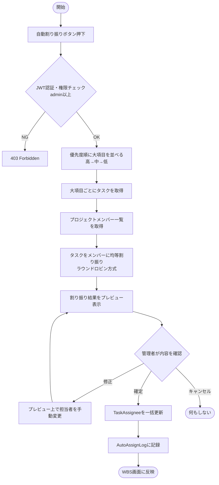
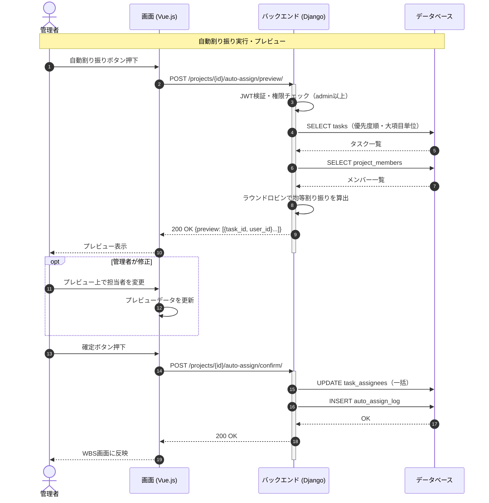

# 【機能仕様書】タスク自動割り振り

## 1. 処理概要

- **目的**：管理者が実行ボタンを押すと、WBSの大項目（第1層）単位の優先度をもとにタスクをメンバーへラウンドロビンで均等割り振りする。プレビューで確認・修正してから確定する。
- **背景**：担当者の手動割り当て作業を削減し、優先度と均等性を考慮した自動化を提供する。

## 2. アクター

| アクター | 種別 | 役割 |
| --- | --- | --- |
| 管理者以上 | ユーザー | 優先度設定・割り振り実行・プレビュー確認・確定 |
| メンバー | ユーザー | 割り振り結果の閲覧 |
| システム | 自動処理 | ラウンドロビン割り振りアルゴリズムの実行 |

## 3. ワークフロー

## 4. シーケンス図

## 5. 処理フロー

### 5.1 優先度設定

1. WBS画面で大項目（第1層）ごとに優先度を選択（高・中・低）。
2. **DB操作**：Taskレコードのpriorityを更新。

### 5.2 自動割り振り実行・プレビュー

1. **権限チェック**：admin以上のみ実行可能。
2. **DB操作**：大項目を優先度順（高→中→低）に取得 → プロジェクトメンバー一覧を取得。（詳細は6.3参照）
   - メンバーが0人の場合：400 Bad Request を返す。
3. **プレビュー**：ラウンドロビン割り振り結果をレスポンスで返却。管理者は手動変更も可能。
4. **確定**：プレビューデータを送信 → TaskAssigneeを一括更新 → AutoAssignLogに記録。（詳細は6.2参照）
   - DB失敗：500 エラーを返す。
5. **画面遷移**：WBS画面に反映。

### 5.3 割り振り履歴確認

1. **権限チェック**：admin以上のみ閲覧可能。
2. **DB操作**：AutoAssignLogを実行日時の降順で取得。
3. 履歴一覧を表示。特定履歴を選択して詳細を表示。

## 6. 処理ロジック詳細

### 6.1 バリデーション条件（What）

| No | 項目名 | 条件 | 備考 |
| :--- | :--- | :--- | :--- |
| 1 | プロジェクトメンバー数 | 1人以上 | 0人の場合は400 |

### 6.2 登録内容（What）

| No | 対象カラム | 登録内容 | 備考 |
| :--- | :--- | :--- | :--- |
| 1 | task_assignee.user_id | 割り振り結果のuser_id | 一括UPDATE |
| 2 | auto_assign_log.project_id | 対象プロジェクトID | |
| 3 | auto_assign_log.result | 割り振り結果JSON | |
| 4 | auto_assign_log.executed_by | 実行者user_id | |
| 5 | auto_assign_log.executed_at | 実行日時 | |

### 6.3 処理制御（How）

- **割り振りアルゴリズム**：優先度（高→中→低）順に大項目を処理し、各大項目内のタスクをプロジェクトメンバーにラウンドロビン（順番に1つずつ割り当て）で均等割り振りする。
- **確定処理**：プレビューで修正された内容も含めて一括UPDATEする。トランザクションで実行し失敗時はロールバック。

## 7. API概要

| API名 | メソッド | 役割・概要 |
| :--- | :---: | :--- |
| 自動割り振りプレビューAPI | `POST` | 割り振り結果をプレビュー生成（DB保存なし） |
| 自動割り振り確定API | `POST` | プレビュー内容を確定・DB反映 |
| 割り振り履歴一覧API | `GET` | 過去の割り振り履歴一覧取得 |
| 割り振り履歴詳細API | `GET` | 特定履歴の割り振り結果詳細 |

## 8. テーブル概要

| テーブル名 | カラム名 | 操作 | 備考 |
| :--- | :--- | :--- | :--- |
| task | id, priority | SELECT / UPDATE | 優先度設定・一覧取得 |
| task_assignee | task_id, user_id | UPDATE | 一括割り振り確定 |
| project_member | project_id, user_id | SELECT | メンバー一覧取得 |
| auto_assign_log | id, project_id, result, executed_by, executed_at | INSERT / SELECT | 履歴記録・取得 |
