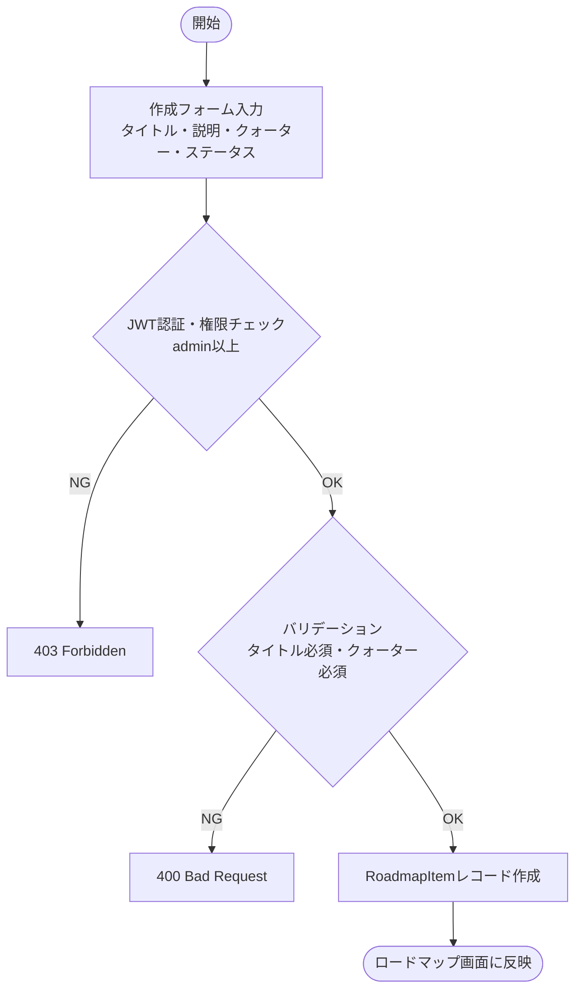
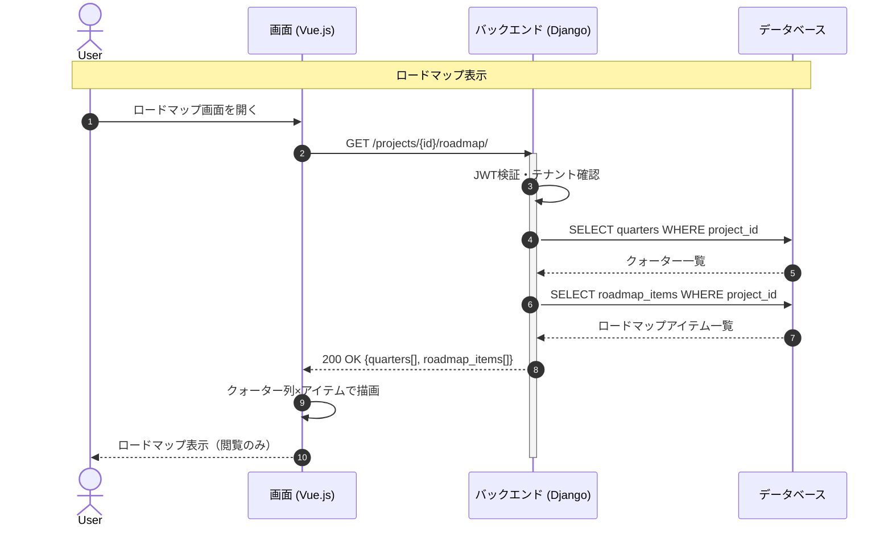

# 【機能仕様書】プロダクトロードマップ

## 1. 処理概要

- **目的**：プロジェクト単位でクォーターを軸にしたロードマップを表示する。WBSのタスクとは独立した機能・テーマ単位の計画・方向性の可視化を目的とする。閲覧専用のため、アイテムの作成・編集は別画面で行う。
- **背景**：タスクの詳細管理とは別に、プロダクト全体の方向性をクォーター単位で把握・共有できる手段が必要。

## 2. アクター

| アクター | 種別 | 役割 |
| --- | --- | --- |
| 管理者以上 | ユーザー | ロードマップアイテムの作成・編集・削除 |
| メンバー | ユーザー | ロードマップの閲覧のみ |
| システム | 自動処理 | クォーター×アイテムのマトリクス描画データを生成 |

## 3. ワークフロー

## 4. シーケンス図

## 5. 処理フロー

### 5.1 ロードマップアイテム作成

1. **バリデーション**：タイトル・クォーター必須、指定クォーターが同プロジェクト内であることを確認（詳細は6.1参照）
   - バリデーションエラー：400 Bad Request を返す。
2. **DB操作**：RoadmapItemレコードを作成。（詳細は6.2参照）
   - DB失敗：500 エラーを返す。
3. **画面遷移**：ロードマップ画面に反映。

### 5.2 ロードマップ表示

1. ロードマップ画面を開く。
2. **DB操作**：プロジェクトのクォーター一覧 + RoadmapItem一覧を取得。
3. クォーター列×アイテム行でロードマップを描画（閲覧のみ・編集操作は提供しない）。

### 5.3 ロードマップアイテム編集

1. **バリデーション**：タイトル・クォーター必須（詳細は6.1参照）
2. **DB操作**：RoadmapItemレコードを更新。（詳細は6.2参照）
3. **画面遷移**：ロードマップ画面に反映。

### 5.4 ロードマップアイテム削除

1. **確認ダイアログ**：削除確認。キャンセル時は何もしない。
2. **DB操作**：RoadmapItemレコードを削除。
3. **画面遷移**：ロードマップ画面に反映。

## 6. 処理ロジック詳細

### 6.1 バリデーション条件（What）

| No | 項目名 | 条件 | 備考 |
| :--- | :--- | :--- | :--- |
| 1 | タイトル | 必須 | |
| 2 | クォーター | 必須・同プロジェクト内のクォーター | |
| 3 | ステータス | 計画中 / 進行中 / 完了 / 保留 のいずれか | |

### 6.2 登録内容（What）

| No | 対象カラム | 登録内容 | 備考 |
| :--- | :--- | :--- | :--- |
| 1 | roadmap_item.title | 入力値 | |
| 2 | roadmap_item.description | 入力値（任意） | |
| 3 | roadmap_item.quarter_id | 選択したクォーターID | |
| 4 | roadmap_item.status | 選択値 | デフォルト：計画中 |
| 5 | roadmap_item.project_id | パスパラメータのproject_id | |

### 6.3 処理制御（How）

- **閲覧専用**：ロードマップ画面では編集操作を提供しない。作成・編集は専用フォーム画面からのみ行う。

## 7. API概要

| API名 | メソッド | 役割・概要 |
| :--- | :---: | :--- |
| ロードマップ取得API | `GET` | クォーター一覧＋アイテム一覧を取得 |
| アイテム作成API | `POST` | ロードマップアイテム新規作成 |
| アイテム詳細API | `GET` | アイテム詳細情報取得 |
| アイテム編集API | `PUT` | アイテム情報更新 |
| アイテム削除API | `DELETE` | アイテム削除 |

## 8. テーブル概要

| テーブル名 | カラム名 | 操作 | 備考 |
| :--- | :--- | :--- | :--- |
| roadmap_item | id, title, description, quarter_id, status, project_id | INSERT / SELECT / UPDATE / DELETE | |
| quarter | id, title, start_date, end_date, project_id | SELECT | クォーター情報取得 |
