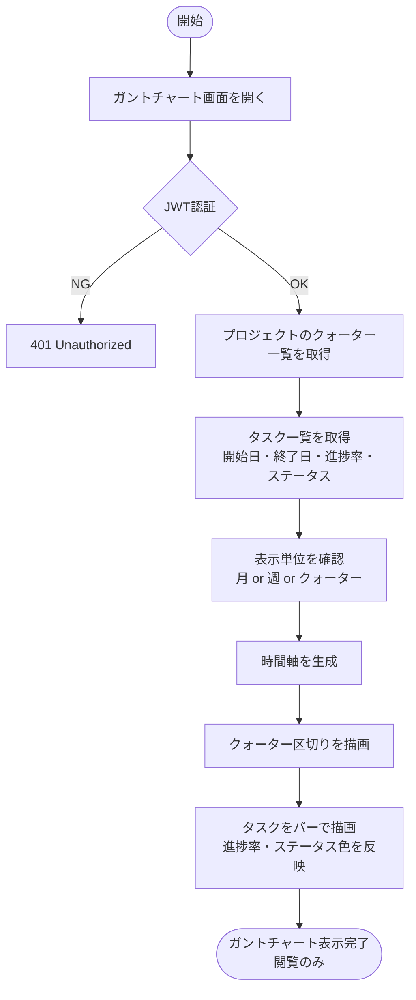
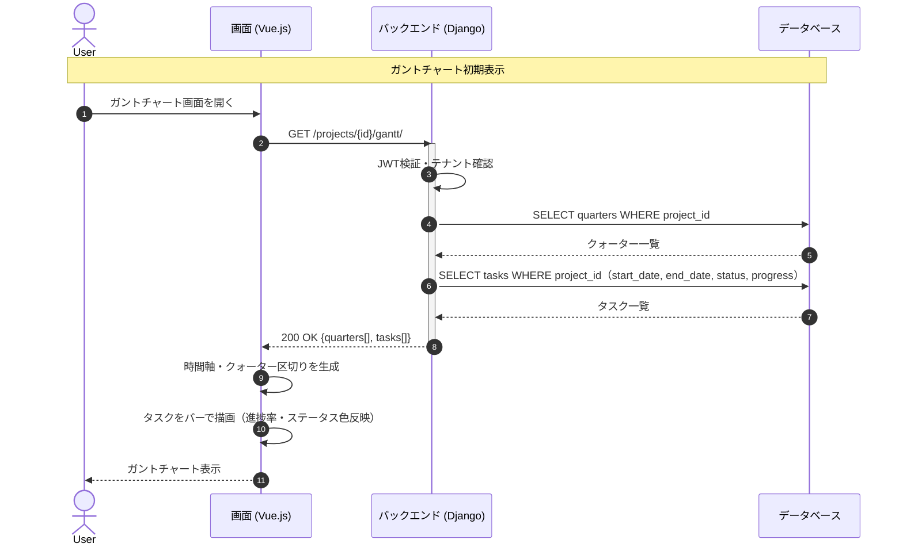

# 【機能仕様書】ガントチャート

## 1. 処理概要

- **目的**：プロジェクト内のタスクをスケジュール軸（月・週・クォーター）で可視化する。閲覧専用であり編集操作は提供しない。
- **背景**：WBSのタスク一覧では把握しにくいスケジュールの全体像を、時間軸で直感的に確認できる手段として提供する。

## 2. アクター

| アクター | 種別 | 役割 |
| --- | --- | --- |
| 全ユーザー | ユーザー | ガントチャートの閲覧・表示単位切り替え |
| システム | 自動処理 | クォーター区切り・バー描画の計算 |

## 3. ワークフロー

## 4. シーケンス図

## 5. 処理フロー

### 5.1 ガントチャート初期表示

1. **DB操作**：クォーター一覧 + タスク一覧（開始日・終了日・進捗率・ステータス）を取得。（詳細は6.3参照）
   - 認証エラー：401 Unauthorized を返す。
2. フロントで月単位（デフォルト）の時間軸を生成。
3. クォーター区切りを縦線で描画。
4. タスクをバーで描画（進捗率の塗り・ステータス別色）。
5. 開始日・終了日が未設定のタスクはバー非表示。

### 5.2 表示単位切り替え

1. 月 / 週 / クォーター の切り替えボタンを押す。
2. APIリクエストなしで時間軸を再計算・再描画。
   - クォーター未設定時：メッセージを表示。

### 5.3 タスク詳細ポップアップ

1. タスクバーをクリック。
2. **DB操作**：タスク詳細を取得（機能仕様04のAPIを共用）。
3. ポップアップで詳細を表示（閲覧のみ・編集ボタンなし）。

## 6. 処理ロジック詳細

### 6.1 バリデーション条件（What）

| No | 項目名 | 条件 | 備考 |
| :--- | :--- | :--- | :--- |
| 1 | 表示単位 | 月 / 週 / クォーター のいずれか | デフォルト：月 |

### 6.2 登録内容（What）

※ガントチャートは閲覧専用のため登録・更新処理なし。

### 6.3 処理制御（How）

- **表示専用**：ガントチャートは読み取り専用。編集操作（タスクのドラッグ変更等）は提供しない。
- **バー色分け**：未着手=グレー、進行中=ブルー、レビュー待ち=オレンジ、完了=グリーン、保留=レッド。
- **クォーター切り替え**：クォーター単位の時間軸はプロジェクトのQ1〜Q4を使用。クォーター未設定時はメッセージを表示する。

## 7. API概要

| API名 | メソッド | 役割・概要 |
| :--- | :---: | :--- |
| ガントチャートデータ取得API | `GET` | クォーター一覧＋タスク一覧（日程・進捗・ステータス）を取得 |

※タスク詳細は機能仕様04（タスク詳細API）を共用。

## 8. テーブル概要

| テーブル名 | カラム名 | 操作 | 備考 |
| :--- | :--- | :--- | :--- |
| quarter | id, title, start_date, end_date, project_id | SELECT | クォーター区切り表示用 |
| task | id, title, start_date, end_date, progress, status, parent_task_id | SELECT | バー描画用 |
