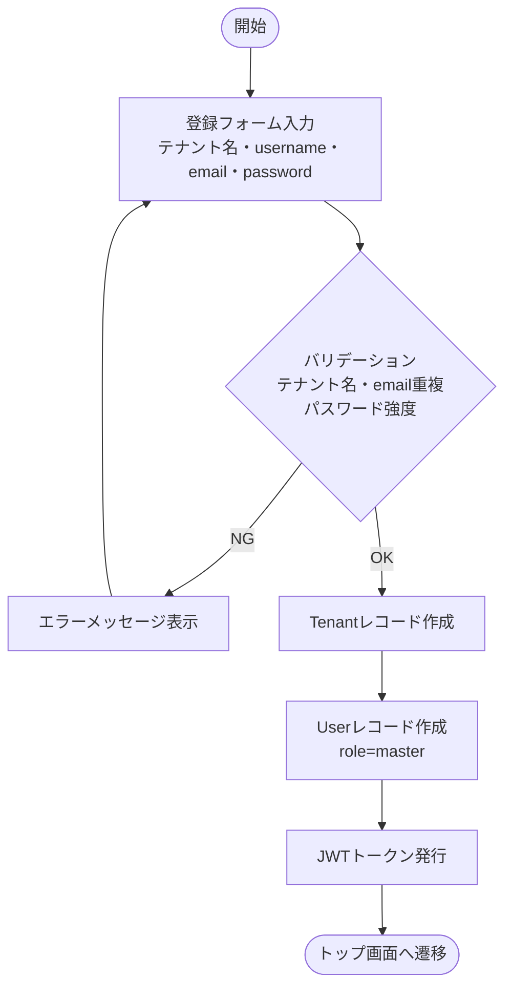
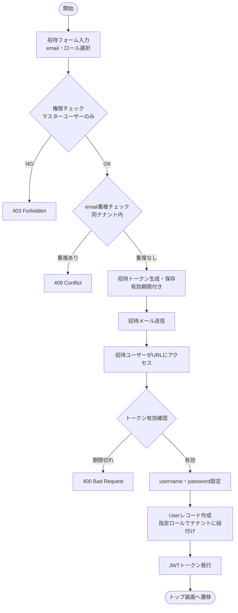
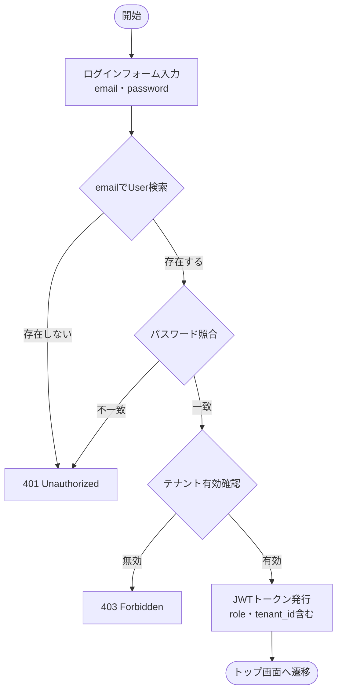
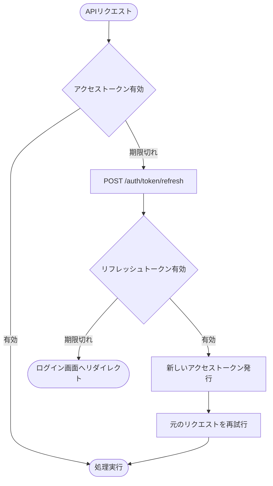
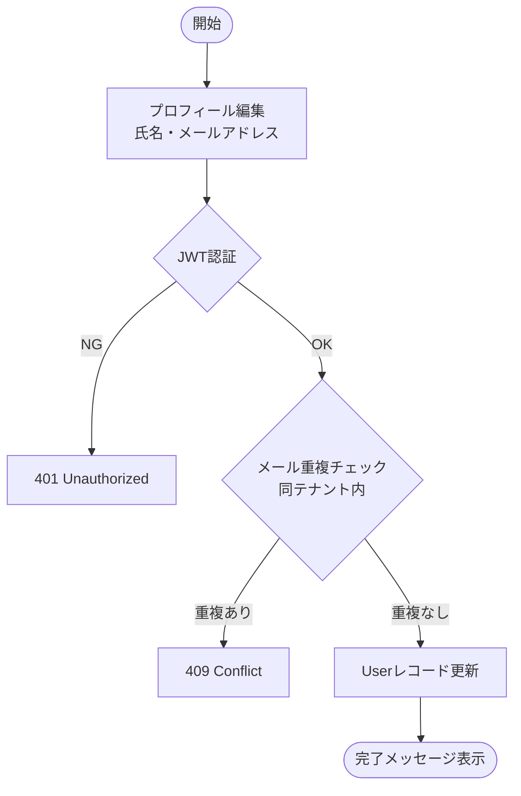
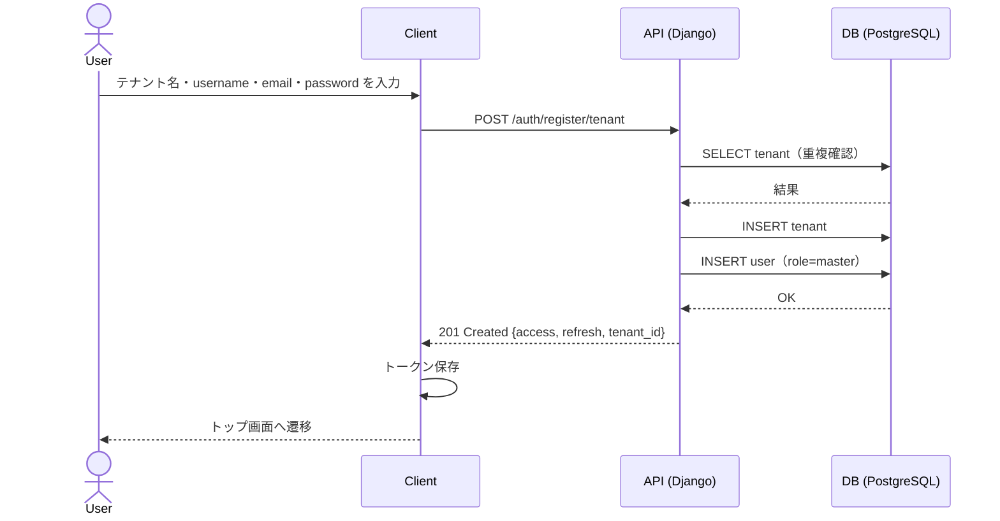
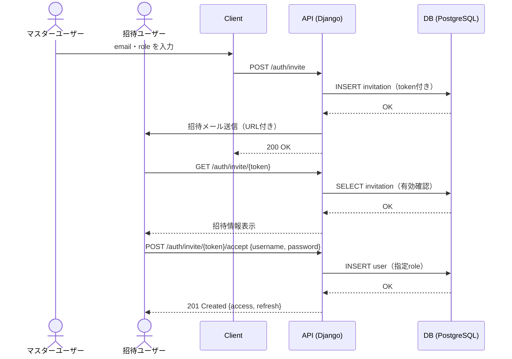
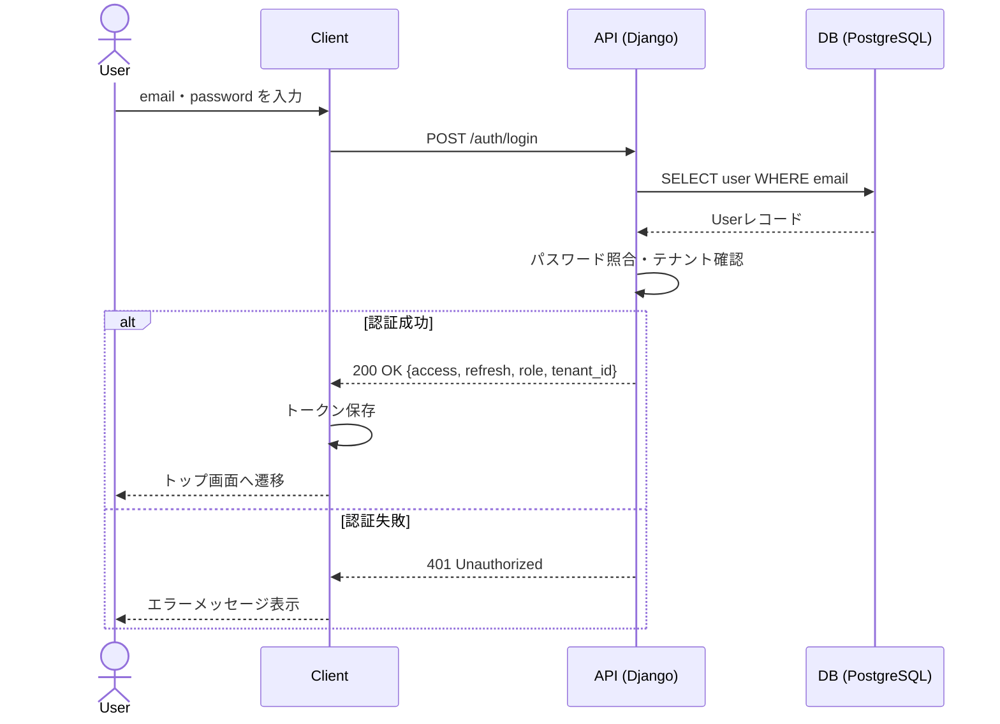
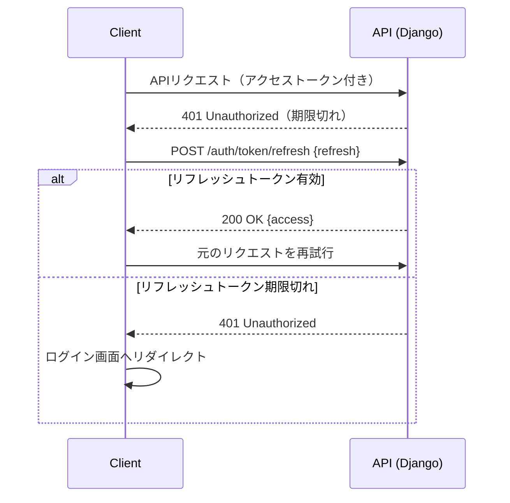

# 機能仕様 01 - 認証・ユーザー管理

**作成日：** 2026年4月12日  
**バージョン：** 1.4

---

## 1. 機能概要

テナントを親単位とし、テナントに紐づくユーザーの登録・招待・ログイン・ログアウト・プロフィール管理を行う。  
認証にはJWT（JSON Web Token）を使用し、アクセストークンとリフレッシュトークンの2トークン方式を採用する。  
テナント間のデータは完全に独立しており、共有は行わない。

### ロール階層

```
マスターユーザー（テナント作成者・最上位権限）
    └── 管理者（Admin）
            └── メンバー（Member）
```

### ロール別権限

| ロール | 権限内容 |
|--------|---------|
| マスターユーザー | テナント情報の編集、ユーザーの作成・削除・ロール変更（全権限）、管理者・メンバーの全操作 |
| 管理者（Admin） | プロジェクト作成・編集・削除、メンバー管理、全タスク編集、レビュー、自動割り振り、報告書作成・出力 |
| メンバー（Member） | 担当タスクの進捗更新・ステータス変更、レビュー、テンプレート作成・利用、報告書閲覧 |

| 項目 | 内容 |
|------|------|
| 認証方式 | JWT（djangorestframework-simplejwt） |
| トークン種別 | アクセストークン（短命）/ リフレッシュトークン（長命） |
| テナント分離 | 完全独立（テナント間のデータ共有なし） |

---

## 2. 処理フロー

### 2-1. テナント作成 & マスターユーザー登録



### 2-2. ユーザー招待



### 2-3. ログイン



### 2-4. トークンリフレッシュ



### 2-5. プロフィール更新



---

## 3. シーケンス図

### 3-1. テナント作成 & マスターユーザー登録



### 3-2. ユーザー招待



### 3-3. ログイン



### 3-4. トークンリフレッシュ



---

## 4. ステップ記述

### 4-1. テナント作成 & マスターユーザー登録

| ステップ | 処理 | 担当 | エラー処理 |
|---------|------|------|-----------|
| 1 | 登録フォームにテナント名・username・email・passwordを入力 | フロントエンド | 必須チェック |
| 2 | POST /auth/register/tenant にリクエスト送信 | フロントエンド | - |
| 3 | テナント名・emailの重複チェック | バックエンド | 409 Conflict |
| 4 | passwordのバリデーション（8文字以上） | バックエンド | 400 Bad Request |
| 5 | Tenantレコードを作成 | バックエンド | 500 Server Error |
| 6 | Userレコードをrole=masterで作成しテナントに紐付け | バックエンド | 500 Server Error |
| 7 | JWTトークンを発行して返却 | バックエンド | - |
| 8 | トークンを保存しトップへ遷移 | フロントエンド | - |

### 4-2. ユーザー招待

| ステップ | 処理 | 担当 | エラー処理 |
|---------|------|------|-----------|
| 1 | 招待フォームにemail・ロールを入力 | マスターユーザー | 必須チェック |
| 2 | POST /auth/invite にリクエスト送信 | フロントエンド | - |
| 3 | JWTでマスターユーザー権限を確認 | バックエンド | 403 Forbidden |
| 4 | emailの重複チェック（同テナント内） | バックエンド | 409 Conflict |
| 5 | 招待トークンを生成しDBに保存（有効期限付き） | バックエンド | - |
| 6 | 招待URLをメールで送信 | バックエンド | - |
| 7 | 招待URLにアクセスしusername・passwordを設定 | 招待ユーザー | トークン期限切れ：400 |
| 8 | Userレコードを指定ロールで作成・テナントに紐付け | バックエンド | 500 Server Error |
| 9 | JWTトークンを発行してログイン状態へ | バックエンド | - |

### 4-3. ログイン

| ステップ | 処理 | 担当 | エラー処理 |
|---------|------|------|-----------|
| 1 | ログインフォームにemail・passwordを入力 | フロントエンド | 必須チェック |
| 2 | POST /auth/login にリクエスト送信 | フロントエンド | - |
| 3 | emailでUserレコードを検索 | バックエンド | 401 Unauthorized |
| 4 | パスワードの照合 | バックエンド | 401 Unauthorized |
| 5 | テナントの有効性を確認 | バックエンド | 403 Forbidden |
| 6 | JWTトークン（role・tenant_id含む）を発行 | バックエンド | - |
| 7 | トークンを保存しトップへ遷移 | フロントエンド | - |

### 4-4. プロフィール更新

| ステップ | 処理 | 担当 | エラー処理 |
|---------|------|------|-----------|
| 1 | プロフィール画面で氏名・メールアドレスを編集 | フロントエンド | 必須チェック |
| 2 | PUT /auth/profile にリクエスト送信 | フロントエンド | - |
| 3 | JWTトークンで本人確認 | バックエンド | 401 Unauthorized |
| 4 | メールアドレスの重複チェック（同テナント内） | バックエンド | 409 Conflict |
| 5 | Userレコードを更新 | バックエンド | 500 Server Error |
| 6 | 完了メッセージを表示 | フロントエンド | - |

---

## 5. APIエンドポイント一覧

| メソッド | エンドポイント | 説明 | 権限 |
|---------|--------------|------|------|
| POST | /auth/register/tenant | テナント作成＋マスターユーザー登録 | 不要 |
| POST | /auth/login | ログイン | 不要 |
| POST | /auth/logout | ログアウト | 全ユーザー |
| POST | /auth/token/refresh | トークンリフレッシュ | 不要 |
| GET | /auth/profile | プロフィール取得 | 全ユーザー |
| PUT | /auth/profile | プロフィール更新 | 全ユーザー |
| POST | /auth/invite | ユーザー招待 | マスターユーザー |
| GET | /auth/invite/{token} | 招待トークン確認 | 不要 |
| POST | /auth/invite/{token}/accept | 招待受諾・ユーザー登録 | 不要 |
| GET | /auth/users | テナント内ユーザー一覧 | マスターユーザー |
| PUT | /auth/users/{id}/role | ユーザーロール変更 | マスターユーザー |
| DELETE | /auth/users/{id} | ユーザー削除 | マスターユーザー |
