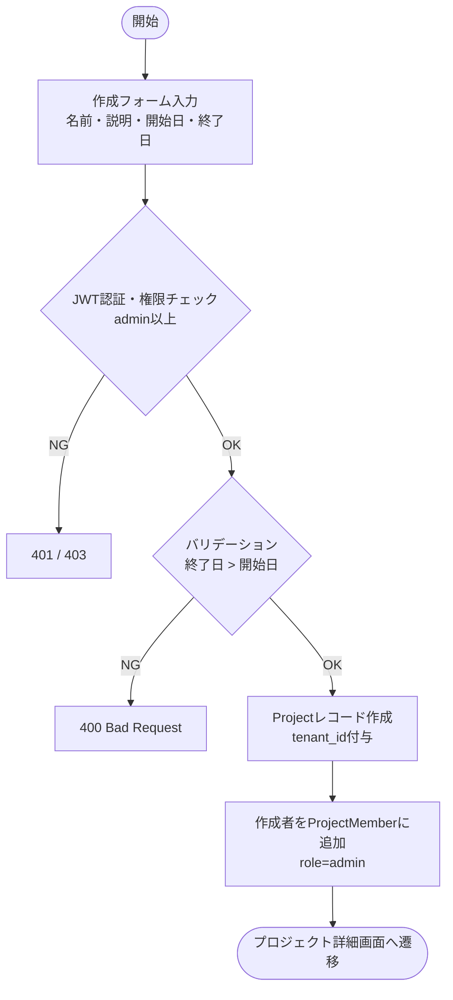
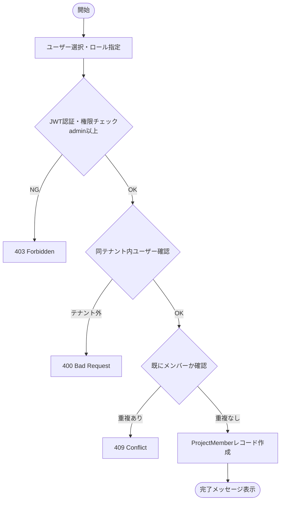
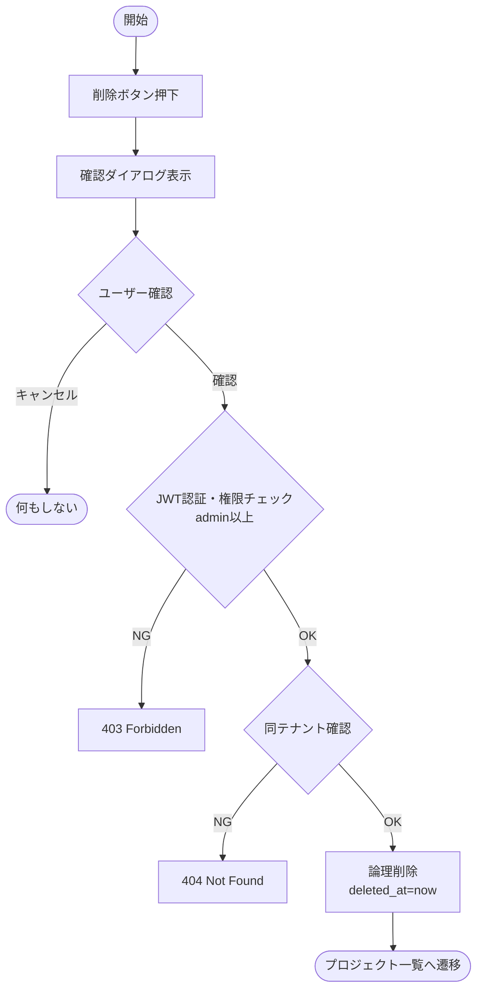
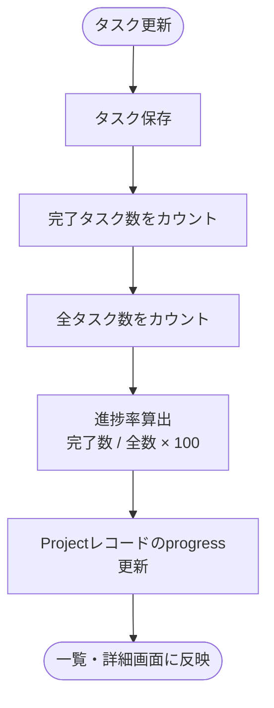
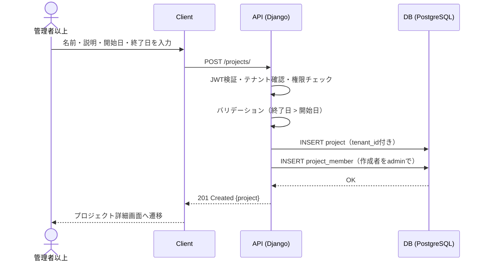
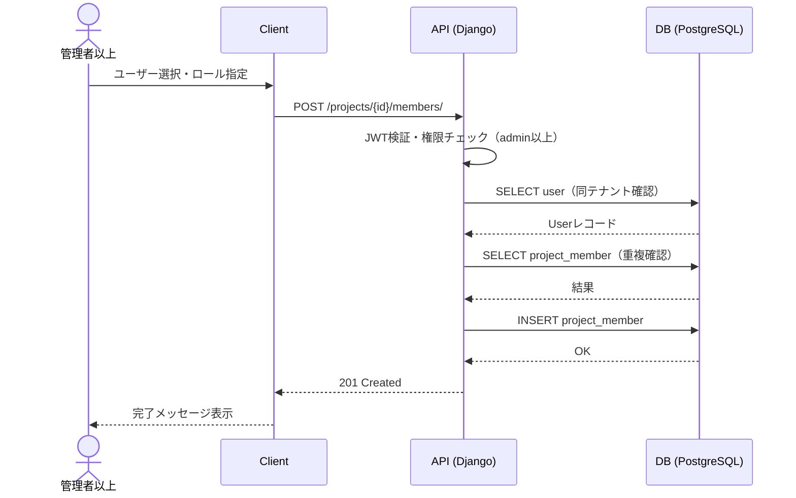
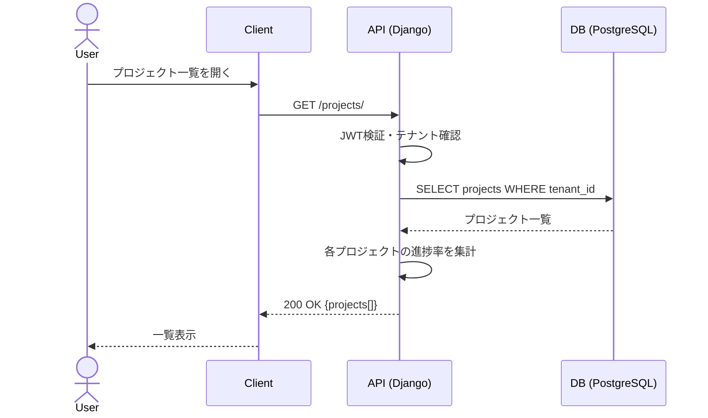
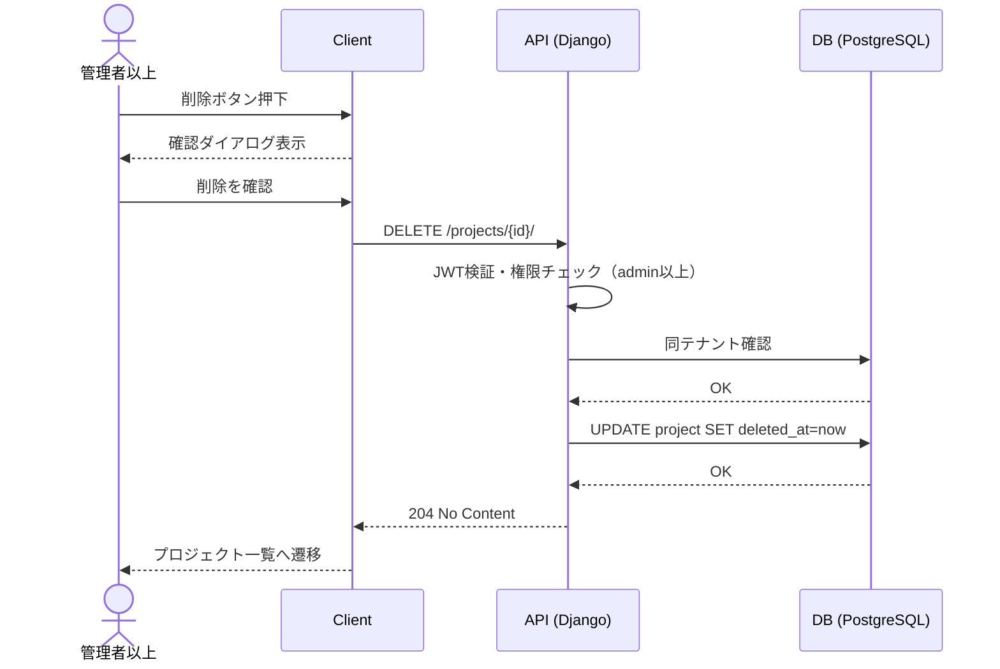

# 機能仕様 02 - プロジェクト管理

**作成日：** 2026年4月12日  
**バージョン：** 1.2

---

## 1. 機能概要

テナント内で複数のプロジェクトを作成・管理する。プロジェクトはテナントに紐づき、テナント外からはアクセスできない。管理者以上がプロジェクトを作成し、メンバーを招待して共同作業を行う。

| 項目 | 内容 |
|------|------|
| 対象ユーザー | マスターユーザー・管理者（作成・編集・削除）、メンバー（閲覧・作業） |
| データ範囲 | テナント内に閉じる |
| 複数プロジェクト | 同一テナント内で複数プロジェクトを並行管理可能 |

---

## 2. 処理フロー

### 2-1. プロジェクト作成

### 2-2. メンバー追加

### 2-3. プロジェクト削除

### 2-4. 進捗率自動集計

---

## 3. シーケンス図

### 3-1. プロジェクト作成

### 3-2. メンバー追加

### 3-3. プロジェクト一覧取得

### 3-4. プロジェクト削除

---

## 4. ステップ記述

### 4-1. プロジェクト作成

| ステップ | 処理 | 担当 | エラー処理 |
|---------|------|------|-----------|
| 1 | 作成フォームに名前・説明・開始日・終了日を入力 | フロントエンド | 必須チェック（名前・開始日） |
| 2 | POST /projects/ にリクエスト送信 | フロントエンド | - |
| 3 | JWTでテナント・権限（admin以上）を確認 | バックエンド | 401 / 403 |
| 4 | 終了日が開始日より後であることを確認 | バックエンド | 400 Bad Request |
| 5 | Projectレコードをtenant_id付きで作成 | バックエンド | 500 Server Error |
| 6 | 作成者をProjectMemberにrole=adminで追加 | バックエンド | - |
| 7 | 201レスポンスでプロジェクト情報を返却 | バックエンド | - |
| 8 | プロジェクト詳細画面へ遷移 | フロントエンド | - |

### 4-2. メンバー追加

| ステップ | 処理 | 担当 | エラー処理 |
|---------|------|------|-----------|
| 1 | テナント内ユーザー一覧から追加するユーザーを選択 | フロントエンド | - |
| 2 | ロール（admin/member）を選択 | フロントエンド | 必須チェック |
| 3 | POST /projects/{id}/members/ にリクエスト送信 | フロントエンド | - |
| 4 | JWTで権限（admin以上）を確認 | バックエンド | 403 Forbidden |
| 5 | 対象ユーザーが同テナント内であることを確認 | バックエンド | 400 Bad Request |
| 6 | 既にメンバーでないことを確認 | バックエンド | 409 Conflict |
| 7 | ProjectMemberレコードを作成 | バックエンド | 500 Server Error |
| 8 | 完了メッセージを表示 | フロントエンド | - |

### 4-3. プロジェクト削除

| ステップ | 処理 | 担当 | エラー処理 |
|---------|------|------|-----------|
| 1 | 削除ボタンを押下 | フロントエンド | - |
| 2 | 確認ダイアログを表示（「削除すると元に戻せません」） | フロントエンド | キャンセル時は何もしない |
| 3 | DELETE /projects/{id}/ にリクエスト送信 | フロントエンド | - |
| 4 | JWTで権限（admin以上）を確認 | バックエンド | 403 Forbidden |
| 5 | 対象プロジェクトが同テナントであることを確認 | バックエンド | 404 Not Found |
| 6 | deleted_atを付与して論理削除 | バックエンド | 500 Server Error |
| 7 | 204レスポンスを返却 | バックエンド | - |
| 8 | プロジェクト一覧へ遷移 | フロントエンド | - |

### 4-4. 進捗率自動集計

| ステップ | 処理 | 担当 | エラー処理 |
|---------|------|------|-----------|
| 1 | タスクのステータス or 進捗率が更新される | ユーザー操作 | - |
| 2 | タスク更新APIが呼ばれる | フロントエンド | - |
| 3 | タスク保存後にプロジェクト進捗率を再計算 | バックエンド | - |
| 4 | 完了タスク数 / 全タスク数 × 100 で算出 | バックエンド | - |
| 5 | Projectレコードのprogressを更新 | バックエンド | - |
| 6 | プロジェクト一覧・詳細画面に反映 | フロントエンド | - |

---

## 5. APIエンドポイント一覧

| メソッド | エンドポイント | 説明 | 権限 |
|---------|--------------|------|------|
| GET | /projects/ | プロジェクト一覧取得 | 全ユーザー |
| POST | /projects/ | プロジェクト作成 | admin以上 |
| GET | /projects/{id}/ | プロジェクト詳細取得 | メンバー以上 |
| PUT | /projects/{id}/ | プロジェクト編集 | admin以上 |
| DELETE | /projects/{id}/ | プロジェクト削除（論理削除） | admin以上 |
| GET | /projects/{id}/members/ | メンバー一覧取得 | メンバー以上 |
| POST | /projects/{id}/members/ | メンバー追加 | admin以上 |
| PUT | /projects/{id}/members/{user_id}/ | メンバーロール変更 | admin以上 |
| DELETE | /projects/{id}/members/{user_id}/ | メンバー削除 | admin以上 |
