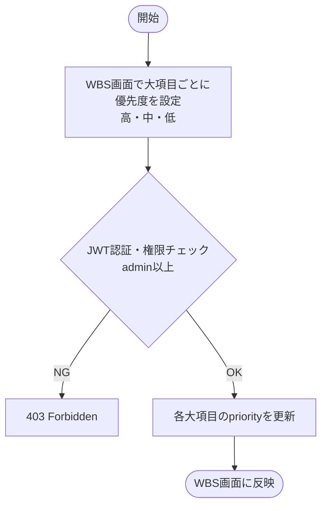
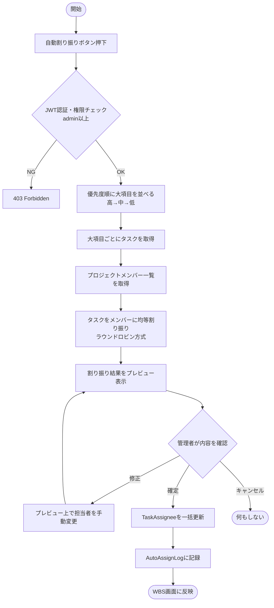
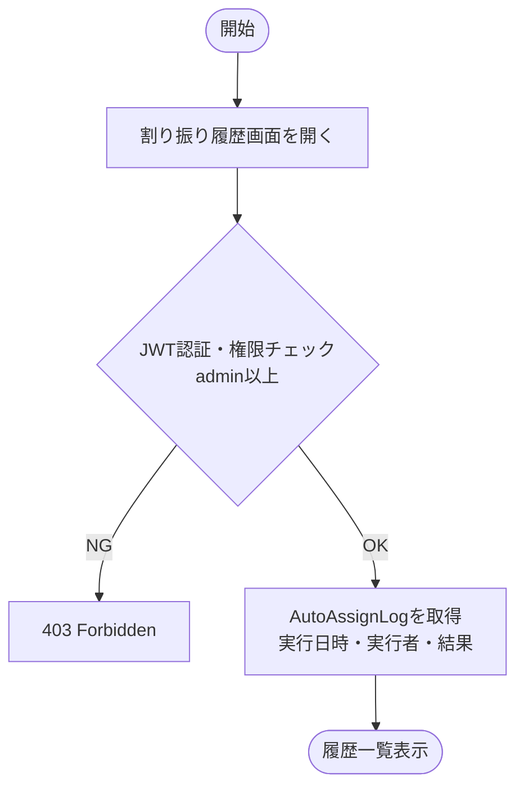
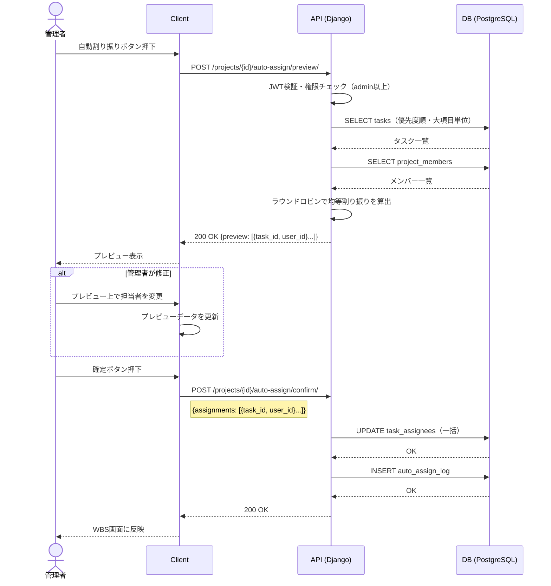
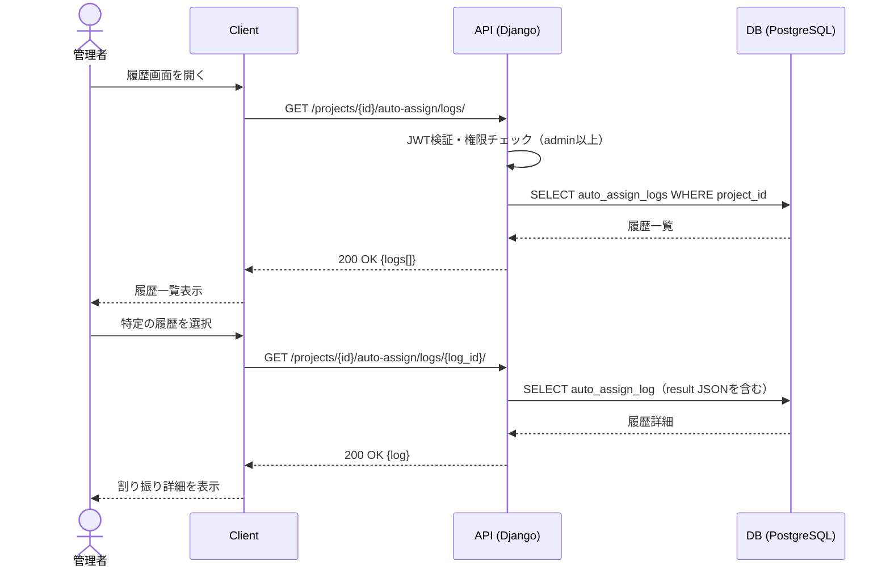

# 機能仕様 05 - タスク自動割り振り

**作成日：** 2026年4月12日  
**バージョン：** 1.0

---

## 1. 機能概要

管理者が実行ボタンを押すと、WBSの大項目（第1層）単位で設定した優先度をもとに、タスクをメンバーへ均等に自動割り振りする。実行結果はプレビューで確認してから確定する。確定後も手動での変更は可能。

| 項目 | 内容 |
|------|------|
| 対象ユーザー | admin以上（実行・確定）、メンバー（結果の閲覧） |
| 割り振り単位 | 大項目（第1層）単位で優先度を設定し、その中のタスクをメンバーに均等割り振り |
| 実行タイミング | 管理者が任意のタイミングで手動実行 |
| 確定前 | プレビュー画面で結果を確認・修正してから確定 |
| 確定後 | 手動での担当者変更は引き続き可能 |
| 履歴 | 実行ごとに割り振り結果をAutoAssignLogに記録 |

### 割り振りロジック

```
Step 1: 大項目（第1層）単位で優先度を設定（高・中・低）
Step 2: 優先度の高い大項目から順に処理
Step 3: 大項目内の未割り当てタスクをメンバーに均等に割り振り
Step 4: 割り振り結果をプレビューで確認 → 管理者が承認して確定
```

---

## 2. 処理フロー

### 2-1. 優先度設定



### 2-2. 自動割り振り実行・プレビュー



### 2-3. 割り振り履歴確認



---

## 3. シーケンス図

### 3-1. 自動割り振り実行・プレビュー



### 3-2. 割り振り履歴確認



---

## 4. ステップ記述

### 4-1. 優先度設定

| ステップ | 処理 | 担当 | エラー処理 |
|---------|------|------|-----------|
| 1 | WBS画面で大項目（第1層）ごとに優先度を選択（高・中・低） | フロントエンド | - |
| 2 | PATCH /projects/{id}/tasks/{task_id}/ にpriority値を送信 | フロントエンド | - |
| 3 | JWTで権限（admin以上）を確認 | バックエンド | 403 Forbidden |
| 4 | Taskレコードのpriorityを更新 | バックエンド | 500 Server Error |
| 5 | WBS画面に反映 | フロントエンド | - |

### 4-2. 自動割り振り実行・プレビュー

| ステップ | 処理 | 担当 | エラー処理 |
|---------|------|------|-----------|
| 1 | 自動割り振りボタンを押下 | フロントエンド | - |
| 2 | POST /projects/{id}/auto-assign/preview/ にリクエスト送信 | フロントエンド | - |
| 3 | JWTで権限（admin以上）を確認 | バックエンド | 403 Forbidden |
| 4 | 大項目を優先度順（高→中→低）に並べる | バックエンド | - |
| 5 | 各大項目内のタスクをプロジェクトメンバーにラウンドロビンで割り振り | バックエンド | メンバーが0人の場合は400 |
| 6 | プレビューデータを返却 | バックエンド | - |
| 7 | プレビュー画面を表示（担当者の手動変更も可能） | フロントエンド | - |
| 8 | 確定ボタンを押下 | フロントエンド | - |
| 9 | POST /projects/{id}/auto-assign/confirm/ にプレビューデータを送信 | フロントエンド | - |
| 10 | TaskAssigneeを一括更新 | バックエンド | 500 Server Error |
| 11 | AutoAssignLogに実行結果を記録 | バックエンド | - |
| 12 | WBS画面に反映 | フロントエンド | - |

### 4-3. 割り振り履歴確認

| ステップ | 処理 | 担当 | エラー処理 |
|---------|------|------|-----------|
| 1 | 履歴画面を開く | フロントエンド | - |
| 2 | GET /projects/{id}/auto-assign/logs/ にリクエスト送信 | フロントエンド | - |
| 3 | JWTで権限（admin以上）を確認 | バックエンド | 403 Forbidden |
| 4 | AutoAssignLogを実行日時の降順で取得 | バックエンド | - |
| 5 | 履歴一覧を表示 | フロントエンド | - |
| 6 | 特定の履歴を選択して詳細を表示（割り振り結果のJSON） | フロントエンド | - |

---

## 5. APIエンドポイント一覧

| メソッド | エンドポイント | 説明 | 権限 |
|---------|--------------|------|------|
| POST | /projects/{id}/auto-assign/preview/ | 自動割り振りプレビュー生成 | admin以上 |
| POST | /projects/{id}/auto-assign/confirm/ | 割り振り結果の確定 | admin以上 |
| GET | /projects/{id}/auto-assign/logs/ | 割り振り履歴一覧 | admin以上 |
| GET | /projects/{id}/auto-assign/logs/{log_id}/ | 割り振り履歴詳細 | admin以上 |
