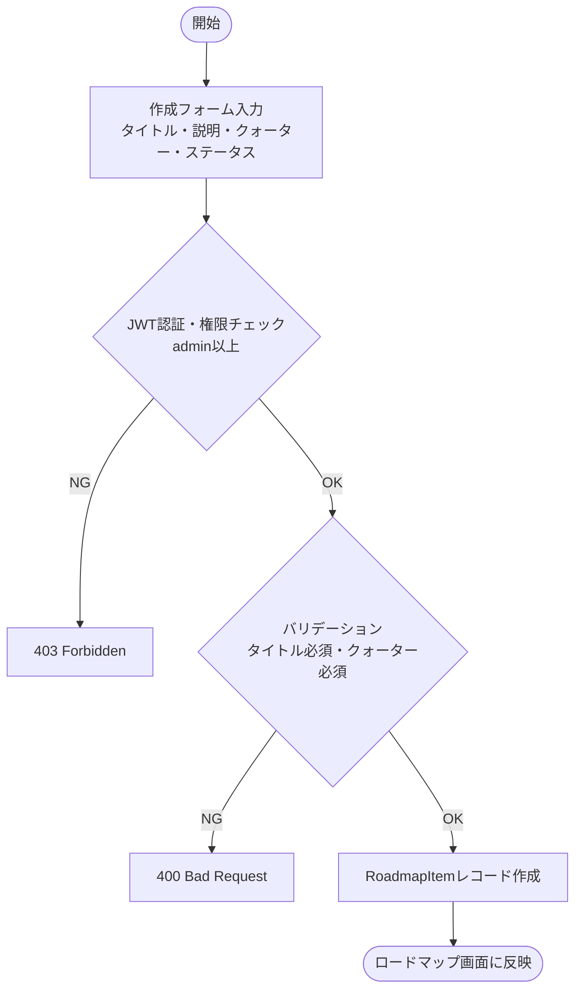
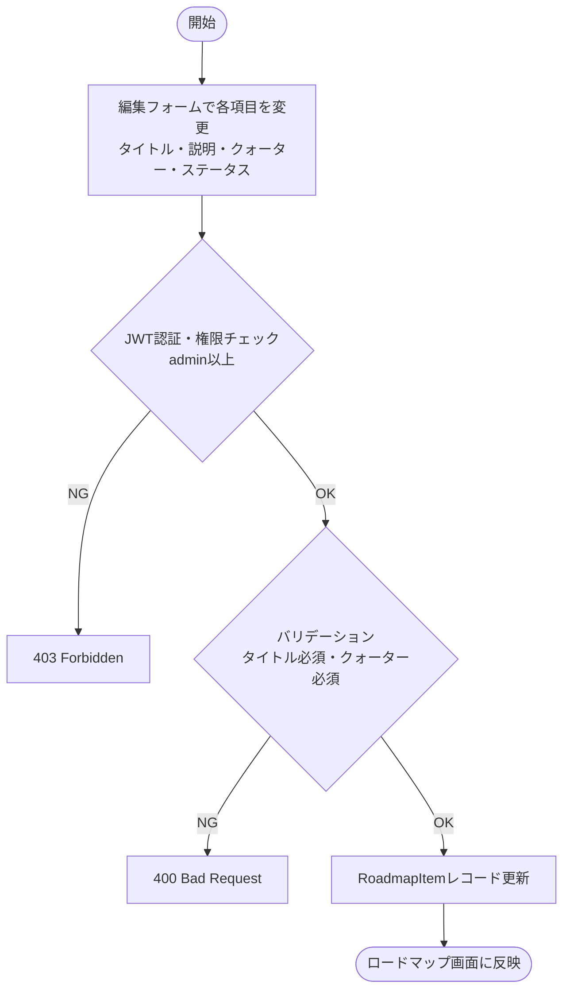
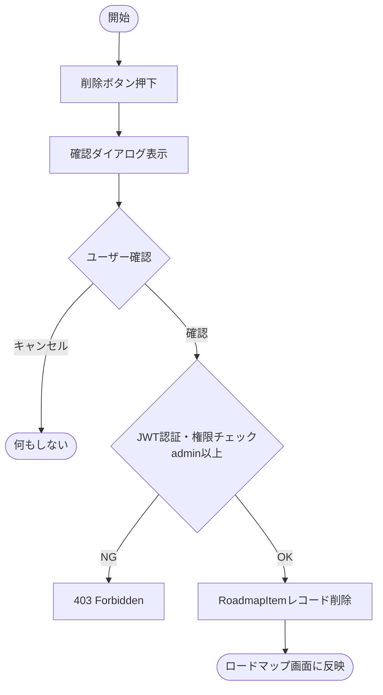
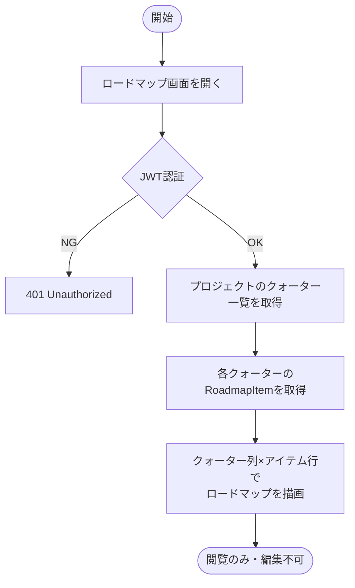
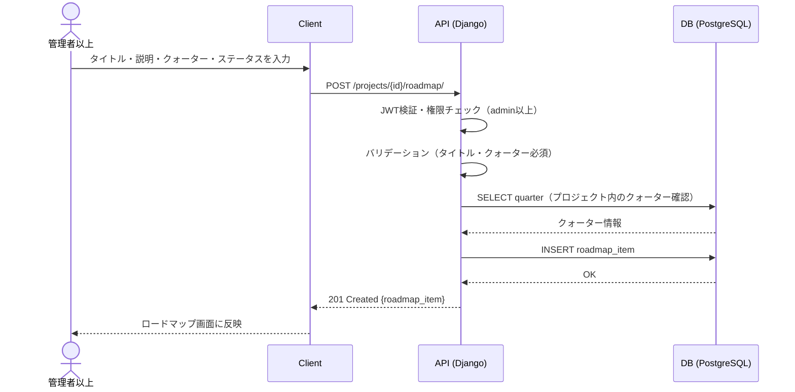
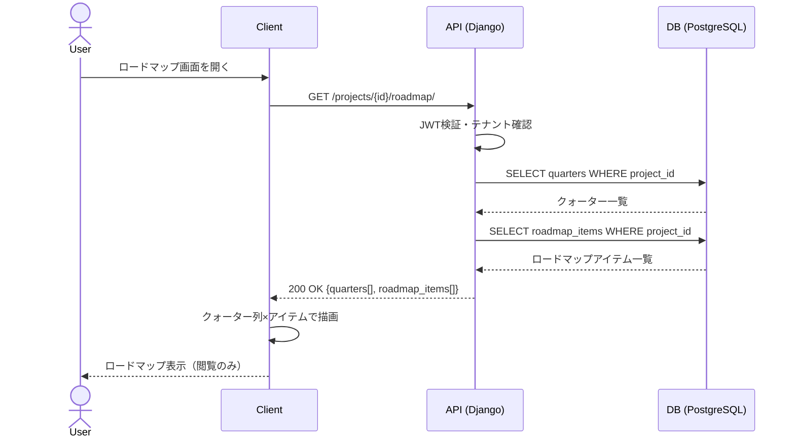
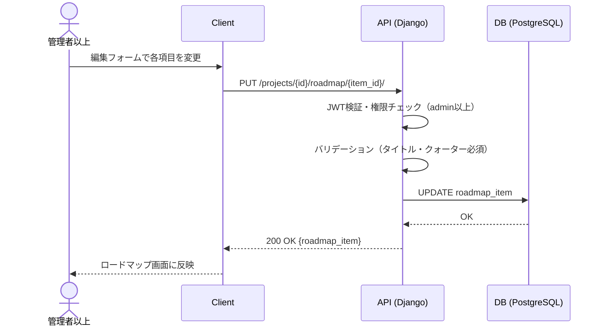

# 機能仕様 06 - プロダクトロードマップ

**作成日：** 2026年4月12日  
**バージョン：** 1.0

---

## 1. 機能概要

プロジェクト単位でクォーターを軸にしたロードマップを表示する。WBSのタスクとは独立した機能・テーマ単位の計画・方向性の可視化が目的。閲覧専用のため、ロードマップアイテムの作成・編集は別画面で行う。

| 項目 | 内容 |
|------|------|
| 対象ユーザー | admin以上（アイテム作成・編集・削除）、メンバー（閲覧のみ） |
| 表示範囲 | プロジェクト単位 |
| 時間軸 | クォーター単位（Q1 / Q2 / Q3 / Q4） |
| WBSとの関係 | 独立（タスクとの直接紐付けなし） |
| 編集操作 | 閲覧専用（ガントチャートと同様） |

### ロードマップアイテムのステータス定義

| ステータス | 説明 |
|-----------|------|
| 計画中 | まだ着手していない計画段階 |
| 進行中 | 現在対応中の機能・テーマ |
| 完了 | リリース・完了済み |
| 保留 | 一時停止・優先度を下げた状態 |

---

## 2. 処理フロー

### 2-1. ロードマップアイテム作成

### 2-2. ロードマップアイテム編集

### 2-3. ロードマップアイテム削除

### 2-4. ロードマップ表示

---

## 3. シーケンス図

### 3-1. ロードマップアイテム作成

### 3-2. ロードマップ表示

### 3-3. ロードマップアイテム編集

---

## 4. ステップ記述

### 4-1. ロードマップアイテム作成

| ステップ | 処理 | 担当 | エラー処理 |
|---------|------|------|-----------|
| 1 | 作成フォームにタイトル・説明・クォーター・ステータスを入力 | フロントエンド | タイトル・クォーター必須チェック |
| 2 | POST /projects/{id}/roadmap/ にリクエスト送信 | フロントエンド | - |
| 3 | JWTで権限（admin以上）を確認 | バックエンド | 403 Forbidden |
| 4 | バリデーション（タイトル・クォーター必須） | バックエンド | 400 Bad Request |
| 5 | 指定クォーターが同プロジェクト内であることを確認 | バックエンド | 400 Bad Request |
| 6 | RoadmapItemレコードを作成 | バックエンド | 500 Server Error |
| 7 | 201レスポンスでアイテム情報を返却 | バックエンド | - |
| 8 | ロードマップ画面に反映 | フロントエンド | - |

### 4-2. ロードマップ表示

| ステップ | 処理 | 担当 | エラー処理 |
|---------|------|------|-----------|
| 1 | ロードマップ画面を開く | フロントエンド | - |
| 2 | GET /projects/{id}/roadmap/ にリクエスト送信 | フロントエンド | - |
| 3 | JWT認証・テナント確認 | バックエンド | 401 Unauthorized |
| 4 | プロジェクトのクォーター一覧を取得 | バックエンド | - |
| 5 | 各クォーターに紐づくRoadmapItemを取得 | バックエンド | - |
| 6 | クォーター列×アイテム行でロードマップを描画 | フロントエンド | - |
| 7 | 閲覧のみで編集操作は提供しない | フロントエンド | - |

### 4-3. ロードマップアイテム削除

| ステップ | 処理 | 担当 | エラー処理 |
|---------|------|------|-----------|
| 1 | 削除ボタンを押下 | フロントエンド | - |
| 2 | 確認ダイアログを表示 | フロントエンド | キャンセル時は何もしない |
| 3 | DELETE /projects/{id}/roadmap/{item_id}/ にリクエスト送信 | フロントエンド | - |
| 4 | JWTで権限（admin以上）を確認 | バックエンド | 403 Forbidden |
| 5 | RoadmapItemレコードを削除 | バックエンド | 500 Server Error |
| 6 | 204レスポンスを返却 | バックエンド | - |
| 7 | ロードマップ画面に反映 | フロントエンド | - |

---

## 5. APIエンドポイント一覧

| メソッド | エンドポイント | 説明 | 権限 |
|---------|--------------|------|------|
| GET | /projects/{id}/roadmap/ | ロードマップ取得（クォーター＋アイテム） | メンバー以上 |
| POST | /projects/{id}/roadmap/ | ロードマップアイテム作成 | admin以上 |
| GET | /projects/{id}/roadmap/{item_id}/ | アイテム詳細取得 | メンバー以上 |
| PUT | /projects/{id}/roadmap/{item_id}/ | アイテム編集 | admin以上 |
| DELETE | /projects/{id}/roadmap/{item_id}/ | アイテム削除 | admin以上 |
