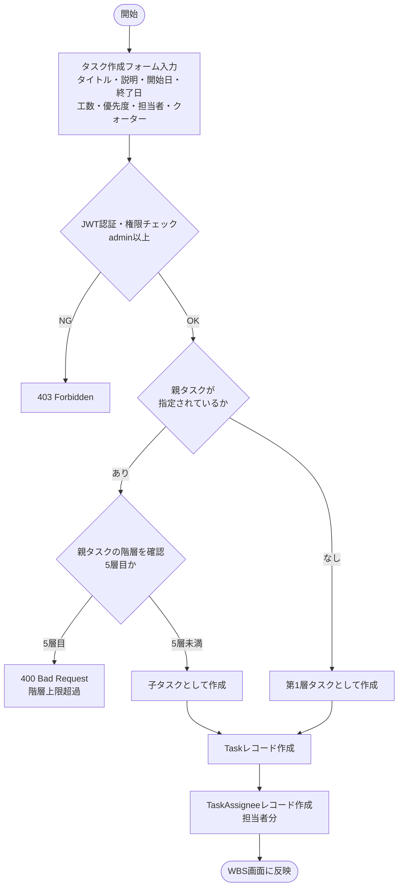
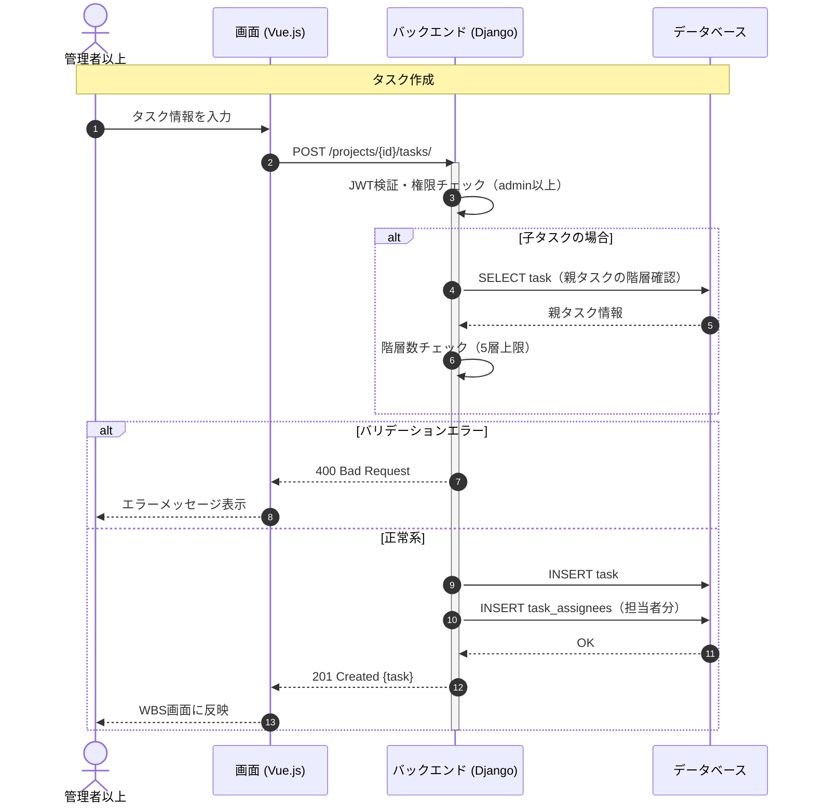

# 【機能仕様書】WBS・タスク管理

## 1. 処理概要

- **目的**：プロジェクト内のタスクを最大5階層の木構造で管理する。タスクは自己参照（parent_task_id）で階層を表現し、ドラッグ&ドロップによる並び替えや、ステータス・進捗率・担当者・クォーターの管理を行う。
- **背景**：WBS形式での作業管理を実現するため、タスクの階層構造・一括作成・権限による編集制御が必要。

## 2. アクター

| アクター | 種別 | 役割 |
| --- | --- | --- |
| 管理者以上 | ユーザー | タスクの全項目作成・編集・削除・並び替え |
| メンバー | ユーザー | 担当タスクのステータス・進捗率のみ更新 |
| システム | 自動処理 | 階層バリデーション・進捗率再集計 |

## 3. ワークフロー

## 4. シーケンス図

## 5. 処理フロー

### 5.1 タスク作成

1. **バリデーション**：タイトル必須・終了日が開始日より後・階層5層以内（詳細は6.1参照）
   - バリデーションエラー：400 Bad Request を返す。
2. **DB操作**：Taskレコード作成 → TaskAssigneeレコードを担当者分作成（詳細は6.2, 6.3参照）
   - DB失敗：500 エラーを返す。
3. **画面遷移**：WBS画面に新しいタスクを反映。

### 5.2 タスク一括作成

1. **バリデーション**：各タスクのタイトル必須・階層5層以内（詳細は6.1参照）
   - バリデーションエラー：400（エラーのタスク番号を返却）。
2. **DB操作**：Taskレコードを一括INSERT。（詳細は6.2参照）
3. **画面遷移**：WBS画面に新しいタスクを反映。

### 5.3 タスク編集

1. **権限チェック**：adminは全項目、memberは担当タスクのステータス・進捗率のみ。
   - 担当外：403 Forbidden を返す。
2. **バリデーション**：終了日が開始日より後（詳細は6.1参照）
3. **DB操作**：Taskレコードを更新 → プロジェクト・クォーター進捗率を再集計。（詳細は6.2, 6.3参照）
4. **画面遷移**：WBS画面に反映。

### 5.4 タスク削除

1. **確認ダイアログ**：子タスクも削除される旨の警告。キャンセル時は何もしない。
2. **DB操作**：子タスクを再帰的に取得 → 対象＋子タスクをすべて論理削除 → 進捗率を再集計。（詳細は6.3参照）
3. **画面遷移**：WBS画面に反映。

### 5.5 並び替え（ドラッグ&ドロップ）

1. ドロップ位置から新しい order 値を算出。
2. PATCH でorder値を送信。
3. **DB操作**：Taskレコードのorder値を更新。
   - 失敗：元の順序に戻す。

## 6. 処理ロジック詳細

### 6.1 バリデーション条件（What）

| No | 項目名 | 条件 | 備考 |
| :--- | :--- | :--- | :--- |
| 1 | タイトル | 必須 | |
| 2 | 終了日 | 開始日より後 | |
| 3 | 階層 | 最大5層（第6層以降は作成不可） | 親タスクのdepthを再帰カウント |
| 4 | 担当者 | 同プロジェクトメンバーのみ | |
| 5 | task_kind | task_type='task' の場合のみ設定可。選択肢：実装 / ドキュメント作成 / レビュー依頼 / レビュー修正 | NULL許容 |

### 6.2 登録内容（What）

| No | 対象カラム | 登録内容 | 備考 |
| :--- | :--- | :--- | :--- |
| 1 | task.title | 入力値 | |
| 2 | task.parent_task_id | 指定した親タスクのID / NULL | |
| 3 | task.status | `'Todo'`（初期値） | |
| 4 | task.priority | 入力値（高/中/低） | |
| 5 | task.start_date / end_date | 入力値 | |
| 6 | task.task_kind | 入力値 / NULL | task_type='task' の場合のみ設定。実装 / ドキュメント作成 / レビュー依頼 / レビュー修正 |
| 7 | task_assignee.user_id | 担当者分 | |

### 6.3 処理制御（How）

- **論理削除**：タスク削除時は deleted_at にタイムスタンプを付与。子タスクを再帰的に取得し同時に論理削除する。
- **進捗率再集計**：タスク更新・削除後にクォーター進捗率（平均）→ プロジェクト進捗率（平均）の順で再計算する。

## 7. API概要

| API名 | メソッド | 役割・概要 |
| :--- | :---: | :--- |
| タスク一覧API | `GET` | ツリー構造でタスク一覧取得 |
| タスク作成API | `POST` | タスク1件作成 |
| タスク一括作成API | `POST` | 複数タスクを一括作成 |
| タスク詳細API | `GET` | タスク詳細情報取得 |
| タスク全項目編集API | `PUT` | 全項目を更新（admin以上） |
| タスク部分編集API | `PATCH` | ステータスを更新（member） |
| タスク削除API | `DELETE` | 子タスク含む論理削除 |
| タスク並び替えAPI | `PATCH` | order値の更新 |
| 担当者追加API | `POST` | 担当者を追加 |
| 担当者削除API | `DELETE` | 担当者を除外 |
| 直近のタスク一覧API | `GET` | 期限切れ・今週開始予定・着手中のタスクを集計して返却 |

## 8. テーブル概要

| テーブル名 | カラム名 | 操作 | 備考 |
| :--- | :--- | :--- | :--- |
| task | id, title, description, parent_task_id, project_id, quarter_id, status（Todo/InProgress/InReview/Done/OnHold）, task_kind（実装/ドキュメント作成/レビュー依頼/レビュー修正, NULL許容）, priority, progress, start_date, end_date, actual_start_date, actual_end_date, order, deleted_at | INSERT / SELECT / UPDATE | 自己参照で階層を表現 |
| task_assignee | id, task_id, user_id | INSERT / SELECT / DELETE | |
