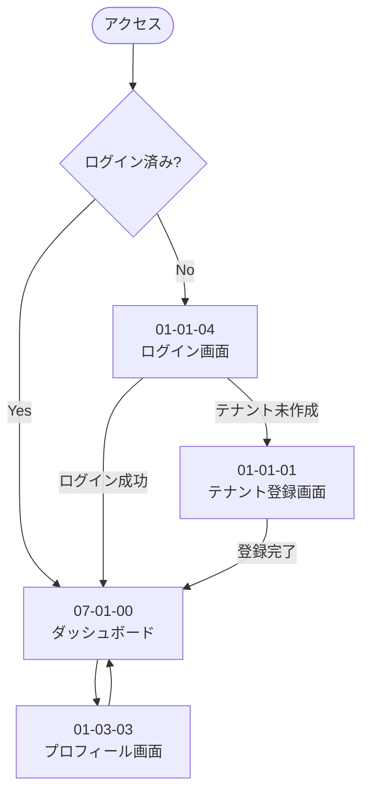
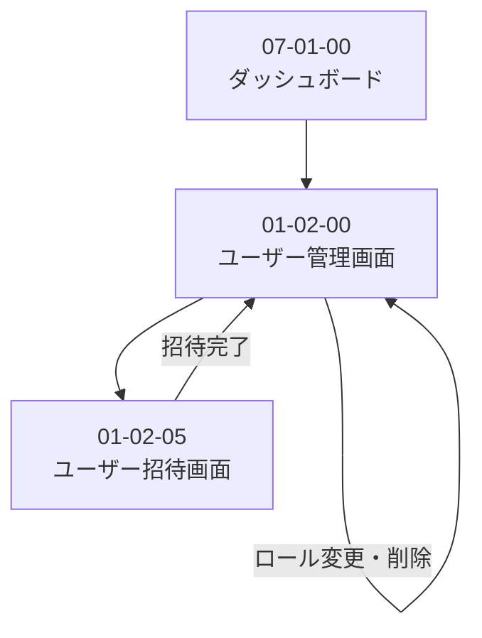
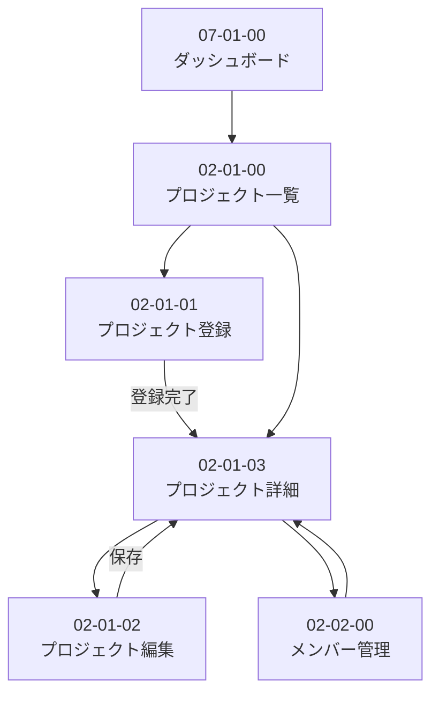
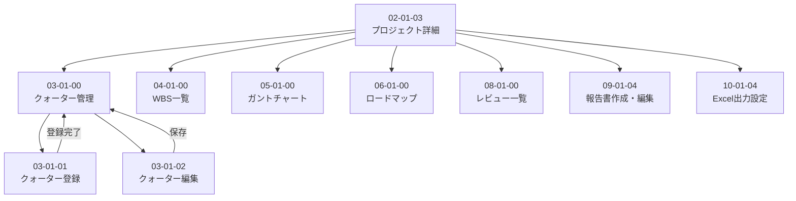
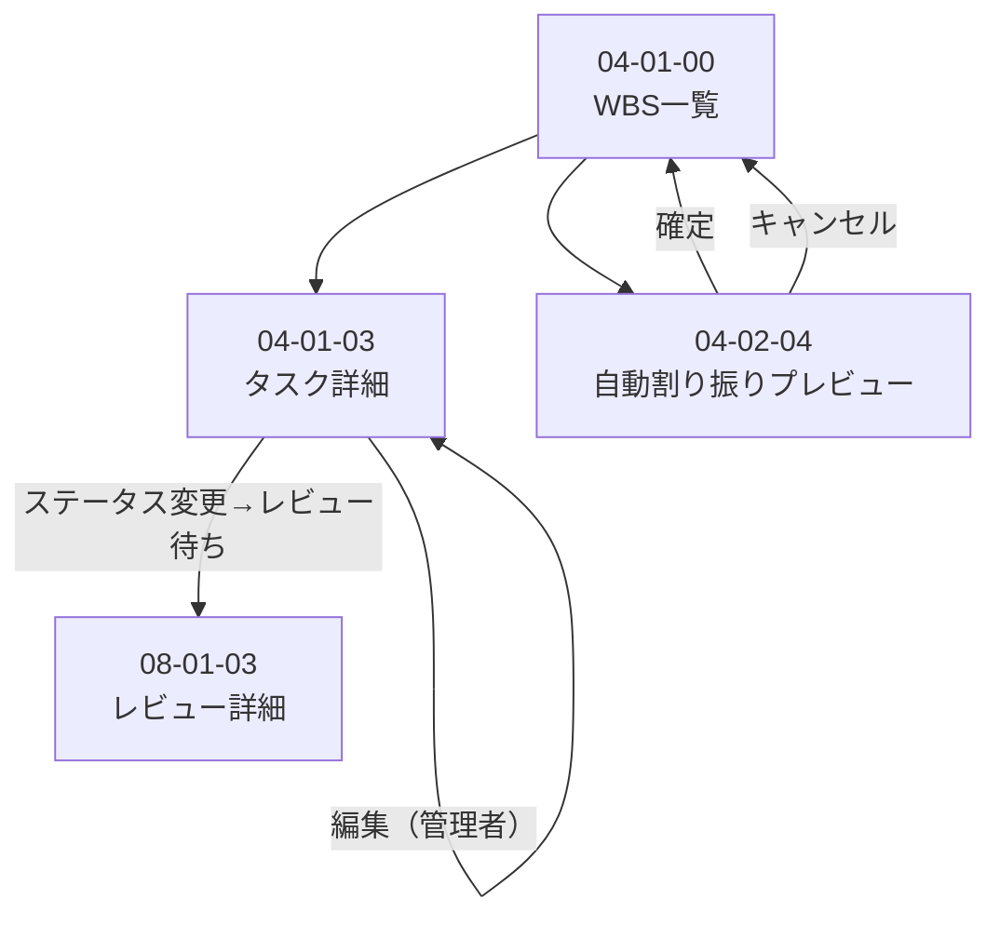
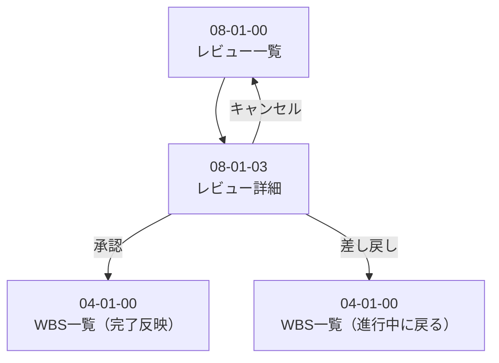
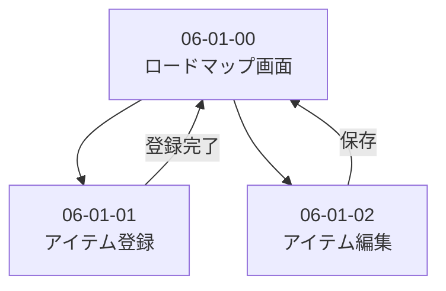
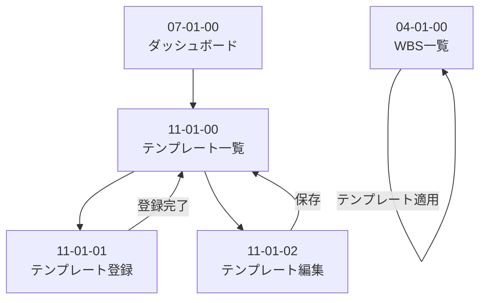

# 画面遷移図

- **最終更新日**：2026-04-26
- **バージョン**：v1.0

---

## 1. 全体遷移概要

ログイン後はダッシュボード（07-01-00）が起点となる。プロジェクトを選択すると、そのプロジェクト内の各機能画面へ遷移する。

---

## 2. 認証フロー（01）

---

## 3. ユーザー管理フロー（01）

---

## 4. プロジェクト管理フロー（02）

---

## 5. プロジェクト内フロー（03〜11）

プロジェクト詳細（02-01-03）からプロジェクト内の各機能へ遷移する。

---

## 6. WBS・タスク管理フロー（04）

---

## 7. レビュー管理フロー（08）

---

## 8. ロードマップフロー（06）

---

## 9. テンプレート管理フロー（11）

