# 画面遷移図

WBS管理ソフト全32画面間の遷移関係を定義する。各画面IDは [画面一覧](画面一覧.md) に準拠する。

- **作成日**：2026-04-23
- **バージョン**：1.0

---

## 1. 全体フロー（俯瞰）

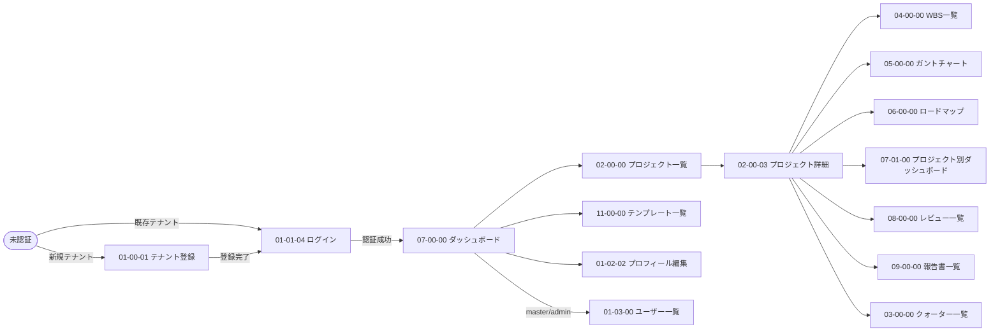

---

## 2. カテゴリ別遷移図

### 2.1 認証・ユーザー管理（01）

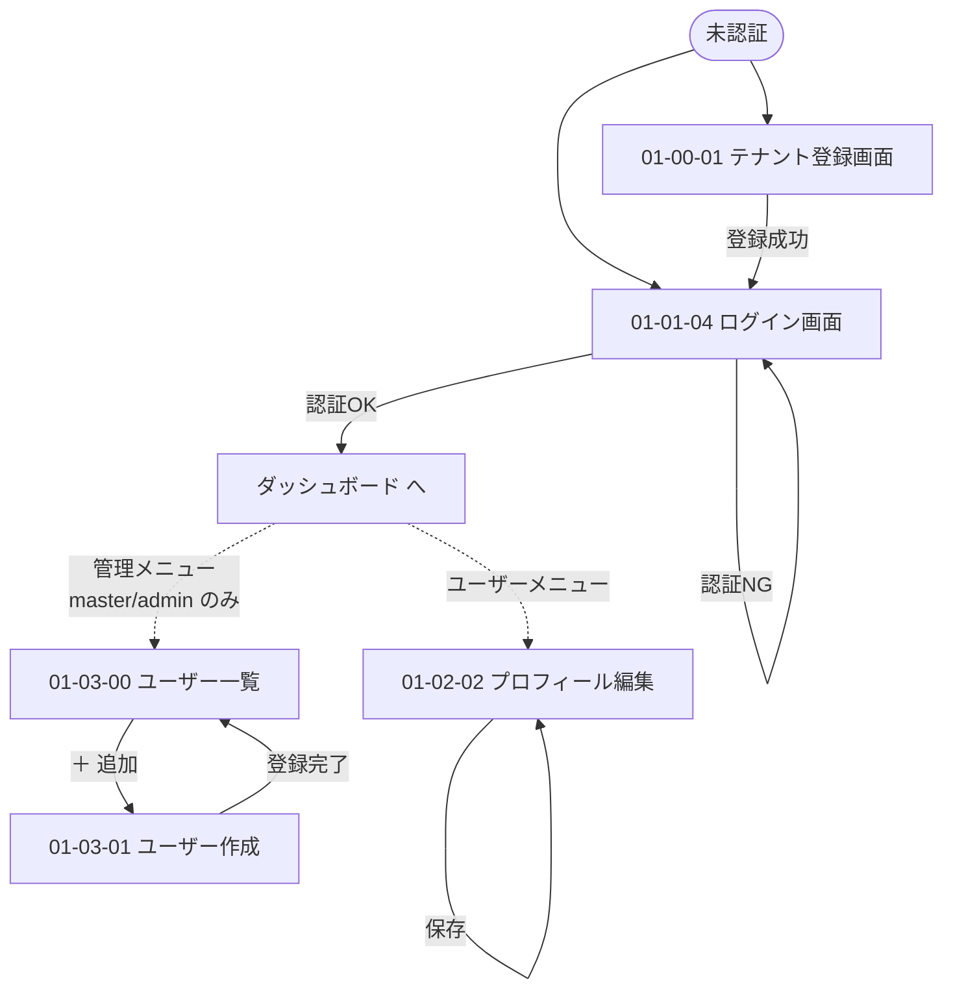

### 2.2 プロジェクト管理（02）

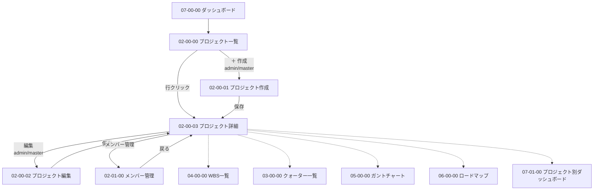

### 2.3 クォーター管理（03）

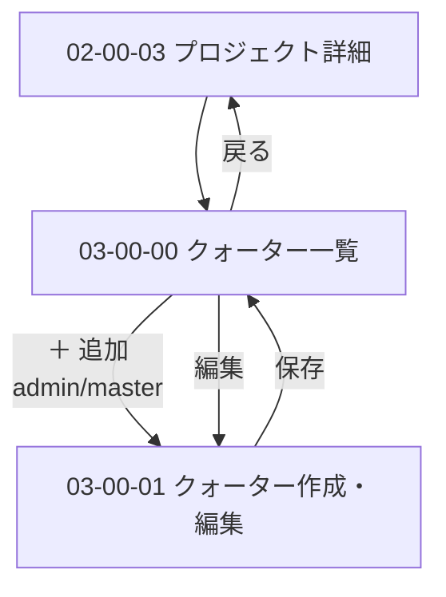

### 2.4 WBS・タスク管理（04）

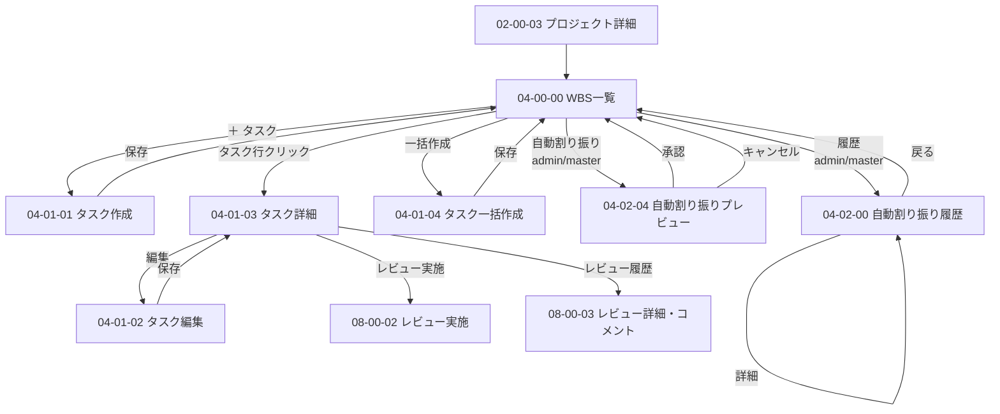

### 2.5 ガントチャート / ロードマップ（05・06）

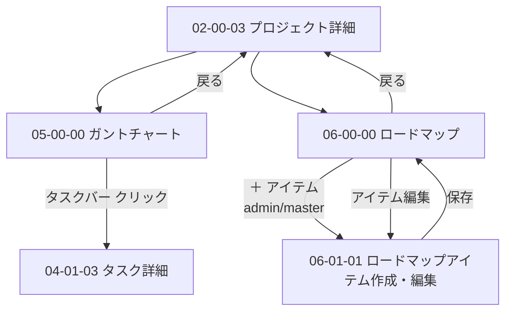

### 2.6 ダッシュボード（07）

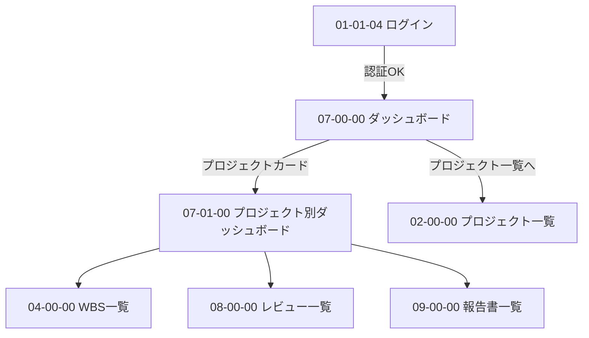

### 2.7 レビュー管理（08）

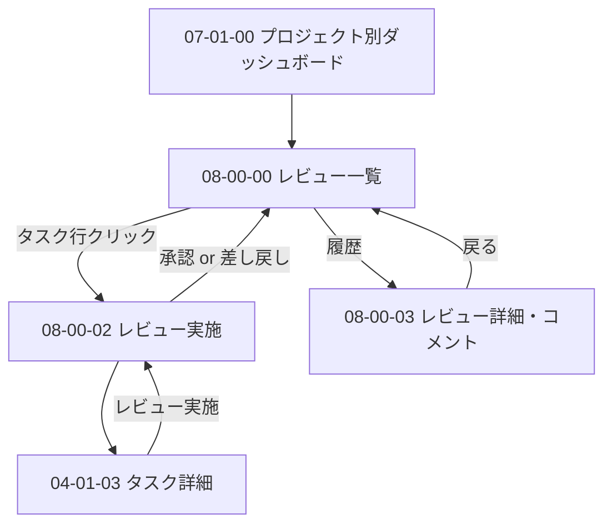

### 2.8 報告書管理（09）

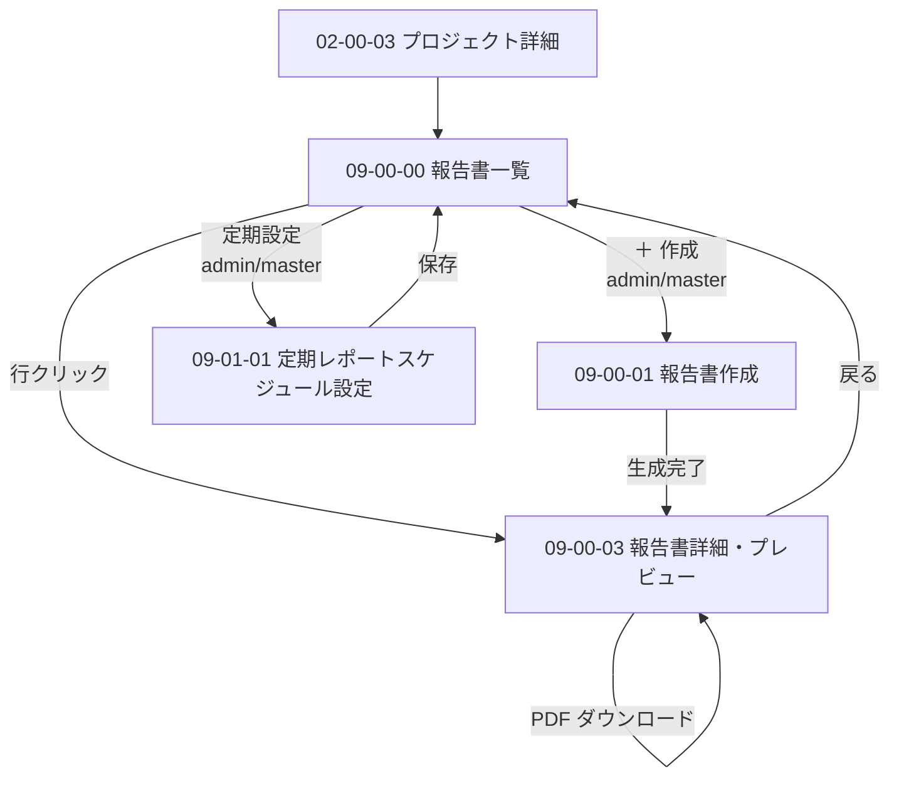

### 2.9 Excel出力（10）

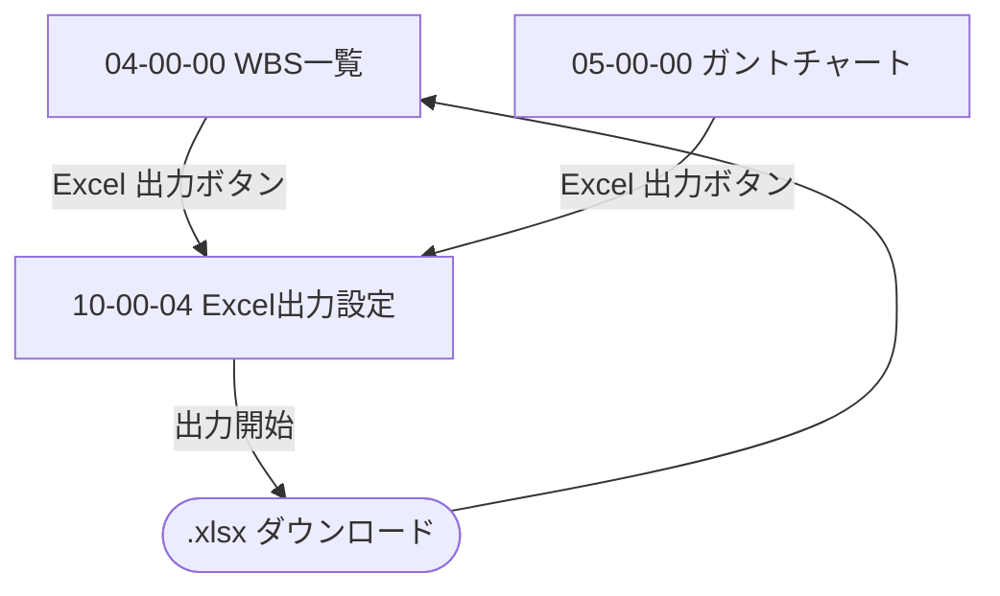

### 2.10 テンプレート管理（11）

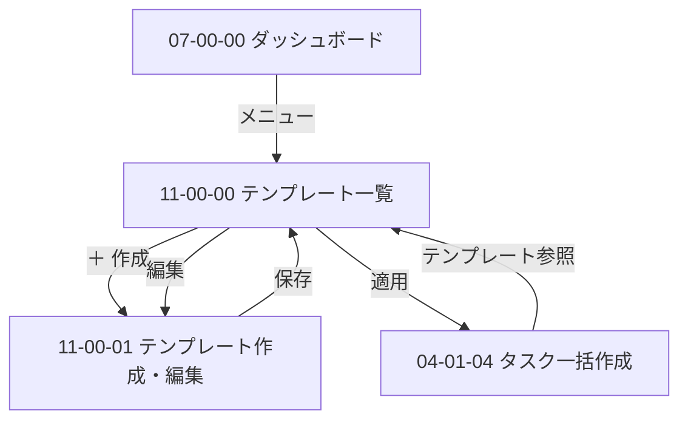

---

## 3. 画面間の依存関係（まとめ）

| 起点画面 | 主な遷移先 | きっかけ |
|---------|----------|---------|
| 07-00-00 ダッシュボード | 02-00-00, 07-01-00, 11-00-00, 01-02-02 | グローバルナビ |
| 02-00-03 プロジェクト詳細 | 03-00-00, 04-00-00, 05-00-00, 06-00-00, 07-01-00, 08-00-00, 09-00-00 | プロジェクト内メニュー |
| 04-00-00 WBS一覧 | 04-01-01〜04-01-04, 04-02-04, 10-00-04, 05-00-00 | ツールバー操作 |
| 04-01-03 タスク詳細 | 04-01-02, 08-00-02, 08-00-03 | アクションボタン |
| 08-00-00 レビュー一覧 | 08-00-02, 08-00-03 | レビュー選択 |
| 09-00-00 報告書一覧 | 09-00-01, 09-00-03, 09-01-01 | 報告書選択・新規作成 |

---

## 4. 共通遷移ルール

| ケース | 遷移先 | 備考 |
|-------|-------|------|
| 未認証でアクセス | `01-01-04 ログイン画面` | 元URLを query で保持し、認証後に復帰 |
| 権限不足 | `403 エラー画面` | サイドナビは表示しない |
| セッションタイムアウト（JWT 期限切れ） | `01-01-04 ログイン画面` | リフレッシュ失敗時にのみ遷移 |
| データ未存在（404） | 当該一覧画面 | フラッシュメッセージで通知 |
| 5xx エラー | 元画面に留まる | トーストで通知 |
| プロジェクト切り替え | 同一機能の対応画面へ | 例：プロジェクトA の WBS一覧 → プロジェクトB の WBS一覧 |

---

## 5. 改版履歴

| バージョン | 日付 | 変更内容 |
|-----------|------|---------|
| 1.0 | 2026-04-23 | 初版作成（カテゴリ別フロー + 全体俯瞰図） |
